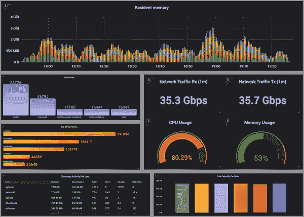

# Cloudian 增加了基于对象的存储平台监控工具

> 原文：<https://devops.com/cloudian-adds-object-based-storage-platform-monitoring-tool/>

Cloudian 今天在其基于对象的设备组合中添加了一个监控和可观察性工具，用于在内部 IT 环境中存储非结构化数据。

Cloudian 首席营销官 Jon Toor 表示，HyperIQ 提供了对分析和健康检查的访问，从而实现预测性维护，增强安全性并优化存储利用率。Cloudian 还承诺在未来通过连接器将 HyperIQ 扩展到其他 IT 基础设施。

HyperIQ 以虚拟机的形式出现，IT 团队下载并在内部安装。免费的 HyperIQ 基础版带有预先配置的仪表板。HyperIQ Enterprise 附带支持和访问更高级的分析功能，并按容量许可，每月每 GB 0.025 美分。

Cloudian 还提供了对多个通知渠道的集成，包括 Slack、OpsGenie、Kafka 和 PagerDuty，以根据 IT 组织在 HyperIQ 中定义的参数来共享警报。除了预配置的控制面板之外，IT 团队还可以利用 100 多个数据面板，以更精细的方式深入了解用户或存储数据。

Toor 表示，HyperIQ 将成为 Cloudian 开始向其平台添加 AIOps 功能的基础。他说，基于机器学习算法，HyperIQ 将使 Cloudian 能够收集训练这些算法所需的数据。

Cloudian 一直致力于开发分布式存储系统，使 IT 团队能够通过单一用户界面对设备进行全局管理。随着现代应用程序变得越来越复杂，访问存储在内部 IT 环境中的非结构化数据的需求也变得越来越明显。

IT 团队面临的挑战是他们没有足够的员工在本地管理这些系统。随着新冠肺炎疫情带来的经济衰退，这个问题变得更加严重。许多 IT 组织要么试图减少其 IT 员工的规模，要么限制他们额外雇用的全职员工的数量。

与此同时，组织需要存储的非结构化数据量持续增长。虽然这些数据中的大部分可以存储在公共云上，但是各种各样的全球合规性法规要求将这些数据中的大部分存储在内部 IT 环境中。

考虑到这些数据的分布情况，显然需要更深入的分析，最终使分布式存储系统的管理更加自动化。许多 IT 组织已经大大自动化了本地数据中心内存储系统的管理。现在的挑战是自动化分布在多个地理区域的分布式系统。

依靠[基于对象的存储](https://en.wikipedia.org/wiki/Object_storage)系统来管理本地数据中心内的非结构化数据仍然是一个相对较新的现象。近十年来，云存储服务提供商一直在利用基于对象的存储系统来管理海量数据。现在，内部 IT 团队也开始效仿。基于对象的存储系统不太可能在短期内完全取代基于文件的存储系统。然而，自动化现代基于对象的存储系统管理的机会可能要大得多。