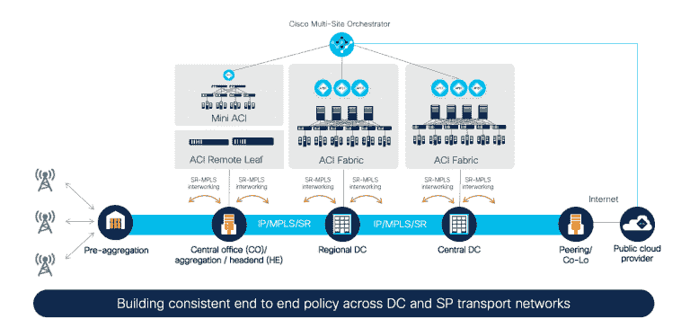

# 思科推进 ACI 战略

> 原文：<https://devops.com/cisco-moves-aci-strategy-forward/>

思科正在推进其混合云计算战略，发布了思科应用中心基础设施 (ACI)的[版本 5.0，这是一种软件定义的网络(SDN)，可以部署在云平台或内部 IT 环境中部署的网络设备上。](https://blogs.cisco.com/datacenter/cisco-application-centric-infrastructure-cisco-aci-5-0-for-the-changing-world)

最新版本的 Cisco ACI 增加了对亚马逊 Web 服务(AWS)云上虚拟专用云(VPC)实例之间的中转网关的支持，以提供更有效的方式在东西和南北云计算环境中路由流量。

思科还在扩展其为微软 Azure 云提供的网络服务，以包括 Azure 虚拟网络内的 VNET 对等、共享服务部署和其他服务自动化功能。

通过 ACI 5.0，IT 团队现在可以集中查看 AWS 和 Microsoft Azure 中的云资源清单，以及状态指示器和一组向导来简化配置。

思科还深化了 Cisco ACI 和 Kubernetes 之间的集成水平，以提高基于 VMware vSphere 等平台的 IT 环境中可实现的规模。

最后，思科增加了对多租户环境中基于角色的访问控制(RBAC)的支持，以及由思科 DUO 平台实现的双因素认证(TFA)功能。思科还增加了一个更灵活的策略结构，称为端点安全组(ESG ),可用于根据 L3 属性对端点进行分组，并在 ESG 之间应用合同。

思科 ACI 产品管理高级总监 Srinivas Kotamraju 表示，SDN 平台的最新更新为 IT 团队提供了相当于思科历史上在内部 IT 环境中提供的许多相同网络服务。

思科一直致力于采用混合云计算方法来提供网络服务，使 IT 团队能够通过中央控制台管理这些服务。Cisco ACI 使跨多个云和内部 it 环境部署相同的 SDN 成为可能，而不必管理每个云服务提供商提供的网络服务。Cisco 认为，这种方法通过集中管理和简化跨多个 it 环境的网络服务的自动化管理，最终有助于降低交付网络服务的总成本。

思科公开这些网络服务有两种主要方式。DevOps 团队可以利用应用程序编程接口(API)以编程方式调用 ACI 服务。或者，Cisco 为网络管理员提供图形用户界面(GUI ),他们可以通过该界面访问命令行界面(CLI)来配置特定的路由器或交换机。

Kotamraju 说[随着 DevOps 的兴起，让开发者对网络服务进行编程控制的组织数量也在继续增加](https://devops.com/cisco-aligns-with-google-to-meld-devops-and-netops/)。现在说 NetOps 和 DevOps 团队最终会融合到什么程度还为时过早；然而，Kotamraju 说，随着应用程序变得更加分散，许多 IT 组织正在更频繁地讨论如何找到融合这两个群体的方法。

当然，实现这一目标的最大挑战将是文化上的，而不是技术上的。然而，随着网络服务变得越来越容易通过 API 访问，现在更多的是一个时间和方式的问题，而不是如果。