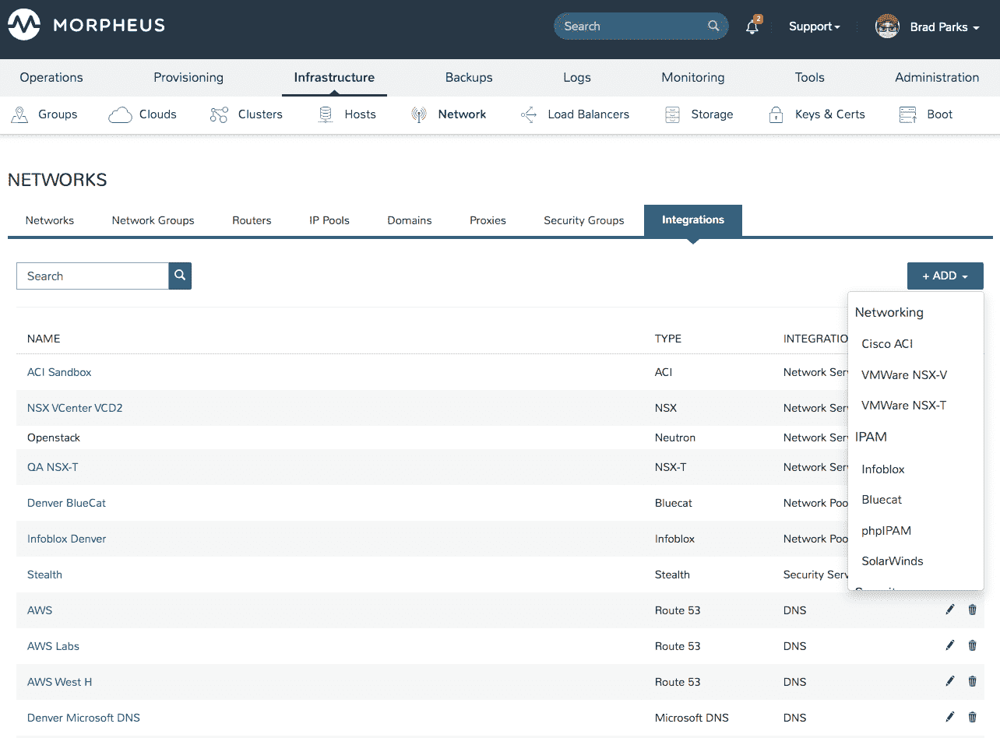

# Morpheus Data 自动化混合云管理

> 原文：<https://devops.com/morpheus-data-automates-of-hybrid-cloud-management/>

Morpheus Data 已经将[更新到其云管理平台](https://www.businesswire.com/news/home/20200528005296/en/Morpheus-Announces-Zero-Trust-Cloud-Management-Platform-Enhances)，使得动态集成使用不同工具和框架创建的自动化任务的不同实现更加容易。

此外，该公司还扩展了其支持的操作系统，包括亚马逊 Linux 2、红帽 Linux 8.x 和 SUSE Linux，此外还扩展了对微软 Azure、亚马逊 Web 服务、甲骨文云和谷歌云平台的现有支持。

Morpheus Data 还增加了对 VMware NSX-T 和 Unisys Stealth 网络软件的支持，这是通过更轻松地将微网关应用于网络以创建零信任 it 环境来推进 DevSecOps 的[努力的一部分。人们对零信任 IT 环境越来越感兴趣，这是一种在 IT 资产遭到破坏时对抗恶意软件横向移动的方法。](https://devops.com/morpheus-data-extends-devops-reach/)

最后，Morpheus Data 更新了图形用户界面(GUI ),以单一平台的形式管理多个云平台。

Morpheus Data 的业务开发副总裁 Brad Parks 表示，DevOps 团队现在可以使用 Morpheus 云管理平台来协调用 Ansible、Python、Groovy、Shell、Powershell、jRuby 甚至电子邮件开发的任务。帕克斯说，这些任务可以链接在一起，形成一个工作流程。

对 GUI 的更新还使得跨云创建应用程序实例的自定义视图以及将自定义数据集导出为 CSV 或 JSON 数据格式以供分析成为可能，包括按存储容量使用计费、按存储容量使用显示和项目报告。导航也得到简化，更新了全局搜索、导航和表格数据的粒度排序。

帕克斯说，随着新冠肺炎疫情带来的经济衰退，更多的 IT 组织将需要降低 IT 的总成本。他们面临的挑战是 IT 环境变得比以往更加分散。Morpheus 平台使集中管理多个平台成为可能，这将使 it 团队能够通过在混合云计算环境中更积极地应用 IT 自动化来大幅降低 IT 总成本。如今，大多数组织都采用了多种云，每种云通常都是独立管理的。这种方法不仅需要工具来管理每个平台，还需要专门的 IT 支持专家来管理每个平台。

目前还不清楚在疫情之后，It 组织将在多大程度上实现 IT 管理的集中化。许多组织正在使用的云平台都是由业务线高管而不是中央 IT 组织资助的。然而，现在许多企业高管都面临着降低成本的压力，企业高管可自由支配的支出可能会减少。然而，与此同时，许多组织正在增加对数字业务转型计划的投资，这些计划通常涉及部署在云上的应用程序。

不管前进的道路如何，有一件事是清楚的，那就是大多数组织内的 IT 现状将不会持续下去。