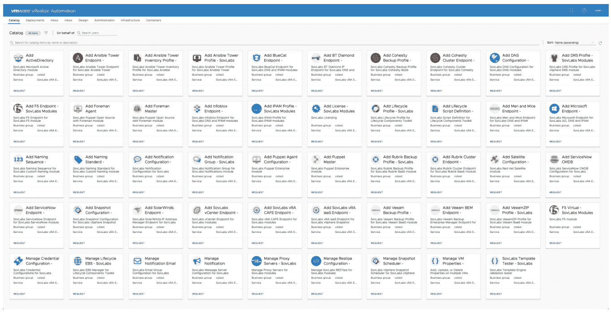

# CloudBolt 收购 SovLabs 推进混合云战略

> 原文：<https://devops.com/cloudbolt-acquires-sovlabs-to-advance-hybrid-cloud-strategy/>

CloudBolt Software 本周宣布它已经[收购了 SovLabs](https://www.globenewswire.com/news-release/2020/06/02/2042256/0/en/CloudBolt-Software-announces-acquisition-of-SovLabs-to-help-enterprises-simplify-their-hybrid-cloud-journey.html) ，SovLabs 是一个框架提供商，它扩展了 VMware 自动化框架的范围。

公司首席执行官 Jeff Kukowski 表示，作为云管理平台的提供商，SovLabs 框架将 CloudBolt 的触角延伸到已经投资了 VMware 自动化工具的 VMware 环境中。

Kukowski 说，随着 IT 环境越来越广泛地分布在一系列平台上，对能够使 IT 团队集中管理多个云计算环境的平台的需求也在增加。将 SovLabs 添加到 CloudBolt 产品组合将更容易弥合云计算平台和基于 VMware 实现标准化的企业内部 it 环境之间的鸿沟。

CloudBolt 一直在努力[使 IT 团队能够通过他们采用的任何 IT 自动化框架](https://containerjournal.com/topics/container-management/cloudbolt-software-simplifies-kubernetes-deployments/)调用其云管理框架，包括 Terraform 等工具。Kukowski 说，目标是减少 IT 组织依赖他们自己的定制代码来实现这一目标的需要。

总的来说，在新冠肺炎疫情带来的经济衰退之后，许多 IT 组织现在都在集中管理多个 IT 环境方面投入更多资金，作为降低 IT 总成本的努力的一部分。这种转变正在加速向混合云计算模式的过渡，这需要更多地依赖 IT 自动化。

许多组织面临的挑战是，企业 IT 环境往往存在许多 IT 自动化孤岛。CloudBolt 正在寻求一种策略，使 IT 团队能够扩展这些自动化孤岛或直接访问 CloudBolt 来管理混合云计算环境。

CloudBolt 方法为 IT 团队提供了依赖单一平台供应商实现混合云计算的替代方案。例如，VMware 一直在论证在多个云上部署 VMware vSphere，而不是依赖云服务提供商提供的虚拟机。大多数大型云服务提供商同时在内部 IT 环境中部署其平台实例，这些环境可以作为公共云的扩展进行管理。

现在说这场争夺混合云计算控制权的大战将如何收场还为时过早。然而，CloudBolt 认为，与其局限于单一平台，许多 IT 组织更愿意奔向某个中立地带，部署能够管理多个云和内部 IT 环境的控制平台。

当然，CloudBolt 并不是唯一的云管理平台提供商。随着对混合云计算的兴趣开始超越理论，混合云管理平台提供商之间的竞争正在升温。无论选择哪条前进道路，历史都表明，未来几个月，大多数 IT 组织都将寻求对其 IT 环境的更多控制。