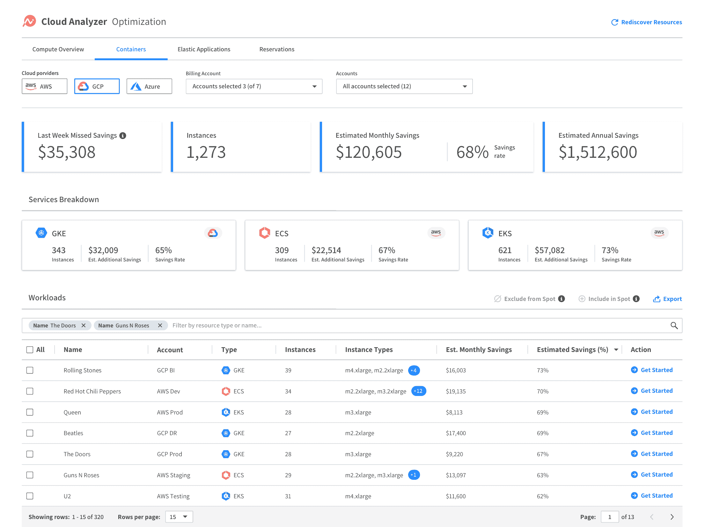

# NetApp 收购 Spot 以控制云成本

> 原文：<https://devops.com/netapp-acquires-spot-to-rein-in-cloud-costs/>

NetApp 本周宣布,[收购了 Spot](https://www.netapp.com/us/company/news/press-releases/news-rel-20200603-954373.aspx), Spot 是一家服务提供商，可帮助 it 团队不断优化云工作负载的成本。

NetApp 高级副总裁兼公共云服务总经理 Anthony Lye 表示，Spot 服务基于应用程序编程接口(API ), IT 团队将该接口添加到每个应用程序工作负载中。然后，该 API 定期调用 Spot，Spot 利用算法来确定工作负载应该在何时以及在何种类型的实例上运行，以降低云成本。

然后，spot 服务将在亚马逊网络服务(AWS)、微软 Azure 或谷歌云平台(GCP)上的按需、预留和 Spot 实例之间自动移动工作负载。它不是为跨不同云服务套利而设计的；相反，它优化了 it 团队决定在其上部署工作负载的任何云平台上的计算资源分配。

Lye 说，云计算往往比内部 IT 环境更昂贵，因为 IT 团队没有实时优化云平台成本所需的工具。开发人员通常以编程方式在云中部署工作负载，而不了解使用一个服务层与另一个服务层的许多含义。即使他们意识到了成本，大多数 IT 团队也没有为他们提供做任何事情所需的工具。事实上，人们通常认为 it 运营团队在监控云环境时会找到一些优化成本的方法。

然后，在月末，IT 运营和财务团队收到云服务提供商的账单，该账单几乎无法辨认，无法确定哪些工作负载在何时消耗了何种级别的计算资源。Lye 说，在没有 Spot 服务的情况下，IT 团队最大的希望是一份分析报告，提供如何在事后优化云实例的建议。

Lye 表示，NetApp 将 Spot 视为其优化云存储资源消耗方法的补充，通过在公共云上部署其软件来管理这些资源。总的来说，这些产品使 IT 团队能够解决现已成为企业中最大的一项成本。

此外，Lye 指出，spot 可以在执行服务级别协议(SLA)方面发挥关键作用，因为除其他外，它可以自动检测虚拟机的 Spot 实例何时离开。然后，它会自动启动更多实例，以确保工作负载保持可用。

关于云计算真实成本的争论已经持续了多年。最初，大多数云服务提供商声称云平台比内部 IT 环境便宜，因为计算资源是按消费付费的。事实证明，对于运行时间有限的工作负载来说确实如此，但在大多数情况下，运行时间较长的工作负载在云中运行的成本更高。

随着新冠肺炎疫情的出现，组织希望通过云来部署更灵活、更具弹性的云原生应用程序，这使得许多内部 IT 环境更难访问，关于成本的辩论再次爆发。虽然组织需要更灵活的 IT 方法，但在疫情带来的经济衰退之后，他们同时也在努力降低 IT 的总成本。

现在说 It 组织将在多大程度上接受持续优化以及持续集成(CI)和持续交付(CD)还为时过早。然而，考虑到当前的经济环境，云成本优化将成为大大小小的 it 团队关注的主要领域，现在的问题更多的是何时，而不是是否。