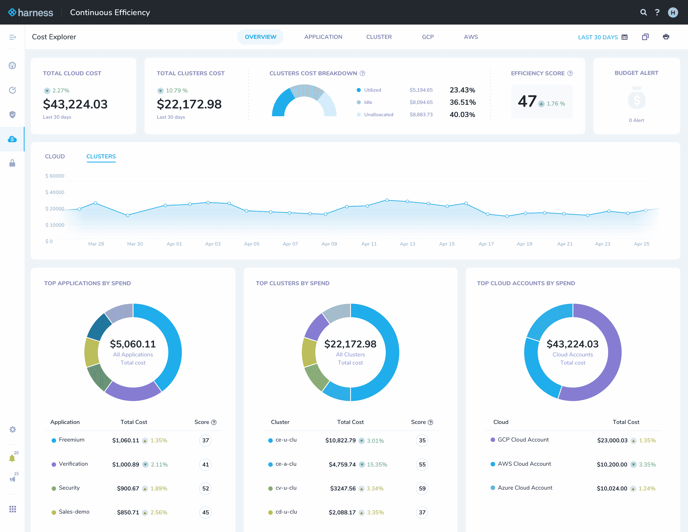

# 利用使开发运维团队能够控制云成本

> 原文：<https://devops.com/harness-enables-devops-teams-to-rein-in-cloud-costs/>

Harness today 展示了其持续效率应用程序，使开发运维团队能够利用其作为服务交付的持续交付平台[监控在公共云上部署应用程序的成本](https://www.prnewswire.com/news-releases/harness-democratizes-cloud-cost-data-for-engineering-teams-with-continuous-efficiency-301072657.html)。

公司首席执行官 Jyoti Bansal 表示，在许多 IT 组织中，云成本正在失控，因为 DevOps 团队无法了解在不同云上部署应用程序的真实成本，也无法了解云服务提供商提供的特定服务层。

持续效率为 DevOps 团队提供了按云提供商、云服务、应用程序、微服务和环境以及 Kubernetes 集群、命名空间、工作负载、节点和 pod 细分的成本明细。

Bansal 表示，这种能力对于希望确定未充分利用的资源的组织来说至关重要，这些资源目前通常只有在云服务提供商提交月度账单时才会意识到。即便如此，DevOps 团队主动优化云环境以最大限度降低成本也为时已晚。

他指出，事实上，目前很难将云服务提供商提交的每月账单与可能消耗该基础架构的特定应用服务相关联，并补充说，持续效率是专门为开发运维团队而不是财务团队设计的。

Bansal 说，随着新冠肺炎疫情带来的经济衰退，DevOps 团队面临着前所未有的降低云成本的压力。云不仅成为开发运维团队最大的支出，而且在组织不确定下个月能够产生多少收入时，IT 主管也需要更好地预测成本。他指出，DevOps 团队可以将云视为免费资源的日子已经过去了。

Bansal 补充说，测试持续效率的测试客户已经能够实现高达 500，000 美元的年化云成本节约。

Harness 正在利用其持续交付服务来自动发现云成本，而无需 IT 团队手动标记云资源。作为一个以服务形式访问的 CD 平台，Harness 能够代表其客户实时汇总所有数据。Harness 平台支持亚马逊网络服务(AWS)、微软 Azure 和谷歌云平台，包括这些服务提供的基于 Kubernetes 的服务。

就像 IT 环境的其他部分一样，Bansal 说，管理云成本的责任将越来越多地转移到 DevOps 团队。作为这些服务的主要消费者之一，开发运维团队通常对云服务的消费最不稳定。很多时候，开发人员为了方便起见在公共云上保留了虚拟机实例，但实际上并没有使用，这导致了成本的增加。当许多组织深切关注现金流时，对这种行为的容忍度迅速下降到接近于零。

当然，云计算环境的合理规模是不可避免的。发生变化的是，当前的经济环境已经将合理规模从仅仅是期望的目标转变为绝对的要求。