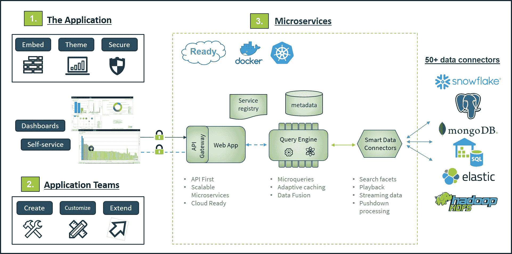

# Logi Analytics 简化了仪表板开发

> 原文：<https://devops.com/logi-analytics-simplifies-dashboard-development/>

Logi Analytics 推出了一款工具，该工具有望简化应用程序中交互式仪表盘和数据可视化的设计、构建和嵌入。

公司首席执行官 Steven Schneider 表示 [Logi Composer](https://www.globenewswire.com/news-release/2020/06/10/2046263/0/en/Logi-Analytics-Launches-Industry-First-Out-of-the-Box-Embedded-Analytics-Development-Platform.html) 有助于在 DevOps 工作流的上下文中轻松创建数据可视化。

他说，基于 Logi Analytics 去年通过收购 Zoomdata 获得的技术，Logi Composer 使 DevOps 团队能够为最终用户创建交互式自助仪表板，作为基于 Docker containers 的微服务架构的一部分。

为了帮助实现这一目标，Logi Composer 包括对一系列智能数据连接器的支持，这些连接器被构造为一组访问数据库和其他东西的微服务。

Schneider 表示，随着应用程序的发展，开发人员越来越多地被要求在其应用程序中嵌入商业智能(BI)功能。然而，他指出，大多数最终用户不希望将数据转移到单独的 BI 应用程序中来分析趋势，因为这些数据可以在他们已经使用的应用程序中更容易地呈现出来。

他说，挑战在于找到一种方法，为开发人员提供一套以模块化方式构建自助可视化的工具，使他们更容易构建、维护和更新。

当然，开发人员多年来一直在为应用程序添加可视化功能。Schneider 说，但是大多数可视化并不允许终端用户查询数据——用户现在希望能够用现代应用程序在更深的层次上操作可视化。

Dresner Advisory Services 最近发布的一项[市场研究发现，62%的受访者认为自助 BI“至关重要”或“非常重要”联合市场研究](https://www.globenewswire.com/news-release/2020/04/30/2025274/0/en/Dresner-Advisory-Services-Publishes-2020-Self-Service-Business-Intelligence-Market-Study.html)发布的另一份[报告估计，到 2023 年，嵌入式分析市场的收入将超过 600 亿美元。](https://www.globenewswire.com/news-release/2020/06/01/2041391/0/en/Global-Embedded-Analytics-Market-to-Reach-60-28-Billion-by-2023-AMR.html)

数据可视化是每个数字业务转型计划的一个重要方面。随着组织在新冠肺炎疫情之后寻求数字化更多的流程，对应用程序中更强大的数据可视化功能的需求变得更加迫切。如果没有可视化工具的帮助，大多数最终用户无法理解大量的数据。

尚不清楚在应用程序中嵌入 BI 功能会对独立的 BI 应用程序产生什么影响。总有一些分析师想要从多个应用程序源中提取数据来分析趋势。然而，大多数用户可能在一个应用程序中满足他们的 BI 需求，该应用程序包括在需要时引入外部数据的连接器。不包含数据可视化功能的应用程序不太可能被用户广泛使用。

最终，嵌入式数据可视化将减少对电子表格和独立 BI 应用程序的依赖。然而，像大多数最终用户行为的实质性变化一样，这种文化转变可能还需要一段时间。

与此同时，DevOps 团队应该会看到更多的分析功能嵌入到应用程序中。现在的挑战是找到一种方法，在更大的应用程序开发项目的环境中简化这些模块的开发和部署。