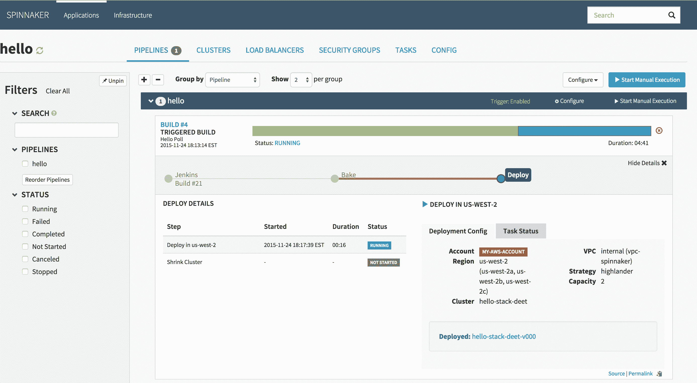

# CD 基金会吹捧 Spinnaker 的 CD 进展

> 原文：<https://devops.com/cd-foundation-touts-spinnaker-cd-progress/>

在今天的在线 [Spinnaker Live](https://events.linuxfoundation.org/spinnaker-live/) 活动上，持续交付(CD)基金会透露，自从网飞去年年底做出贡献以来，开源 CD 平台正在获得显著的发展势头。

2020 年第一季度，平均每月有 842 个合并的 pull Spinnaker 请求。去年共有 1，183 名参与者参与了该项目，其中 40%的参与者在第一季度参与了该项目。自第一季度以来，该项目每周至少增加两名新的贡献者。

CD 基金会外联委员会主席兼 Armory 社区主任 Rosalind Benoit 是 Spinnaker 企业版的提供商，他表示，Spinnaker 增加的大部分贡献来自亚马逊网络服务(AWS)，云服务提供商已经使用它来协调跨多个平台的软件交付。

Benoit 说 Spinnaker 代表了最终解决大多数组织难以解决的 CD 问题的努力。尽管持续集成(CI)是一个已经解决的问题，Benoit 说 CD 仍然是个问题。企业 IT 环境中部署的每个平台代码都是一片雪花；Benoit 说，因此，在跨不同平台的代码交付自动化方面没有取得多大进展。

她指出，Spinnaker 的目标是为 CD 创建一个基础，实现云计算原生计算基金会(CNCF)对 Kubernetes 的支持。CD 基金会和 CNCF 都是 Linux 基金会的分支。

去年，[CD Foundation 成立](https://devops.com/the-linux-foundation-launches-continuous-delivery-foundation/),旨在推动 Spinnaker 和 Jenkins(一个开源 CI/CD 平台)的开发和采用；Jenkins X，一个自以为是的开源 CI/CD 平台；Tekton 是一个用于创建 CI/CD 组件的开源项目和规范。

虽然许多 DevOps 团队尝试使用 Jenkins 解决 CD 挑战，但进展并不均衡。Spinnaker 是由网飞专门开发的，使用一个可以与任何 CI 工具集成的框架来跨多个云自动交付软件。因此，它在 CI 结束和 CD 开始之间提供了一条更清晰的界限。

从历史上看，大多数应用程序代码都是从 CI 工具推出到部署平台的。随着 Spinnaker 和 Kubernetes 等其他云原生平台的不断发展，从 CI 工具中提取映像以实现 CD 目标的过程将变得更加自动化。

目前还不清楚 DevOps 平台提供商对 Spinnaker 的支持程度。除了 Armory 之外，CD 基金会的成员还包括 CloudBees、CircleCI、Google、华为、IBM、JFrog、网飞、GitLab、Harness、Puppet、Rancher Labs、Red Hat、SAP 和 Sysdig。AWS 尚未正式加入 CD 基金会。然而，这些供应商中很少有人详细说明他们打算如何将 Spinnaker 集成到各自的平台中。

与此同时，DevOps 团队应该密切关注最佳 CD 实践将如何与现有 CI 流程一起发展，因为很明显，他们持续的 DevOps 冒险的下一个主要阶段现在才刚刚开始。