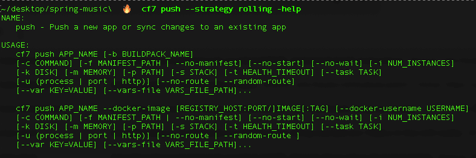

# Cloud Foundry Foundation 更新 CLI 以扩展 DevOps 流程

> 原文：<https://devops.com/cloud-foundry-foundation-updates-cli-to-extend-devops-processes/>

Cloud Foundry Foundation (CFF)今天发布了其命令行界面(CLI)的更新，这将使 DevOps 团队能够在开源平台即服务(PaaS)环境中构建跨多个流程的更精细和复杂的工作流。

在 [Cloud Foundry 北美峰会](https://www.cloudfoundry.org/events/summit/)上发布的第 7 版 Cloud Foundry CLI 采用了对通过 Cloud Foundry PaaS 公开的应用编程接口(API)的更新，以调用包、droplet、构建和流程控制资源，同时添加 sidecars、清单和部署等资源。

对 CLI 和相关 API 的更新将使滚动应用程序部署、在同一容器中运行多个流程以及向对象添加元数据成为可能。

CFF 执行董事 Chip Childers 表示，大多数采用云计算平台即服务(PaaS)的组织在实施最佳开发运维实践方面已经相当先进。CLI 的最新版本将使得在 PaaS 环境中收紧 DevOps 反馈循环成为可能。

总的来说，CFF 将 Cloud Foundry PaaS 环境定位为在传统虚拟机和 Kubernetes 集群上构建和部署应用程序的通用框架。CFF 已经启动了一个孵化项目，名为 kube cf T1，可以在 Kubernetes 上部署 Cloud Foundry 运行时的虚拟实例。与此同时，CFF 已经推出了[项目 Eirini](https://containerjournal.com/topics/container-ecosystems/cff-certifies-kubernetes-as-diego-alternative/) ，这是另一个孵化项目，可以让 Kubernetes 取代 Cloud Foundry 调度程序，以及 Quarks 项目，可以使用容器打包 CF 应用程序运行时。

CFF 还为 Kubernetes (cf-for-k8s)推出了 [Cloud Foundry，这是一项更加雄心勃勃的努力，旨在用 Kubernetes 基金会取代 PaaS 环境的基础。这一举措应该会导致云铸造需要部署更少的 IT 基础设施。CFF 还致力于采用其他云原生技术，如 Istio 服务网格。](https://www.cloudfoundry.org/blog/cloud-foundry-becomes-more-kubernetes-native-with-cf-for-k8s/)

作为这项工作的一部分，CFF 为自动化其 PaaS 部署而创建的 Bosh 框架最终也将被针对 Kubernetes 环境优化的框架所取代。

Childers 说，现在很清楚，Kubernetes 将成熟到支持企业级应用程序开发环境所需的水平。Childers 说，现在的机会是 VMware、SUSE 和其他 IT 供应商提供一个应用程序开发环境，使开发人员在云原生基础设施上比任何其他人都更高效。

例如，VMware 今天正在基于 cf-for-k8s 项目为 Kubernetes 提供 VMware Tanzu 应用程序服务的公开测试版。

CFF 项目的捐助者显然在努力弥补失去的时间。竞争对手 PaaS 环境，如 Red Hat OpenShift，早已与 Kubernetes 集成。然而，CFF 社区认为，一旦更多的企业 IT 组织发现他们已经依赖的 PaaS 环境的各种发行版可以在 Kubernetes 平台上使用，他们就会接受 Kubernetes。

无论选择哪条道路，有一件事是清楚的，那就是云铸造平台即服务(PaaS)将变得越来越容易被那些以前在整体规模上犹豫不决的组织所利用，不管他们的开发者体验有多好。