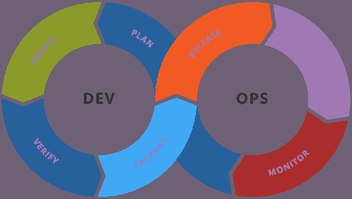

# 为什么可追溯性应该是 DevOps 优先考虑的 3 个原因

> 原文：<https://devops.com/3-reasons-why-traceability-should-be-a-devops-priority/>

***devo PS 中的可追溯性是关于确保清晰性、责任性和为客户提供最好的最终产品*** 

谈到移动 DevOps，需要考虑很多问题。首先，不同团队的成员之间需要有效的合作，也许甚至可以通过针对远程工作人员的团队协作软件。有这么多的人在开发运维上工作，有些人很容易变得孤立于他们的同事之外，阻碍交流并破坏团队合作。

然后还有一个更广泛的问题，那就是开发战略，决定一个愿景，设定目标，并想出如何衡量你的成功(或者其他，视情况而定)。你的策略的核心是可追溯性。你可能已经见过这个术语几次了。它在商业世界的其他地方也很常用，尤其是在供应链方面。基本上，它的意思是在生产过程的每个阶段跟踪商品或产品。

产品的整个生产和销售历史的记录被保存，以便任何问题的来源可以在以后被确定和处理。因此，可追溯性确保了供应商能够在产品召回事件中迅速果断地采取行动。

可追溯性的另一个优点是它提供了额外的透明度，这有助于保持消费者的信心。随着消费者越来越意识到产品是如何采购和制造的，这现在是一个重要的考虑因素。它让消费者放心，制造商和供应商意识到他们的担忧，并为他们的最大利益着想。

那么，您已经可以看到，这在很大程度上也适用于移动开发运维。DevOps 中的可追溯性是关于确保清晰性、责任性和为消费者提供最好的最终产品。但这在 DevOps 中尤为重要，因为速度至关重要——不断有压力将应用程序开发出来，送到用户手中，然后尽快整合反馈。不言而喻，这会导致原本可以避免的疏忽和失误。

此外，DevOps 团队通过在他们的团队中允许更大的分散和自治来寻求加速这个过程。这背后的逻辑是，它允许更快的交付和部署。屏幕共享解决方案和其他类似的技术解决方案有助于促进更密切的合作。然而，这种控制的放松仍然会在开发过程中产生一些潜在的混乱。这可能会使开发人员和测试人员之间保持一致的协调更加困难，等等。

这里我们将列出为什么可追溯性应该是 DevOps 优先考虑的三个关键原因。所有这些都是基于开发团队的经验和他们遇到的挑战。

## 减少缺陷

正如我们已经讨论过的，更快的软件部署和反馈的压力可能会使某些错误更有可能得不到快速或有效的解决。我们还注意到，漏洞百出的应用程序会通过提供劣质和不可靠的用户体验对公司的声誉造成很大损害。

这可能会产生严重的影响——毕竟，消息传得很快，尤其是在社交媒体上。因此，采取一切可能的措施来确保您的软件尽可能平稳可靠地运行是符合您的利益的。

经验强烈表明，你的可追溯性过程越严格，你的应用程序就越不容易出错。您捕获的可追溯性信息的完整性在这里非常重要。

因此，例如， [EMR 软件开发人员](https://spdload.com/blog/how-to-build-ehr-eml-software/)将从更完整的可追溯性信息中获得巨大价值，因为这将有助于降低可能的缺陷率。详细的可追溯性和缺陷率之间的这种关联有助于产生更可靠的应用程序，并通过消除可避免的错误和缺陷来提高效率。你应该在适当的时候主动征求用户的反馈，并将其整合到你更广泛的[客户支持](https://blog.hubspot.com/service/sms-customer-support)包中。

## 确保合规

在其他行业，全面的可追溯性通常是监管机构设定的要求。这样，在产品需要召回的情况下，可以重新检查整个供应链，并发现问题的原因。例如，自《普通食品法》于 2002 年生效以来，在欧盟运营的食品和饲料企业就必须遵守强制性的可追溯性要求。同样，在 DevOps 中，开发人员必须考虑法规遵从性。

因此，健壮和详细的可追溯性有助于跨各种行业工作的 DevOps 公司努力遵守。许多行业都与此相关，无论是金融服务(众所周知的监管雷区)、[人力资源软件](https://www.bamboohr.com/blog/10-benefits-of-hr-software/)、保险或公共部门承包商和医疗保健公司，其中任何一个行业都可能受到严格的可追溯性要求的约束。

跟踪代码是遵从框架中坚持的一个常见的先决条件。例如，除非您能够为应用程序源代码中的每个代码变更提供完整的证据说明，否则您将无法完成 [SOC 2](https://www.itgovernance.co.uk/soc-reporting) 流程完整性要求。

## 提高速度而不牺牲质量

我们已经讨论过如何在 DevOps 中实现微妙的平衡。这是软件推出速度和性能可靠性之间的平衡。我们也注意到不同部门日益增加的自主性会妨碍它们之间的协调；从而在速度和推广方面提供了一些好处，但通常是以最终产品的可靠性和质量为代价的。因此，这里的关键是找到一种穿针引线的方法，确保应用程序可以在保持严格标准的同时以一致的速度快速生产。

这就是可追溯性的来源。这不仅有助于提高速度，也有助于提高标准。它允许开发人员更快地执行任务，同时提高他们执行任务的标准。

这对整体效率水平也有积极影响，释放资源(即团队成员)以承担可能需要他们的其他任务。例如，开发联络中心软件的工程师可以根据需要重用或修改现有代码，从而从维护更好的代码中获益。

这里值得再次注意的是，从法规的角度来看，需求到代码的可追溯性可能是强制性的。这取决于你工作的行业。但即使不是，也是值得做的事情。它可以带来全面的显著改进，留下更清晰、更高效的流程，提高您的团队绩效，让客户和消费者受益，最重要的是，为您的底线带来真正的收益。

考虑到所有这些，那么，你需要考虑如何实现 DevOps 的可追溯性。当然，当引入可追溯性过程时，您必须真正小心谨慎地去做。对实现过于草率可能会产生瓶颈，从而加剧甚至导致问题，否则可追溯性应该有助于解决这些问题，并降低生产的整体速度。

因此，要确保以一种认真对待开发人员需求的方式来实现可追溯性。首先，起草一份指南文件，为开发人员提供清晰简明的解释，说明对他们的期望。概述可追溯性过程及其与关键目标的关系。此外，在选择用于可追溯性目的的工具时，给开发人员一些自主权。举例来说，您可能会精明地使用[自动化](https://devops.com/automation-achieving-faster-rollouts-better-accuracy/)(比如自动代码检查)。这应该有助于每个人获得可追溯性的回报，并避免任何不必要的实现中断。