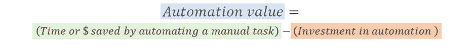
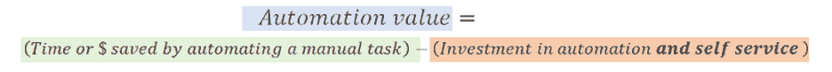
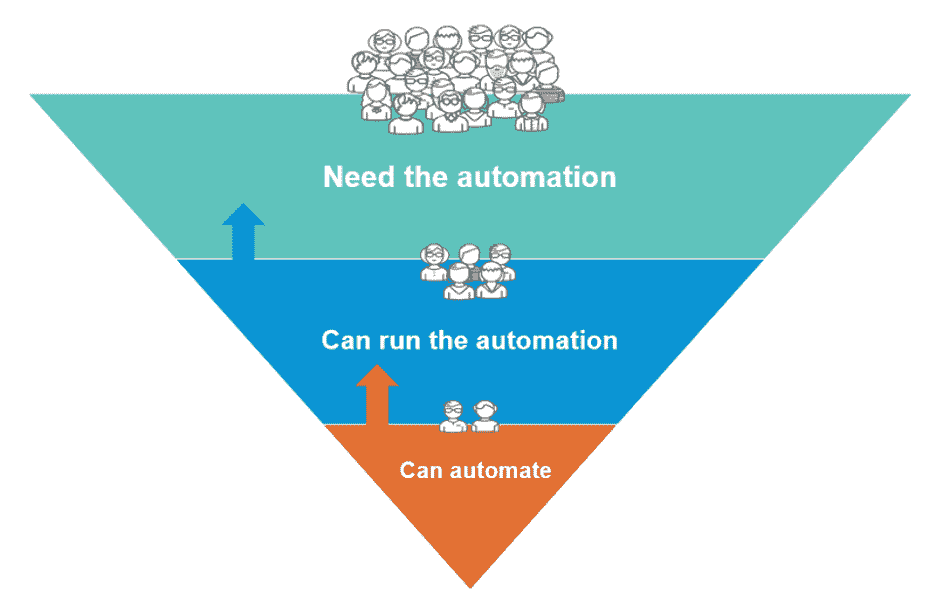
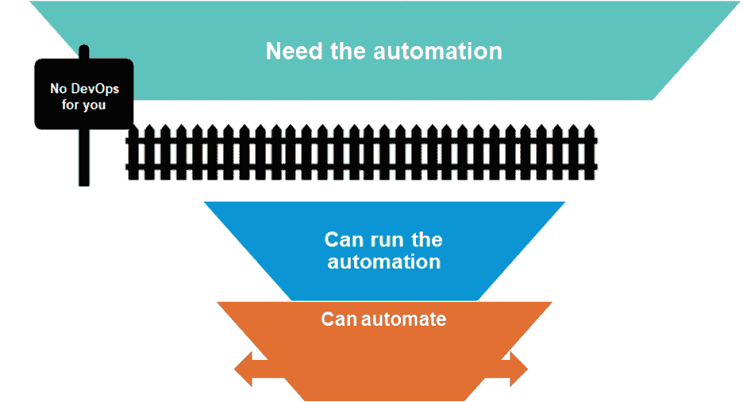
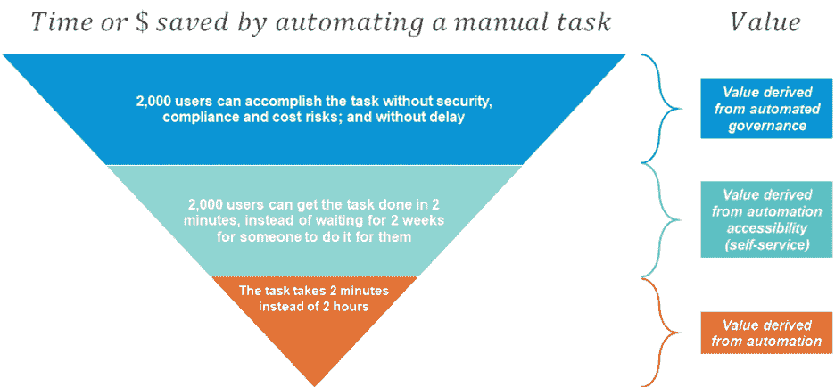
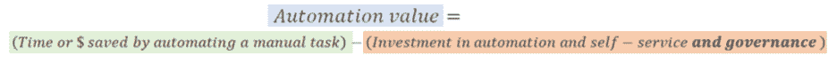
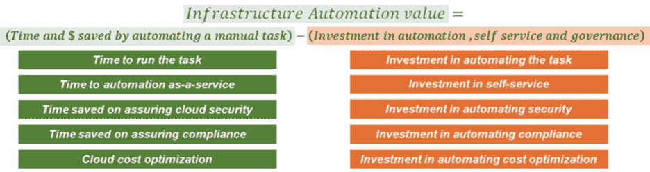

# 如何计算基础设施自动化的投资回报率

> 原文：<https://devops.com/how-to-calculate-roi-on-infrastructure-automation/>

基础设施和云自动化。你知道你想要它。代码基础设施和[可编程基础设施](https://www.quali.com/faq/#What-is-Programmable-Infrastructure)是最近的热门话题。将软件开发实践应用于基础设施所带来的可能性，使得透明基础设施的愿景比以往任何时候都更加接近。

但是在你开始自动化之前，你可能想看看你从投资中得到的价值，并确保你的计划是有意义的。在自动化领域工作了十多年之后，我一次又一次地看到了清楚理解自动化价值的重要性。该是我写关于计算基础设施自动化的投资回报(ROI)的时候了。但是在讨论基础设施和云自动化的细节之前，从自动化的一般价值入手可能是明智的。

## 自动化的价值

等式很简单。你有一个漫长的手工过程。你想办法让它自动化。哒哒！曾经需要两个小时的事情现在只需要两分钟。你节省了甜蜜的 118 分钟。如果您非常频繁地运行这个可爱的自动化程序，其价值会成倍增加。每天节省 118 分钟 10 次是很有意义的。像魔法一样。

## 价值公式

自动化价值的计算公式非常简单:

### 

## 通过自动化手动任务节省的时间或金钱

通过自动化手动任务节省的时间或金钱应该包括您可以归因于自动化的任何好处。以下是一些例子:

1.  自动化完成一项复杂任务所节省的时间(这个过程需要八个小时。自动化在八分钟内完成。现在可以更经常的做了)。
2.  为过去手动操作的人节省的时间(过去手动操作的人现在有八个小时的空闲时间，而自动化完成了这项工作)。
3.  等待任务完成的人节省的时间(过去等待任务完成需要八个小时的人，现在只需要八分钟；他们可以做得更多)。
4.  由于不犯人为错误而节省的时间(过去花 10 个小时排除故障的人在 8 个小时完成后节省了 10 个小时)。
5.  不必记录手动过程而节省的时间(两个人每月花五个小时教其他人如何做八个小时的事情……)。

## 自动化投资

对自动化的投资往往被天真地计算为对*建设*自动化的投资，但对自动化的真正投资还包括*维护*和*支持*你已经建成的东西。因此，如果有人告诉你花了五分钟就完成了这个小小的 Bash 脚本，问问自己更新它并永远支持它会是什么样子(当有 300 多个这样的脚本时)。您对自动化投资的计算必须包括构建、维护和支持您的自动化。

## 我应该自动化什么？

这个公式让你很容易决定你的自动化目标应该是什么——或者，换句话说，你会在自动化中找到**最大的价值。**

一个好的开始是寻找那些需要花很长时间手工完成的任务或者那些经常完成的任务，因为自动化将会节省更多的时间和金钱。但是你需要确保在自动化方面的投资能够补偿收益。

我希望每次和那些想自动化“最困难的任务”的人交谈时，我都能得到一块钱，以证明自动化的价值。这就遵循了逻辑，“如果你能做最难的事，你也能做最简单的事。”—有点像在纽约制作。但这不是自动化的工作方式。为什么？因为自动化非常像软件开发。

在软件开发领域，当产品团队问开发人员“有可能实现特性 X 吗？”时，他们得到的最常见的答案之一是就是:“一切皆有可能。只是努力的问题。”

嗯，自动化也是一样的(这并不是软件产品开发的唯一相似之处)。

几乎所有事情都可以自动化。问题是这是否值得。

如果你把手工需要一整天才能做的事情自动化了，但是你一年只需要做一次，那可能就不值得自动化了。

你可以自动化最愚蠢的事情，只节省 20 分钟，但这种事情每天发生 2000 次，所以这很可能是值得的。而且自动化越蠢越好。

## 现实生活中的基础设施自动化

回到价值公式。在现实生活中，这个公式有更多的方面。影响您从自动化中获得的价值的因素之一是有多少人可以访问它。

你可以自动化一些每天可能运行 2000 次的东西；就价值而言，这可能会改变游戏规则。但是，如果这是 2000 个不同的人需要做的事情，那么还有一个问题是**你的自动化有多容易实现**。

让您的自动化由其他人顺利运行并不总是小菜一碟(“您的问题是什么？！在 git 里面！是的，你只是从那里得到它。我会把链接发给你。你没有用户？获取一个用户！你不能运行它？当然不能，需要一个运行时。只要得到运行时间。自述里都有！哦，等等，版本不在自述文件里。获得 3.0，它只适用于 3.0。哦，你编辑了配置文件，对吗？”).

在计算通过自动化手动任务节省的时间或金钱时，需要考虑自动化可访问性带来的价值:

参与的人越多，分布越广，就越难实现无障碍。因此，您对自动化投资的计算也应该包括对自助服务的投资:

## 添加自助服务

当考虑自动化的价值时，等式中的自助服务部分经常被忽略，尤其是当关注点非常技术性时。如果你能自动完成一项任务，展现价值承诺是非常容易的，当自助服务的问题浮出水面时，可能已经太晚了。

这在基层自动化中很常见。在我的领域，我一次又一次地看到团队采用免费的基础设施自动化工具(Ansible、Terraform、Cloudformation、ARM，等等)。在 2020 年，大多数人都明白没有免费的午餐，开发和维护这种自动化需要宝贵的时间。大多数人已经意识到，随着时间的推移，支持 it 会导致自动化团队经常忙得不可开交。

但是我敢说，很少有人正确估计将这种自动化作为服务提供给其他团队有多困难。我不怪他们。对于工程师来说，“这太慢了！“我将自动完成它”是非常自然的。作为开发者，很难想象一个用户*不*理解 Terraform 的美丽功能；一听到“在 GitHub 里”就僵住的人；有人对代码的优雅不感兴趣，也不知道如何处理代码。

在一个有多个团队的公司里，能够自动化的人和需要自动化的人之间的差距是巨大的。如果你忽略它，你的自动化价值公式可能会非常倾斜。

## 每个人都能运行这个自动化吗？

当你考虑自动化时，技术问题是，“它能自动化吗？”是不够的。代码的效率如何，或者构建自动化需要多少时间，也是不够的。

问题是，“所有相关用户能否将它作为其工作流程的一个无缝部分来运行？”必须被询问和权衡。你可能会感到惊讶，但是[高度可及但技术上平庸的自动化](https://devops.com/solving-the-automagical-apps-automation-problem/)实际上在某些情况下可以胜出。

## 价值等式在 RPA 中的工作原理

机器人流程自动化(RPA)就是一个很好的例子。RPA 系统通常通过记录用户在图形用户界面上执行的任务来为用户提供自动化操作列表。

对于许多编码人员和自动化专业人员来说，这种方法几乎是亵渎神明的。您可以快速实现自动化，但是扩展这项技术非常有限。它让广大读者能够在不强制执行编码最佳实践的情况下实现自动化任务(我们已经知道大众不可能是自动化专家)。但是 RPA 在某些情况下可以提供很高的 ROI。如果我们回到价值公式，这种快速和肮脏类型的自动化是高度可及的，因此自助服务的投资是低的。如果使用 RPA 意味着 x100 或 x1000 人可以从自动化中受益，与只有少数人可以使用的高代码工具相比，我们可能能够获得令人印象深刻的 ROI。

这是否意味着我们应该将 RPA 用于 DevOps 自动化？不完全是。RPA 并不总是适合这项工作的工具，也不总是能在自动化方面提供最佳价值。当您想要消除小任务中的繁重工作时，RPA 工作得很好(例如，人工触发的会计任务非常流行)，但是当您有严格的规模、效率和可靠性要求时，价值较低，这在 DevOps 中很典型。

在 DevOps 的情况下，通过机器对机器的繁重接口，您在扩展和维护 RPA 方面的投资可能会非常高，而投资回报最终会非常低。因此，RPA 可能无法在该领域提供最大价值，选择更具可扩展性的选项是有意义的。但这并不意味着您应该只关注好的工程，可访问性和自助服务的问题必须在您的 ROI 计算中解决。

## DevOps 中的基础架构自动化

在过去几年中，人们越来越意识到传统基础设施自动化中的自助服务。通常由 IT 和运营部门领导，其中一些从简单的方式开始，例如将票务系统(JIRA，立即服务)连接到自动化工具。

然而，在 DevOps 基础设施自动化中，自动化的可访问性通常是事后才想到的。DevOps 自动化计划通常从开发人员开始。自然的趋势是投资于高代码自动化，并关注执行任务所节省的时间所带来的价值，而不是通过更广泛的用户基础实现的价值倍增。现有的自助服务机制被扔到了一边，理由很充分:它们太慢，并且它们不能无缝地融入 DevOps 流程。

忽视自助服务是 DevOps 计划在小范围内表现出巨大价值承诺而在大范围内失败的原因之一。

此外，由于 DevOps 跨越了如此多的主题专业知识领域，将关键专业知识留在编码人员的筒仓之外的可能性非常高——尤其是运营、安全和财务方面的专业知识。忽视这些专家对自动化的可访问性会使他们处于 DevOps 循环之外。

我很高兴看到 Gartner 在四月份发布的“[基础设施自动化工具市场指南](https://www.gartner.com/en/documents/3983695)”。如果你没有访问这些封闭内容的权限，我推荐你看看万寿之露·巴特在 T2 发的关于这个话题的帖子。Gartner 最后强调自助服务是基础架构自动化的一项关键功能:

> “基础架构自动化工具为开发运维团队提供了对标准化环境的按需自助式访问。采用这些工具增强了他们提供以客户为中心的敏捷性和速度改进的能力，同时以有限的中断消耗新技术平台。”

我认为这种对面向客户的可访问性的重要性的认可是在更大规模的 DevOps 计划中实现价值的重要里程碑。

## 基础设施自动化的附加价值因素

与一般自动化不同，基础设施自动化是一个在价值公式中有额外因素的领域，这些因素属于**基础设施治理**类别:

1.  **云安全。**
2.  **云成本。**
3.  **符合行业标准。** 

在阐述自动化带来的价值时，需要考虑这些因素。基础架构自动化，尤其是在公共云中，涉及敏感资产:计算、网络、存储、数据和安全元素。这些元素可能非常昂贵，并且非常容易受到攻击。

如果忽略了这三个因素，就会降低价值。但是在自动化中正确处理它们也可以产生价值。

因此，“通过自动化手动任务节省的时间/金钱”可以包括一个额外的价值部分:

投资计算还应该包括嵌入式治理:

## 

## 构建您的价值公式

如果您正在进行自动化计划，不要忘记您的价值公式。它将帮助你建立一个商业案例，获得管理层的认同，并更好地理解你应该关注的价值因素。

TLDR 版本:

