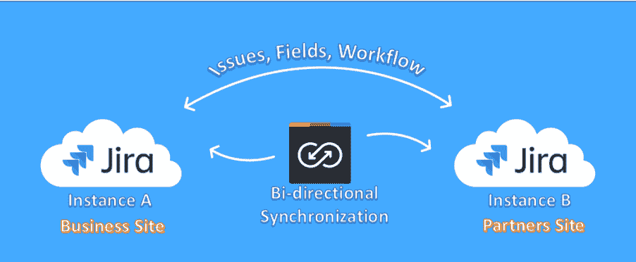
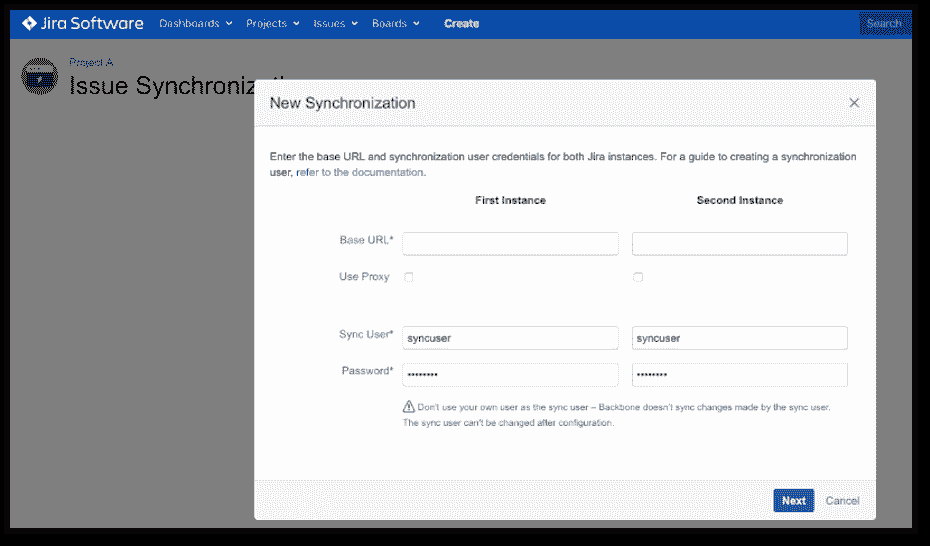
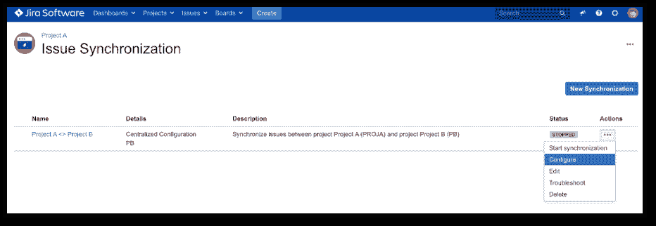
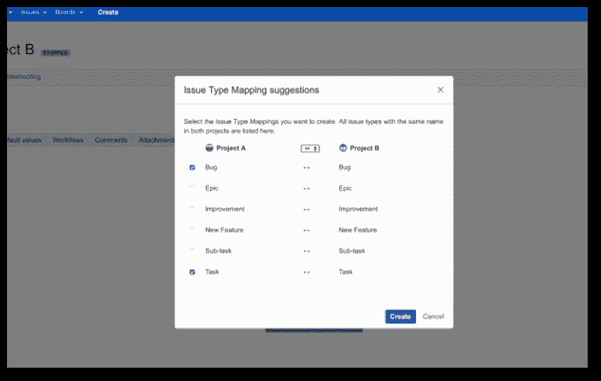

# 如何在两个吉拉实例之间同步吉拉项目

> 原文：<https://devops.com/how-to-synchronize-jira-projects-between-2-jira-instances/>

我们大多数人都知道吉拉是一款备受推崇的应用生命周期管理工具。它的一个主要特点是团队协作。然而，有时，由于网络限制，业务团队及其合作伙伴之间的协作可能会带来挑战。

在本文中，我们将了解如何解决这个问题以及可用的选项。

## 吉拉商业案例

作为外部合作伙伴，我们为一家嵌入式系统客户提供支持，该客户已经在为其内部用户使用吉拉。在此期间，客户采取了严密的安全措施，其 IT 团队无法授权我们访问其系统和工具；相反，我们不得不使用客户提供的带 VPN 连接的笔记本电脑。这种设置效率不高，导致当新的外部用户需要访问时需要更多的投资和程序，因此我们开始寻找一种替代解决方案，通过吉拉门户与每个人进行良好的合作，更有效地运营业务。

许多供应商已经将自动同步作为吉拉插件解决了这个问题。

这些插件包括:

*   主干问题同步。
*   [加速吉拉问题同步](https://marketplace.atlassian.com/apps/1213645/exalate-jira-issue-sync-more)。
*   问题同步-吉拉集成。

本文着眼于主干问题同步，以及如何在两个实例之间完成吉拉项目的同步。

## 主干问题同步

主干问题同步帮助用户同步吉拉项目，实现跨部门和 B2B 边界的协作。与其他插件相比，它的设置和配置非常简单。

主干问题同步是 K15t 小组开发的付费插件。它可以在亚特兰蒂斯市场买到。

该插件支持以下吉拉版本:

*   吉拉云。
*   从 6.2 到 8.6.1 的吉拉服务器。
*   吉拉数据中心 6.3–8 . 6 . 1。

### 主要特点:

*   吉拉项目之间的自动双向问题同步。
*   控制问题、注释、字段和附件映射。
*   地图工作流。
*   使用 JQL 定义问题同步、过滤和限制。
*   同步评论和附件。
*   定义工作流映射并指定分布式责任。
*   简单的设置、配置和管理用户界面。
*   经过企业安装验证的性能、可靠性和可扩展性。
*   完全隐私和安全控制。
*   通过 HTTP(S)、文件和电子邮件同步数据。
*   提供产品内故障排除支持。
*   合作伙伴/供应商可以同步无限的项目和问题。

让我们假设我们有一个业务团队和外部合作伙伴，他们希望每天一起处理吉拉问题，但是他们在每个团队之间有一个网络限制。

在这种情况下，我们需要建立一个单独的吉拉实例，并在两端创建一个同名的项目。

### 先决条件:

*   在两侧安装吉拉。
*   在两个吉拉实例中创建同名的吉拉项目。
*   在两个实例上创建一个名为“syncuser”的吉拉用户。
*   授予“同步用户”吉拉权限**浏览项目**、**创建问题**和**编辑问题**。

****

### 建立项目间的联系

1.  首先打开吉拉项目，然后选择“项目设置”>“发布同步”>“新建同步”。为了简单起见，选择集中式配置(这是 Backbone 的“默认”同步类型，推荐用于大多数用例)。
2.  设置同步:
    1.  首先输入您的吉拉的基本 URL，然后输入外部合作伙伴的吉拉 URL 的基本 URL。
    2.  在同步用户字段中，输入同步用户的用户名(在本例中为 Sync User)。
    3.  在密码字段中，输入同步用户的密码。
3.  在下一个屏幕上，选择要同步的项目。在两个实例中选择相同的项目名称。
4.  接下来，为同步分配一个名称和描述。为吉拉项目创建多个同步时，描述性命名对于避免混淆非常重要。现在，我们将使用默认值。

我们已经在两个不同实例的吉拉项目之间建立了联系。现在，让我们配置所有数据将在每个实例的项目之间同步。

### 配置同步设置

1.  在下面的步骤中，我们将配置同步数据，告诉 Backbone 它应该在两个实例的项目之间同步什么数据。
2.  点击…>配置，进入配置界面:
3.  单击编辑配置按钮开始配置。
4.  在“问题类型”选项卡上，单击“从简单映射开始”,然后选择要在吉拉项目的两个实例之间双向同步的问题类型。
5.  现在，在 Fields–Mappings > Start with simple Mappings 中映射应该同步的字段。
    1.  启用摘要和描述字段的复选框，然后单击创建。
    2.  单击发布草稿按钮保存配置，然后选择开始以开始同步。

现在配置了与主干问题同步的同步。

让我们验证同步:

1.  首先创建一个任务类型的新问题，并在“摘要”和“描述”字段中输入一些内容。
2.  在第二个实例中打开吉拉项目:您应该看到问题已经被同步。
3.  打开同步的问题，并在第二个实例中编辑摘要和描述。
4.  回到最初的问题:您应该看到编辑已经同步。

## 结论

主干问题同步有助于克服客户和外部合作伙伴通过受限安全网络进行协作的挑战。使用这个插件，许多高度安全的业务团队能够毫无问题地有效协作。