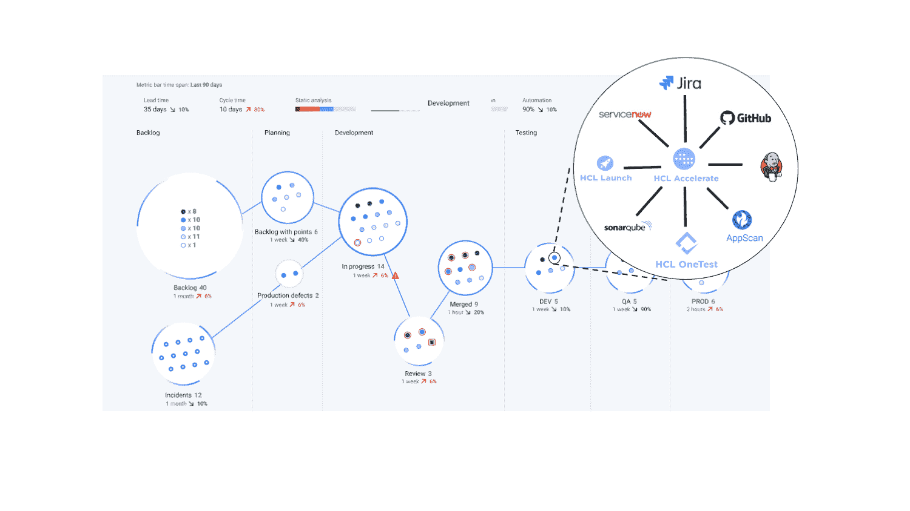

# HCL 软件扩展了 DevOps 产品组合

> 原文：<https://devops.com/hcl-software-expands-devops-portfolio/>

HCL Software 发布了 [DevOps 实践和产品组合](https://www.hcltechsw.com/news/20200622-hcl-software-introduces-devops-portfolio)以及 HCL 工具的三个更新。

HCL Accelerate 2.0 的 2.0 版为价值流管理平台增加了对策略管理和现成报告的支持，而 HCL 7.1 版的发布则自动将公司治理规则应用于持续交付平台。

HCL Software 还更新了 HCL OneTest 10.1，以包括 OneTest Server、向导驱动的测试创作环境和 OneTest Data，one test Data 是一种数据制作工具，可确保手头有正确的数据用于测试，并支持 Kubernetes 和 Red Hat OpenShift 应用程序开发和部署平台。

最后，HCL Software 正在提供 HCL Software DevOps Power Pack，它将 HCL Accelerate、HCL Launch 和 HCL OneTest 以及 40 小时的安装、配置和团队采用服务捆绑在一个产品中。

HCL 软件 DevOps 的产品管理负责人 Steve Boone 表示，目标是确保将 HCL 工具作为 DevOps 计划一部分的 IT 组织获得成功。

Boone 说，HCL 软件专注于扩展持续集成(CI)平台投资的价值。如今，大多数组织都安装了多个 CI 平台，其中一些甚至来自不同的供应商。HCL 软件产品组合使开发运维团队能够利用价值流管理软件等工具跨多个平台扩展部署流程，从而更好地管理开发运维流程。

相比之下，CI/CD 平台提供商通常提供许多相同的功能，但是这些产品针对特定的 CI/CD 平台进行了优化。

DevOps tools 的 HCL 软件组合可以追溯到 IBM，IBM 在 2018 年底将其 AppScan、BigFix 和 Lotus Notes 技术出售给 HCL。从那时起，该公司已经扩展了其产品组合，包括 DevOps 工具和服务，但它不再致力于与 IBM 同步开发这些产品。Boone 说，因此，IT 组织应该期待看到更频繁的更新。

他说，与此同时，随着组织加速多项数字业务转型计划，人们对 DevOps 工具和流程的兴趣在新冠肺炎疫情之后有所增加。作为这些努力的一部分，这些组织开始意识到对 DevOps 工具的需求，这些工具不仅仅提供基本的 CI 功能。

当然，不同的组织会以不同的速度达到一定程度的开发运维成熟度。同一个组织内的不同团队在开发运维成熟度方面有很大差异并不罕见。Boone 说，HCL Software 致力于以服务的形式提供专业知识，使组织能够最大限度地发挥任何 DevOps 投资的潜力，而不仅仅是提供软件。

尚不清楚组织希望 It 供应商在软件采购中加入专业服务的程度。然而，任何组织在开发运维流程方面越不熟练，这些服务通常就越有价值。