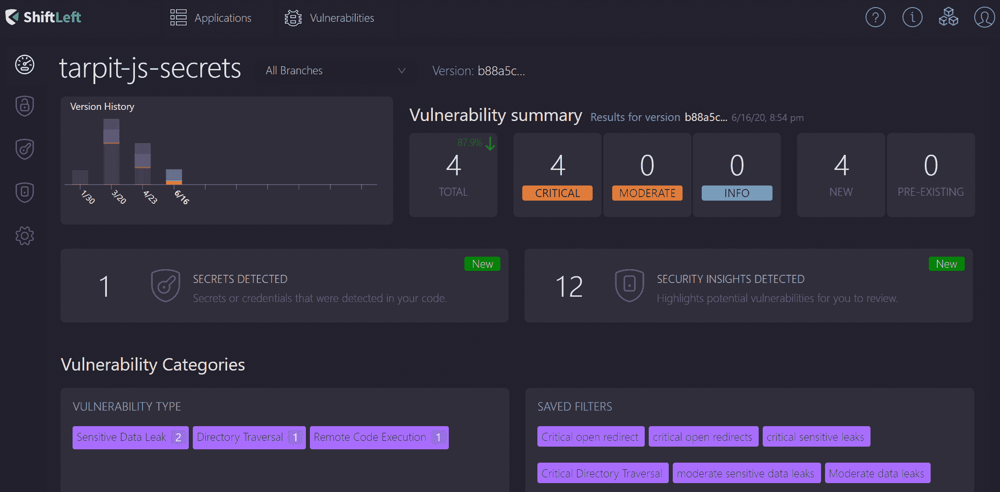

# ShiftLeft 将安全工作流引入开发运维流程

> 原文：<https://devops.com/shiftleft-brings-security-workflows-to-devops-processes/>

ShiftLeft 已经[更新了它的下一代静态分析(NG SAST)工具](https://www.shiftleft.io/press-releases/shiftLeft-announces-new-developer-focused-next-generation-static-analysis-solution-that-increases-application-security-productivity-by-5X/)，以包含专为开发人员构建的工作流。

公司首席执行官 Manish Gupta 表示，安全工作流旨在使 DevOps 团队更容易将它们纳入他们的应用程序开发和部署流程。事实上，ShiftLeft 对超过 165 名开发人员、应用安全和 DevOps 专业人员进行的调查发现，89%的受访者表示，目前开发人员和网络安全团队之间的[脱节](https://devops.com/devops-chat-devsecops-with-shiftleft-cto-chetan-conikee/)是生产力的最大抑制因素。

Gupta 说，竞争对手的静态分析工具的问题是，它们不是从头开始设计的，没有集成到 DevOps 过程中。因此，他指出，安全工作流是围绕应用程序开发流程进行管理的，而不是整合到其中。

调查发现，大多数 IT 团队在软件开发生命周期中执行安全扫描的时间太晚(90%)，当他们发现问题时，他们通常缺乏任何补救指导(88%)。

大多数现有的网络安全流程都跟不上应用程序的部署速度。调查发现，近 70%的软件开发组织每月发布多次或更多，18%的组织至少每天发布一次。

Gupta 说，NG SAST 通过在每个拉/合并请求期间自动进行代码分析，克服了这个问题。这种方法使开发人员能够像处理其他 bug 一样处理安全问题。他说，开发人员可以在安全问题出现在报告中之前，从他们的开发环境日志中修复安全问题，而不必等待应用程序安全团队的报告。

Gupta 说，生产率和应用程序质量得到了提高，因为漏洞得到了更快的修复，而有问题的代码仍然是开发人员心中最重要的。

他补充说，DevOps 团队还可以创建构建规则，根据有多少安全漏洞来接受或拒绝合并。这种能力可以防止安全缺陷在构建过程中变得过于根深蒂固，从而更容易补救。

Gupta 说，安全扫描也在部署应用程序的本地运行，这意味着源代码永远不会离开组织。这种方法还消除了为访问外部扫描服务而更新网络和防火墙架构的需要。他指出，它还减少了组织内部的瓶颈，这些瓶颈可能需要每小时进行多达 20 次扫描。

总的来说，古普塔说，开发人员的生产力提高 40 倍并不罕见，因为 ShiftLeft NG SAST 使扫描可以立即运行。他说，开发人员休息一会儿，等待安全扫描运行的日子已经过去了。

当然，对于开发团队来说，通过在应用程序开发过程中嵌入静态分析可能获得的生产力水平会有很大的不同。然而，鉴于开发人员比网络安全专业人员多几个数量级的事实，专门的应用程序安全团队显然跟不上。除非组织为开发人员提供他们需要的安全工具，否则任何组织关于实现最佳 DevSecOps 过程的雄心壮志都将仍然是一个白日梦。