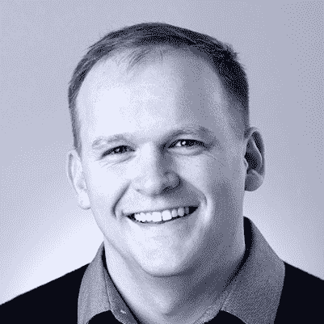

# 时间系列虚拟峰会发言人聚焦:詹姆斯总督，Sameer 法鲁克和拉斯萨维奇

> 原文：<https://devops.com/time-series-virtual-summit-speaker-spotlight-james-governor-sameer-farooqui-and-russ-savage/>

[*时间序列虚拟峰会*](https://timeseriessummit.com/) *将汇聚 InfluxData 社区成员，进行专注于时间序列数据影响的独特学习体验。该活动在虚拟现实环境中进行，将于美国东部时间 7 月 16 日上午 10 点举行。*

*Russ Savage*

*Sameer Farooqui*

*James Governor*

时间序列虚拟峰会汇集了众多时间序列专家，包括 Sameer Farooqui、Russ Savage 和主题演讲人 James Governor。

James Governor 是 RedMonk 的分析师和联合创始人。James 为开发者提供技术策略、开源以及如何提高生产力的建议。在他的主题演讲“重构和重组可观测性”中，他将解释可观测性是如何改变应用程序构建和管理的方式的。James 还将讨论这对开发人员意味着什么，以及如何利用可观察性来深入了解系统性能和用户体验。

Sameer Farooqui 是谷歌的战略云工程师。Sameer 专注于流分析，并帮助将新的流解决方案商业化，如时间序列预测和异常检测。在他的“Google Cloud 中的时间序列数据的分析和 ML”会议中，Sameer 将谈论在 Google 云平台中运行时间序列数据库的好处，以及如何利用 Google 分析工具。

Russ Savage 是 InfluxData 的一名产品经理，他主要负责为使用 InfluxDB 和 TICK 堆栈的团队启用 DevOps。Russ 将致闭幕词，总结参与和了解更多时间序列社区的方式。

在时间序列虚拟峰会上，你可以听到 James、Sameer、Russ 和更多时间序列专家的观点。要查看议程、完整的演讲阵容并进行注册(免费)，请访问 [时间系列虚拟峰会网站](https://timeseriessummit.com/) 。