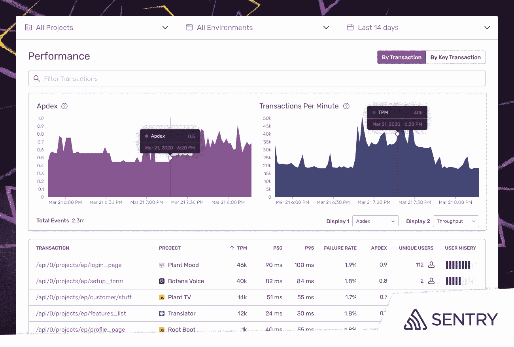

# Sentry 为平台增加了应用性能监控

> 原文：<https://devops.com/sentry-adds-application-performance-monitoring-to-platform/>

sentry[扩展了其无代理监控平台](https://sentry.io/about/press-releases/sentry-brings-performance-monitoring-to-the-developer/)的范围，现在除了显示代码中的错误之外，还可以跟踪性能问题。

公司首席执行官米林·德赛(Milin Desai)表示，IT 组织现在可以整合他们采用的监控平台数量，以降低总体成本。以前，Sentry 平台只识别应用程序中的错误。他说，Sentry 平台现在提供了 JavaScript 和 Python 应用程序整体健康状况的更全面的视图，而不需要 IT 团队在每个应用程序中安装和管理代理软件。

性能监控工具现在可以根据延迟和吞吐量数据动态跟踪应用程序响应时间。IT 团队可以分析缓慢的响应时间、交易量的增加和错误率，以诊断和修复所有性能问题。

IT 团队还可以设置阈值，以便在性能指标低于预定义的容差水平时发出警报。IT 团队还可以深入跟踪瀑布中的事务细节，以直观地突出比预期时间长的应用程序编程接口(API)调用时间。

还有一个事务摘要视图，它根据最慢的持续时间、相关问题和体验缓慢的用户数量对事务进行排序。除了衡量用户对推向生产的新代码的反应，IT 团队还可以跟踪特定的关键事务。

根本原因分析工具使识别和深入挖掘异常值和正常执行事务之间的特征差异成为可能。

最后，跟踪功能使得确定导致错误或性能问题的确切数据库查询成为可能。

德赛说，Sentry 要求开发人员在他们的应用程序中只添加五行代码。因此，开发人员可以利用 Sentry，而不需要 IT 团队的帮助来管理代理软件。然而，在某些情况下，DevOps 团队正在 Sentry 上实现标准化，因为它使性能和错误监控能够进一步推向开发人员，他们是解决问题的最佳人选，他说。

随着应用和 IT 环境[在微服务](https://devops.com/5-business-insights-to-gain-from-apm/)时代变得越来越复杂，显然对仪器的需求也越来越大。争论的焦点是如何最好地实现它。许多 DevOps 团队现在发现他们自己管理着大量的代理软件以及部署的每个应用程序。随着时间的推移，所有代理软件的重量开始影响开发运维流程。

与此同时，一旦问题出现，IT 团队继续花费更多的时间寻找问题的根本原因，而不是实际解决问题。随着应用程序的大量开发，部分由于 DevOps 的兴起，更快地解决应用程序问题变得更加重要。否则，应用程序开发人员将把大部分时间花在调试应用程序上，而不是编写新代码，这就消除了投资开发运维流程的全部理由。

当然，可观察性正是 DevOps 的核心原则。挑战在于确保以尽可能无摩擦的方式提供可观测性。