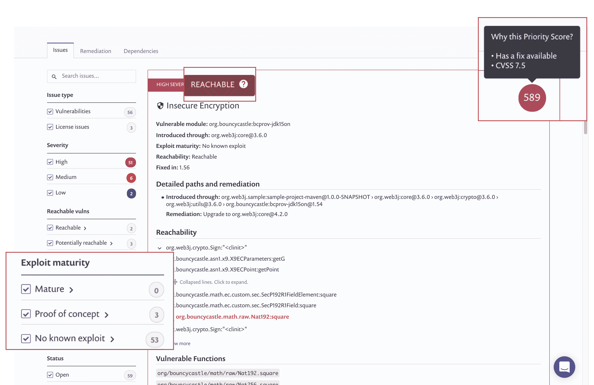

# Snyk 工具区分开源漏洞的优先级

> 原文：<https://devops.com/snyk-tool-prioritizes-open-source-vulnerabilities/>

Snyk 今天宣布，它已经增强了其同名漏洞扫描工具的能力，增加了使用一种利用数据科学和机器学习算法来分析代码的评分工具来确定哪些开源漏洞应该首先修复的能力。

此外，DevOps 团队现在可以利用自动化的拉请求来修复这些漏洞。

最后，DevOps 团队还可以定义策略，要求在发现特定类别的漏洞时进行修复。

Snyk 的首席产品官阿内尔·马祖尔说，考虑到使用的开源模块的数量以及它们之间存在的依赖关系，保持补丁和更新的最新状态已经成为一个重大挑战。他说，实现这一目标的唯一方法是更多地依赖有助于自动化这一过程的工具。

如今，开发团队很容易对修补开源安全漏洞的补丁请求感到不知所措。问题是，并非所有这些要求都同等重要。Snyk 提供了一些工具，使开发人员能够了解哪些漏洞是最严重的，以及它们如何影响他们的代码。

马祖尔说，有了这种认识，就有可能在 DevSecOps 过程中优先考虑补救任务。否则，在时间允许的情况下，开发人员将简单地修复漏洞，而不考虑相关性。开发人员可能会修复几十个 bug，结果却发现一个未被解决的关键缺陷导致了重大危害。

DevOps 团队没有意识到开源代码模块之间的依赖性也是很常见的。当以错误的顺序应用代码补丁时，应用程序可能会崩溃，导致 DevOps 团队不得不重新开始整个过程。马祖尔说，Snyk 提供的优先级工具可以防止这种情况发生。

他补充说，在缺乏任何优先考虑漏洞的能力的情况下，开发人员最终会习惯于补丁请求，因为他们不知道他们的补丁工作是否会产生任何真正的影响。

更糟糕的是，花费在修补低级漏洞上的所有时间减少了开发人员编写新应用程序代码的时间。事实上，DevOps 的一个悖论是，随着部署的应用程序数量的增加，调试它们所花费的时间也在增加。用不了多久，DevOps 团队就会发现自己花在修复现有代码上的时间比开发新应用程序的时间还要多。

随着 DevOps 团队越来越依赖于开源代码，他们从该项目的所有贡献者的集体安全努力中获益。结果是更安全的代码，因为修复特定问题的补丁是可用的。现在的挑战是找到一种方法来自动应用这些更新，而不会降低整个应用程序开发过程的速度。实现这一目标需要了解现在众多的开源项目，没有一个 DevOps 团队能够独自持续实现这些项目。