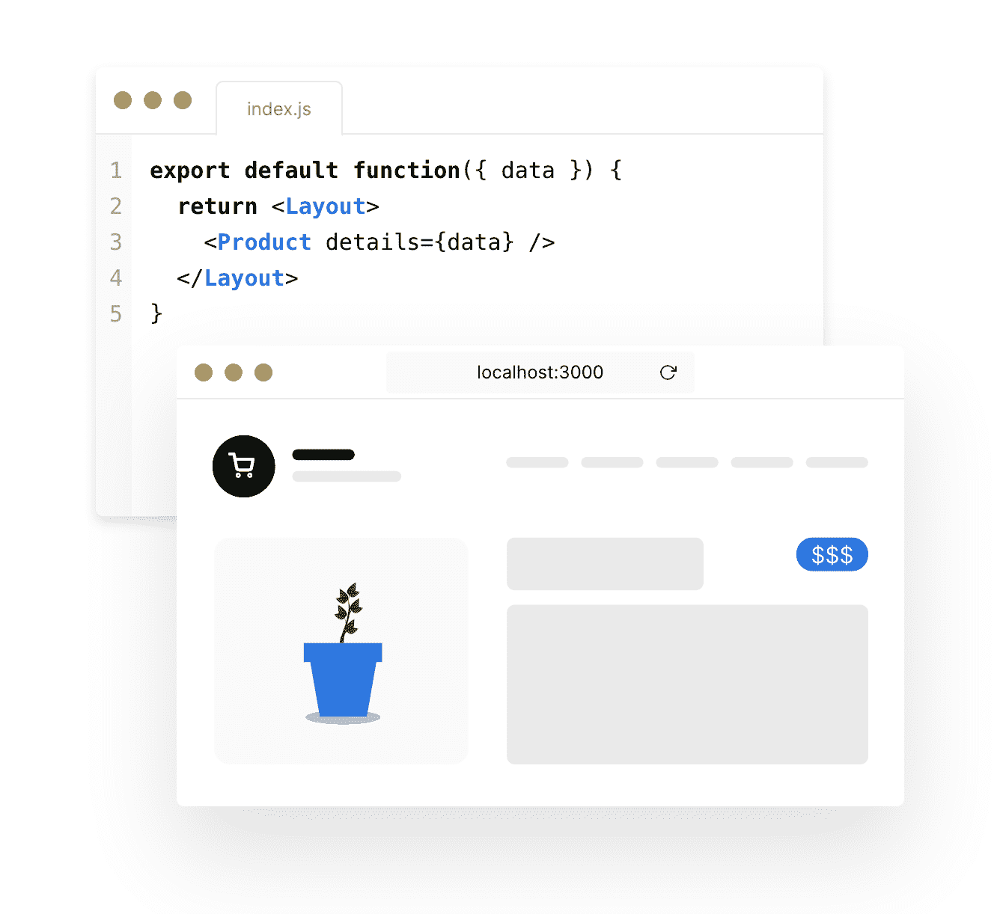

# Vercel 使前端应用更快

> 原文：<https://devops.com/vercel-makes-front-end-applications-faster/>

Vercel 本周进一步努力重新定义前端应用程序的开发方式，以减少对后端系统的依赖。

该公司已经创建了 Next.js，这使得使用基于 React 库的框架来创建 web 应用程序成为可能，该框架用于创建支持静态生成(SSG)和服务器端呈现(SSR)的用户界面。基于 Next.js 的 Vercel Edge 平台的最新版本[已经过重新架构，以提供更快的路由和更好的缓存。](https://www.businesswire.com/news/home/20200721005358/en/%C2%A0Vercel-Accelerates-Frontend-Content-Delivery-Ensure-Highest)

Vercel 首席执行官 Guillermo Rauch 表示，该功能将性能提高了 10 倍，使采用 React 用户界面框架的应用程序能够自动预渲染、代码分割和热重装，而无需任何配置。

Rauch 说，Vercel 刚刚筹集了 2100 万美元的资金，致力于通过利用 Next.js 来更容易地构建实时运行的高度互动的应用程序。Vercel 声称，在 Airbnb、Hulu、Nike、Ticketmaster 和优步等组织中，有超过 3 万个网站正在运行 Next.js。

Rauch 说，大多数开发人员正在寻求利用框架，使他们能够尽可能使用熟悉的 JavaScript 类型的工具，将底层 IT 基础设施视为无服务器的。

与此同时，Vercel 使得在本地主机上运行 Next.js 成为可能，这使得能够与脸书的 React Refresh 集成，从而在本地主机上实现实时页面变化可视化。每当数据发生变化时，还可以自动推送新页面。此外，开发人员可以在本地主机上从云中复制所有定制的功能。

最后，他说，通过 Vercel 的内容交付网络(CDN)提供的分布式缓存消除了对传统 CDN 的依赖，传统 CDN 通常需要重复往返。

随着 Next.js 等框架被接受，DevOps 团队将需要适应能够提供更丰富应用体验而不太依赖后端基础设施的应用。这种转变对从网络带宽消耗到网络应用性能的方方面面都有影响。Rauch 说，Vercel 平台采用缓存、路由和 React 框架来优化应用性能，而不是继续关注后端基础设施来优化应用性能。

目前还不清楚 DevOps 团队是否会或在多大程度上推动开发人员使用 Next.js 等框架来开发 web 应用程序。理论上，web 应用程序越高效，监控应用程序所需的时间和精力就越少。此外，后端 IT 环境的总体规模可能不需要那么大。

然而，不管怎样，web 应用程序的开发方式正在发展。这并不意味着基于 JavaScript 的框架会消除对 Java 等编程语言的需求。然而，依赖 Java 调用后端服务的应用程序的优势可能很快就会大大减少。