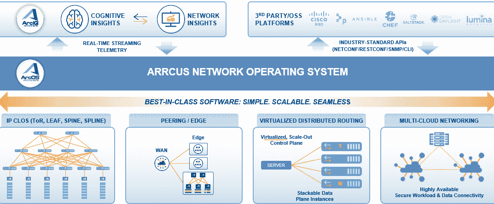

# Arrcus 扩展跨越混合云的网络服务

> 原文：<https://devops.com/arrcus-expands-network-services-spanning-hybrid-clouds/>

arr cus[向 ArcOS](https://www.globenewswire.com/news-release/2020/07/22/2065855/0/en/Arrcus-The-Hyperscale-Networking-Software-Company-Executes-Triple-Play-Extending-its-Market-Leadership.html) 添加了虚拟化分布式路由(VDR)和多云网络(MCN)功能，ArcOS 是一种网络操作系统(NOS)，可以部署在内部或云中。

公司首席执行官 Devesh Garg 表示，这些额外的功能提供了 IT 组织促进混合云计算环境部署所需的程序化网络服务。

他说，Arrcus MCN 提供了跨任何云安全连接工作负载和数据的能力，而 VDR 则消除了对需要自己机箱的物理路由器的依赖。

Arrcus 一直在为消除对物理基础设施的依赖的分散式联网方法提供理由。相反，IT 团队可以在云服务或他们在内部 IT 环境中选择的任何白盒设备上部署 ArcOS。他说，这种方法消除了受限于特定网络硬件平台的可能性。

Garg 补充说，它还为 DevOps 团队提供了部署分布式应用程序的一致基础。ArcOS 为访问网络服务提供了一套一致的应用程序编程接口(API ),而不是在云环境和内部 IT 环境中导航不同的鼻子。

他指出，事实上，以编程方式调用这些网络服务的需求是推动网络运营和开发运维团队融合的原因。随着应用程序在云时代变得更加分散，IT 组织正在寻找更有效的方法来按需公开网络服务。

然而，这种趋同需要时间。许多网络团队仍然倾向于购买包含操作系统的路由器和交换机作为物理设备，而不是在他们选择和管理的基础架构上部署操作系统。然而，随着 DevOps 团队继续推动访问能够根据需要更轻松地扩展和缩减的网络服务，软件定义的网络服务成为默认要求只是时间问题。

Garg 说，事实上，随着 DevOps 团队寻求部署频繁更新的应用程序，微服务的兴起将迫使这个问题出现。

此外，他指出，边缘计算平台和 5G 无线网络服务的兴起将同时推动组织转向虚拟化网络服务。

目前还不清楚网络服务的转变速度。软件定义的网络服务已经在云中可用。内部 IT 环境的进步依赖于 IT 组织为核心网络基础设施的升级提供资金的意愿。在新冠肺炎疫情带来的经济衰退之后，许多 IT 组织现在面临的挑战是找到一种经济高效地实现这一目标的方法。白盒为 Cisco Systems 和 Arista Networks 等供应商的交换机提供了成本更低的替代产品。同时，当在所有平台上采用通用的操作系统时，在混合云计算环境中交付网络服务的总成本可以下降。

无论前进的道路如何，有一点是肯定的，即在 IT 组织需要比以往更加敏捷的时候，传统的网络基础设施已经成为一个主要的瓶颈。