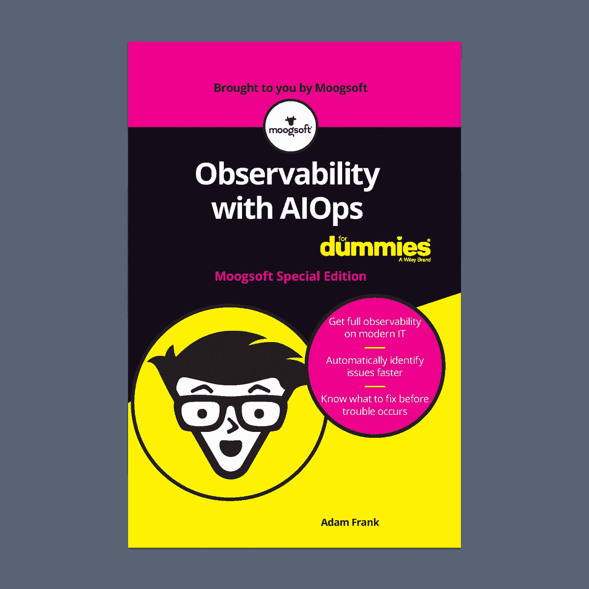

# Moogsoft 出版了《AIOps 对假人的可观测性》

> 原文：<https://devops.com/moogsoft-publishes-observability-with-aiops-for-dummies/>

新电子书为开发运维团队和 SRE 团队提供了最佳实践，以实现 AIOps 的运营可见性

旧金山—2020 年 7 月 8 日—[moog soft](http://www.moogsoft.com/)，IT 运营人工智能的先驱和领先提供商( [AIOps](https://www.moogsoft.com/resources/aiops/guide/everything-aiops/) )，今天宣布发布“虚拟 AIOps 可观察性”，这是一份面向开发运营和站点可靠性工程(SRE)团队的教育最佳实践指南，旨在成功实现复杂 IT 系统可观察性的自动化，并通过 AIOps 为其数字服务建立持续保证。此外，这本书还为使用 AIOps 提高大规模灵活性和响应能力提供了可操作的见解。该电子书可以在 www.moogsoft.com/dummies 的[立即下载。](https://info.moogsoft.com/ebook-observability-aiops-for-dummies.html)

DevOps 和 SRE 团队一直处于救火模式，因为他们要克服复杂的工具链、数据和基础设施带来的障碍。AIOps 允许他们主动检测并解决这些系统中的问题。它简化了事件解决，因此团队可以满足服务级别协议和目标，管理错误预算并加快数字化转型计划。通过利用 AIOps 来自动化可观察性，团队可以开发更多，操作更少，并最终提供创新客户体验所需的敏捷性。

“在不断增长的数字经济中，停机时间根本不是 DevOps 和 SRE 团队的选项，因为他们需要在不断交付新服务和维护日益复杂的基础设施之间进行平衡，”《AIOps For Dummies》一书的作者兼 Moogsoft 产品和设计副总裁亚当·弗兰克(Adam Frank)说。“这本书将指导这些团队通过使用 AIOps 自动化可观测性来释放他们真正的创新潜力。”

“假人 AIOps 的可观察性”包括:

*   对人工智能(AI)实际做什么的实用解释。

*   机器学习和神经网络技术的教育介绍。

*   概述 AIOps 如何帮助 DevOps 和 SRE 团队。

*   描述 AIOps 如何简化对来自应用、云服务、网络和基础设施的运营数据的监控的最佳实践和真实使用案例。

*   Moogsoft 客户在 DevOps 和 SRE 团队中使用 AIOps 的真实案例研究。

*   为组织提供实用建议，帮助他们轻松、快速地应用 AIOps，大幅提升数字体验。

Moogsoft 创始人兼首席执行官 Phil Tee 表示:“Moogsoft 的使命是不仅为我们的客户，而且为整个 AIOps 社区提供教育资源。“这本书是我们的最新举措，旨在教授任何希望在业务运营中实施 AIOps 战略的人所需的实用基础知识。这本书的内容直接来自我们开拓市场、帮助客户和相应创新产品的经验。通过包含 Moogsoft 客户的真实成功案例，读者可以深入了解 AIOps 为 DevOps 和 SRE 团队带来的价值。”

AIOps 和可观测性

“虚拟 AIOps 的可观测性”是对最近发布的 [Moogsoft Express](https://www.moogsoft.com/aiops-express/) 的补充，Moogsoft 的集成、云原生 AIOps 和可观测性解决方案。Moogsoft Express 现已推出，是一款可扩展、灵活、易于使用的 AIOps 和 observability 产品，使团队能够将更多时间用于开发数字化服务，从而实现业务转型和加速发展，同时减少运营时间。有兴趣尝试 Moogsoft Express 的团队可以在“用 AIOps 观察傻瓜”中了解更多信息。

额外资源

*   要下载整本书，请访问[www.moogsoft.com/dummies](https://info.moogsoft.com/ebook-observability-aiops-for-dummies.html)

*   关于 [Moogsoft AIOps 平台](https://www.moogsoft.com/aiops-platform/)和 [Moogsoft Express](https://www.moogsoft.com/aiops-express/) 的更多信息

*   注册免费试用[Moogsoft Express](https://www.moogsoft.com/request-trial-express/)

*   阅读 [Moogsoft 博客](https://www.moogsoft.com/blog)

*   在 [Twitter](https://twitter.com/moogsoft) 、 [LinkedIn](https://www.linkedin.com/company/moogsoft/) 和[脸书](https://www.facebook.com/moogsoftinc/)上关注 Moogsoft

关于 Moogsoft

[Moogsoft](https://www.moogsoft.com/) 是 [AIOps 解决方案](https://www.moogsoft.com/aiops-platform/)的先驱和领先提供商，帮助 IT 团队更快、更智能地工作。Moogsoft AIOps 平台拥有专利人工智能，可在全球最复杂的 IT 环境中每天分析数十亿次事件，帮助全球顶级企业避免停机、实现服务保障自动化，并加速数字化转型计划。Moogsoft 成立于 2012 年，在全球拥有超过 140 家客户，包括美国航空公司、房利美、Fiserv、HCL Technologies、SAP SuccessFactors 和威瑞森媒体。它与领先的托管服务提供商和外包组织建立了战略合作伙伴关系，包括 AWS、Cisco、HCL Technologies、TCS 和 Wipro。

Moogsoft 和 Moogsoft 徽标是 Moogsoft Inc .的专有商标。所有其他产品或名称可能是其各自公司的商标。

有关 Moogsoft 的 AIOps 平台及其客户成功的更多信息，请访问[www.moogsoft.com](https://www.moogsoft.com/)。