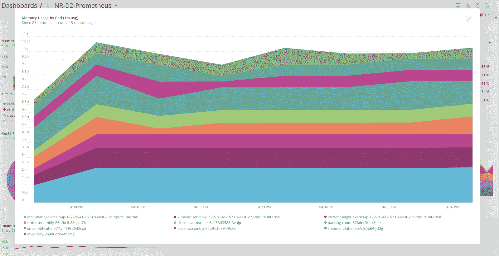

# New Relic 使改进的 APM 平台更加经济实惠

> 原文：<https://devops.com/new-relic-makes-revamped-apm-platform-more-affordable/>

New Relic 已经改进了其应用性能管理(APM)平台，作为使可观测性更容易获得和负担得起的努力的一部分。

New Relic 的首席产品官 Bill Staples 表示，New Relic One 已经更新，提供了一个新的用户界面，旨在更容易地导航和探索一个现在可以监控应用程序和 it 基础设施的可观测性平台。

他说，与此同时，New Relic 通过增加一个没有隐藏成本或信用卡要求的免费层来降低成本。它每月提供一个 100GB 数据的免费许可证。每月前 1 亿次应用程序交易免费，每月前 1，000 次事件也免费。

下一级层的初始定价为每席位每 GB 接收 25 美分，应用智能按交易或事件定价。

Staples 表示，New Relic 通过利用开源代理软件来收集数据，进一步降低了成本，该软件与经过改进的 New Relic One 平台一起将使可观测性无处不在。

降低可观测性成本的举措与基于微服务的应用的兴起相一致，根据定义，这些应用具有许多需要持续监控的依赖性。从历史上看，由于成本的原因，许多 IT 组织将 APM 平台的使用仅限于最关键的整体应用程序。然而，鉴于其固有的复杂性，基于微服务的应用需要 IT 团队采用一个可观测性平台。它们还推动组织接受最佳 DevOps 实践，其中可观察性是核心原则。

Staples 表示，就可观测性平台的采用而言，现在仍处于早期阶段，并指出鉴于它们的缺乏，迄今为止大多数 DevOps 的采用都可以被描述为一种不彻底的措施。

为了进一步实现这一目标，Staples 表示，New Relic One 还将使 it 组织更具成本效益地采用[分布式跟踪](https://devops.com/cloud-native-tracing-and-observability-why-you-care/)作为应用程序采样的替代方案，而不必承担巨额存储成本。分布式跟踪监视服务之间的所有请求，将每个段记录为一个跨度。一个请求的所有跨度都被组合到一个分布式跟踪中，以提供一种监视整个请求的方法。

APM 平台提供商之间的竞争非常激烈。如今，New Relic 占据了相当大的市场份额，但随着对可观测性平台的需求不断扩大，它的竞争对手比以往任何时候都多。随着新冠肺炎疫情带来的经济衰退，IT 组织也向供应商施压以降低成本。IT 组织面临的挑战是，他们在努力降低成本的同时，也在推出更多基于微服务的云原生应用，这些应用需要更深层次的可观察性。

尚不清楚可观测性的未来之战将如何收场。然而，好消息是，主动监控 IT 环境的成本似乎正在日益下降。