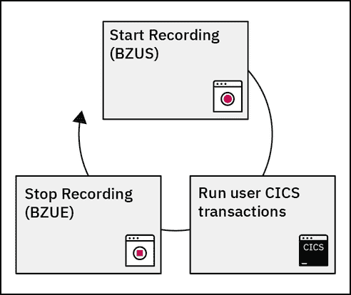
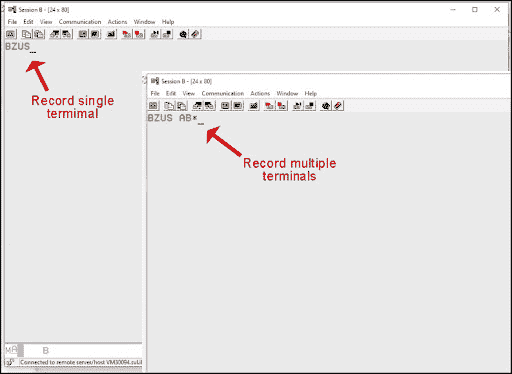
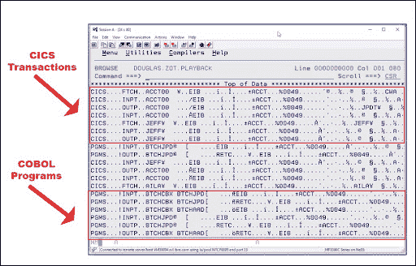
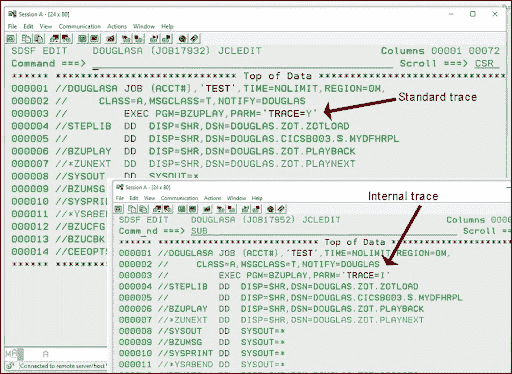
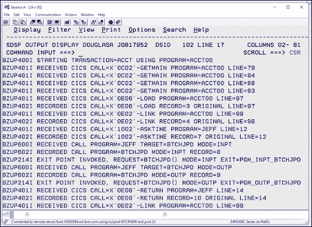
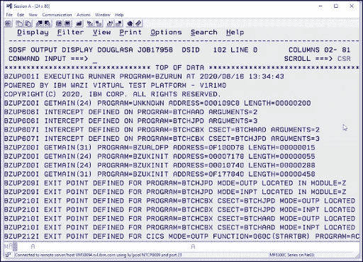
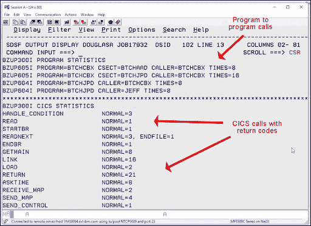

# 瓦兹 VTP 测试记录简化了主机测试

> 原文：<https://devops.com/wazi-vtp-test-recording-streamlines-mainframe-testing/>

***大型机开发人员使用 Wazi 虚拟测试平台*** 进行测试更加轻松

处理测试数据很棘手。如果您是一名在分布式环境中工作的开发人员，事情会变得非常困难。看起来好像你一直在本地系统的数据库中补充测试数据，或者在网络上专门为你补充测试数据。

您运行的测试会摆弄这些数据，当出现问题时，数据会变得非常糟糕。没用的。所以你要重新经历整个补货过程。如果您处理几千兆字节的数据，这没什么大不了的，但是当您对一个非常大的数据库运行测试时——大约几百千兆字节或几兆兆字节的数据——补充过程可能需要几个小时，在某些情况下甚至几天。这是一项非常耗时的工作，即使大部分过程都是自动化的。

似乎这还不够有挑战性，当你在多用户场景中执行测试时，事情会变得更加困难。您有一大群用户对共享数据集进行一大群更改，这反过来会影响应用程序的整体状态。当测试失败时，您不仅要找出问题是出在代码、数据还是两者上，您还必须确定失败发生在哪里。

请记住，分布式应用程序旨在运行分布在一个机器集群上的应用程序逻辑的多个实例。要解决这些问题，需要对网络上运行的应用程序的所有实例中的所有活动进行大量非常详细的监控。而且，确定每个失败的根本原因需要大量的专业知识来成功地进行分析。

尽管开发分布式应用程序的开发人员对他们的环境有很多直接的控制，但这是一个很大的工作量。对于大型机开发人员来说，处理测试数据可能更加棘手；这可能是一个巨大的挑战，甚至会考验最有天赋的开发人员的勇气。

## 理解大型机上的数据共享问题

大型机测试和分布式测试中管理数据的方式有一个基本的区别。虽然分布式开发人员“拥有”他们环境中的数据，但是大型机开发人员真的没有这种奢侈，除非他们在专用的子系统中工作。通常，大型机程序员的程序是编译后的二进制文件，通常是更大的执行单元的一部分。较大的执行单元的一个例子是设置工人接受失业保险的工作。

假设 Sarah 是一名 COBOL 开发人员，他编写了一个程序，该程序是确定工人失业救济金的过程的一部分。Sarah 的程序发现了该工人在过去五年中的所有雇主，并将每个雇主的收入添加到数据库的一个表中，该表与失业救济过程中的其他程序共享。

当然，Sarah 会对她的代码进行单元测试。如果她在 z/OS 主机上工作，她可能会使用像 zUnit 这样的产品来进行测试。但是，仅仅测试 Sarah 的代码只是整个过程工作的一部分；需要更大范围的测试。

现在事情变得棘手了:Sarah 的代码只是完成所需工作的许多程序之一。因此，尽管她的单元测试完全有可能是好的，但是一旦她的程序改变了数据，并且这些改变被应用到更大的画面中，事情可能会变得混乱。在这种情况下，如果 Sarah 的数据破坏了失业救济过程的整体状态，那么与 Sarah 的数据交互的所有其他程序的数据也可能被破坏。因此，需要补充整个数据库。请记住，Sarah 并不“拥有”共享数据；她是众多用户之一。

Sarah 的例子只是一个真实问题的实例，这个问题对于大型机开发人员来说是一个常见的、耗时的难题。如果 Sarah 的程序所做的数据转换可以被隔离并按需重用，这种能力将带来深远的好处，可以改变企业中进行大型机测试的方式。

幸运的是，这种能力是存在的。这是 Wazi 虚拟测试平台的测试记录功能。

## 理解测试记录的机制

由 Wazi 虚拟测试平台(VTP)实现的测试记录解决了在大型机测试环境中管理数据的两个基本问题。第一个问题是创建一种方法来隔离和重用由一个或多个大型机用户的行为产生的测试数据。第二个问题是创建一种方法来更新失效的测试数据。

Wazi VTP 允许开发人员或测试人员记录一个或多个用户对数据库执行数据查询命令的终端。Wazi VTP 保存这些查询的结果，作为测试数据重复使用。

Wazi VTP 有能力记录 CICS 交易或 [JCL 批处理作业](https://www.ibm.com/support/knowledgecenter/SS2HDG_1.0.0/topics/recording_batch.html)。 [CICS 事务](https://www.ibm.com/support/knowledgecenter/SS2HDG_1.0.0/topics/recording_from_cics.html)可以使用 CICS 命令或 Db2、DL/1 以及 MQSeries 调用的任意组合。批处理作业可以使用 dB2 或 [DL/1](https://www.ibm.com/support/knowledgecenter/SS2HDG_1.0.0/topics/recording_from_cics.html) 。可以使用 BZUS transaction 命令从 CICS 开始记录，或者通过运行应用程序从 batch 开始记录。所有这些都是在不改变用户应用程序的情况下完成的。

一旦记录完成，CICS 事务或批处理作业就可以完全成批地重放，完全独立，不受任何子系统的影响。由于数据最初是被记录的，然后被反馈给重放过程，所以它为所有后续测试保持数据的状态。

为了停止使用 CICS 进行记录，开发人员输入命令 BZUE。下面的图 1 从概念的角度展示了命令序列:

Figure 1: Running the Wazi VTP Test Recorder

可以从大型机终端输入开始和停止记录的命令，如下图 2 所示。开发人员输入不带任何参数的命令 BZUS，只记录从调用该命令的终端执行的查询。这显示在下面图 2 的左上部分。如果开发人员想要记录许多终端的活动，他们添加一个通配符参数，如图 2 右下方所示。在这种情况下，BZUS AB*是被调用来记录具有以字符 AB 开头的 ID 的终端的活动的命令。此外，开发人员可以通过使用特定终端的名称而不是通配符参数来记录来自特定终端的活动。

Figure 2: Wazi VTP can record activity from either single or multiple terminals

当开发人员想要停止记录时，他们输入命令 BZUE。

使用 Wazi VTP 并不局限于 3270 终端或终端模拟器。Wazi VTP 还支持一个 [API](https://www.ibm.com/support/knowledgecenter/SS2HDG_1.0.0/topics/using_the_vtp_api.html) ，可以用来在 CI/CD 工作流中执行集成测试。

重要的是要记住，瓦兹 VTP 做了很多比捕捉屏幕活动。事实上，屏幕截图只是所收集数据的一个很小的方面。Wazi VTP 捕获所有 CICS、DB2 或 DL/1 子系统调用的所有参数。并且，如上所述，它收集的数据可以用作测试数据。

下面的图 3 显示了一个记录数据和程序调用参数的例子。注意，瓦兹 both 已经记录了用 COBOL、PL/1 和汇编语言编写的 CIC 和程序(PGMS ),如下面截图左边第一列所示。

Figure 3: The data that is a result of a Wazi VTP recording session

除了简单地记录数据，然后作为可重用的模拟数据，Wazi VTP 检测，然后报告数据何时改变。检测是基于程序逻辑所做的更改。Wazi VTP 允许对编程逻辑的这些改变继续执行，直到尝试新的、未记录的路径或者直到程序结束。

这与分布式计算世界中的测试数据有很大的不同。除非采取预防措施，否则一旦克隆了测试数据库的实例，就无法真正了解这些数据库的状态。单元、集成和性能测试中的事情可能进展顺利，但在生产中却搞砸了，因为测试数据与现实世界的生产数据完全不同步。运行 Wazi VTP 的大型机开发人员没有这个问题。

## 跟踪行为和收集统计数据

Wazi VTP 为大型机测试带来的另一个优势是跟踪查询行为和收集有关执行的查询行为的统计数据的能力。

下面的图 4 显示了如何在 3270 仿真下调用跟踪。左上角的图像显示了调用标准跟踪。图右下方的图像显示了调用更深层内部跟踪的调用。

Figure 4: Wazi VTP supports standard tracing as well as lower, internal tracing

下面的图 5 显示了标准跟踪的详细结果。

Figure 5: Standard tracing shows a broad range of information including information from recorded tests

下面的图 6 显示了调用内部跟踪时报告的一组更丰富的细节。

Figure 6: Wazi VTP Internal tracing provides a deeper level on reporting, including the address and memory usage of calls to a program

如上所述，除了跟踪之外，Wazi VTP 还将报告测试活动的统计数据。下面的图 7 显示了使用 Wazi VTP 进行的典型测试会话的一组统计数据。Wazi VTP 不仅可以报告程序被调用的次数，还可以报告调用者的标识符。此外，Wazi VTP 报告与 CICS 交易不同方面相关的状态代码。

Figure 7: Collecting program statistics using Wazi VTP

瓦兹 VTP 录音是一个强大的功能。记录和重用测试数据的能力大大减轻了大型机测试数据管理的负担。跟踪和统计数据收集功能甚至增加了更多功能——以至于使用 Wazi VTP 的大型机测试在许多方面都超过了当前分布式计算范例中的功能。这不再是几十年前常见的“编码者编码，测试者测试”，瀑布驱动的测试方法。这是当今世界企业测试工作方式的现代方法。总之很爽！

## 大型机开发为每个人提供了机会

我非常喜欢大型机编程带来的机会。这些机器是发电站。它们从一开始就被设计成可以同时处理成千上万的用户。大型计算机仍然处理超过 80%的公司数据。

现在以及在可预见的未来，对大型机程序员的需求仍然很大，尤其是在现有的劳动力不断老化退休的情况下。我已经建议不少年轻的程序员考虑花一两年时间进行大型机开发。大型机编程经验为应对日益动荡的就业市场的起伏提供了一个很好的退路。

随着大型机和分布式社区继续相互促进，各行各业的开发人员完全有可能在任一种环境中工作，只要他们对软件开发的一般原则有清晰、充分的理解，并对任何类型的编程环境都通用的最佳实践有坚实的认识。一旦基础到位，剩下的就是花时间学习编程环境的细节。在过去，这可能需要几年时间。如今，有了 Wazi VTP 这样的工具，学习曲线可以缩短到几个月的时间，前提是开发人员致力于完成必要的工作，以获得有效完成手头工作所需的技能。

瓦齐 VTP 是一个引人注目的，最先进的大型机开发人员测试平台。但是它的潜力要大得多:Wazi VTP 将大型机开发带入了一个通用的开发环境。在许多方面，Wazi VTP 为来自任何计算环境的所有开发人员打开了一扇机会之门。

查看 IBM Wazi 虚拟测试平台演示:[https://mediacenter.ibm.com/media/t/1_tbcimobz](https://mediacenter.ibm.com/media/t/1_tbcimobz)