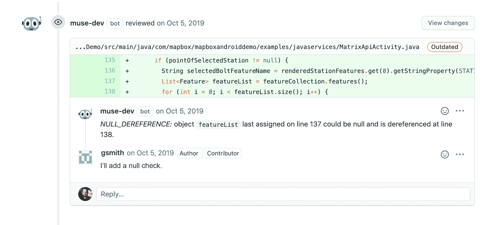

# MuseDev 提供 DevOps 优化的安全代码分析器

> 原文：<https://devops.com/musedev-offers-devops-optimized-security-code-analyzer/>

MuseDev 今天宣布，它已经在 GitHub 上提供了一个早期访问计划，该计划是一个名为 Muse 的代码分析工具，旨在当从仓库发出拉请求时，暴露网络安全问题。

公司首席执行官 Stephen Magill 表示，Muse 让 it 团队更容易始终如一地采用最佳开发实践，而不是等到应用程序部署后才发现网络安全问题。

人们普遍认为，作为任何质量保证过程的一部分，开发运维团队应该对应用安全承担更多的责任。然而，Magill 表示，DevOps 团队缺乏工具来更轻松地将安全分析集成到现有应用程序开发和部署工作流的上下文中。

Magill 说，Muse 还旨在以一种使开发者更容易理解的方式揭示网络安全问题。MuseBot 自动分析每个 pull 请求，并在 GitHub 中提交 bug 报告，作为代码评审意见。相比之下，他指出，网络安全团队使用的代码分析工具往往会暴露漏洞列表，而没有为开发人员提供足够的背景来补救甚至区分优先级。

Magill 指出，Muse 还旨在提供一种更快的替代方案，在大约 20 分钟内产生结果，这意味着 DevOps 团队可以在工作流中解决问题，而不是等待网络安全团队的报告。

他说，代码分析工具经常会产生太多的误报。Muse 包括一套广泛的工具，如 ErrorProne、Infer 和 Pyre，用于各种云平台，这些工具经过定制和配置以减少警报噪音。Magill 补充说，Muse 还提供对开放应用编程接口(API)的访问，使平台完全可定制。

Muse 作为 GitHub 应用程序提供，该公司承诺将对开源项目和其他公共 GitHub 库永远免费。对私有存储库的分析也是免费的。一个可用于 GitHub、Bitbucket 和 GitLab 的自托管企业版计划于今年年底正式推出，也可作为私人测试版提供。MuseDev 还提供了一个专业服务团队来帮助组织实施该平台。

该公司本身是从 Galois 分离出来的，Galois 是一家专注于网络安全的研发公司。

一般来说，在生产环境中部署应用程序以解决网络安全问题后，组织的成本可能会增加 10 倍。尽管对这个问题有着广泛的认识，但是在许多组织中采用最佳开发团队实践仍然相对较新。有很多人对 DevSecOps 感兴趣，但很少有组织能够将构建安全工作流所需的工具交给 DevOps 团队。

然而，随着越来越多的 DevSecOps 工具变得可用，在大多数组织中，很快就会有很多进展是自下而上的，而不是自上而下的。