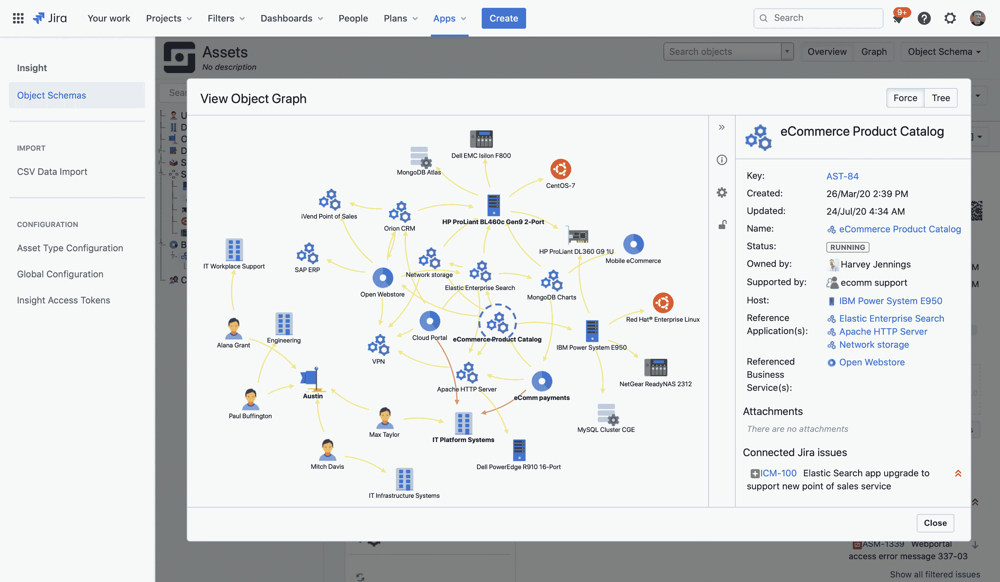

# Atlassian 将资产管理加入 ITSM 投资组合

> 原文：<https://devops.com/atlassian-adds-asset-management-to-itsm-portfolio/>

Atlassian 本周宣布已经收购了 it 资产管理软件提供商 mind ville T1，该公司计划将其与吉拉的 ServiceDesk 平台整合。

Atlassian 的 IT 产品负责人 Edwin Wong 表示，Mindville 将扩大其 IT 服务管理(ITSM)产品组合的覆盖范围，其中包括用于事件管理的 Opsgenie、用于项目管理的吉拉以及最近收购的用于对话票务的 Halp 软件。

Mindville 已经在 Atlassian marketplace 上推出了自己的软件，拥有 1000 多家客户，包括美国宇航局(NASA)、Spotify 和三星。收购 Mindville 为这些 IT 团队提供了一个在吉拉服务台平台内管理 IT 资产的机会，该平台被广泛用作管理与最终用户交互的服务台，Wong 说。

在整个行业竞争激烈之际，Atlassian 一直在稳步增强其 ITSM 投资组合。在新冠肺炎疫情之后，许多 IT 组织正在重新评估他们的 IT 服务台平台，因为很明显，许多员工将更经常地在家工作。

与此同时，IT 组织希望降低 IT 的总成本，如果他们从单一供应商处获得所有的 ITSM 工具，这将变得更容易实现。展望未来，Wong 表示，IT 团队应该预计 Atlassian 将继续加强其 ITSM 和 DevOps 工具组合的集成。他说，我们的目标与其说是将所有产品整合到一个平台上，不如说是在组成这个组合的所有工具之间无缝共享数据。

Atlassian 本周披露，该公司在本财年(T1)创造了 16 亿美元的收入，比上一年增长了 33%。2020 财年第四季度总收入为 4.305 亿美元，比 2019 财年第四季度的 3.346 亿美元增长 29%。根据有效的订购或维护协议，Atlassian 在 2020 财年第四季度结束时共有 174，097 名客户。该公司表示，该季度新增了 3046 名新客户。然而，它在 2020 财年第四季度录得 3.852 亿美元的净亏损，其中包括 3.827 亿美元的非现金费用。

Atlassian 工具可以部署在内部或云中，该公司一直在向 IT 组织提供折扣，作为吸引客户转向云的激励措施。在经济衰退之后，还不清楚企业会在多大程度上优先考虑在 ITSM 工具上的支出。然而，随着越来越多的员工和 IT 管理员现在在家工作，对基于云的工具的需求变得前所未有的明显。Wong 说，Atlassian 与众不同的一点是公司对 ITSM 和 DevOps 采取的以团队为中心的方法。

与此同时，随着 Atlassian ITSM 和 DevOps 产品组合的扩展，IT 团队应该预计这两种不同的 IT 管理方法之间的差距会继续缩小。