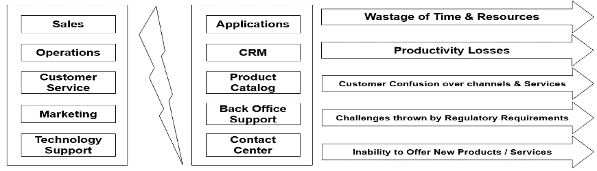
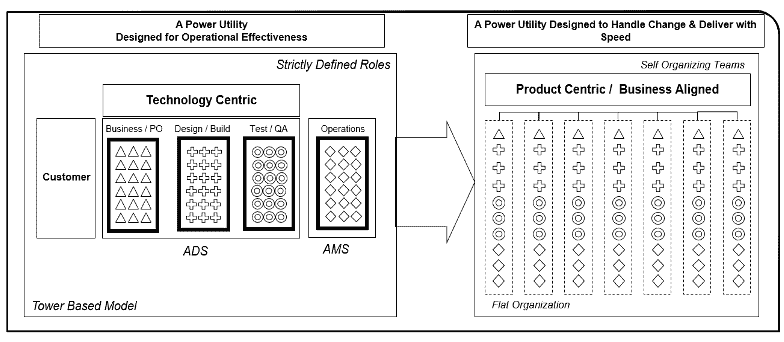
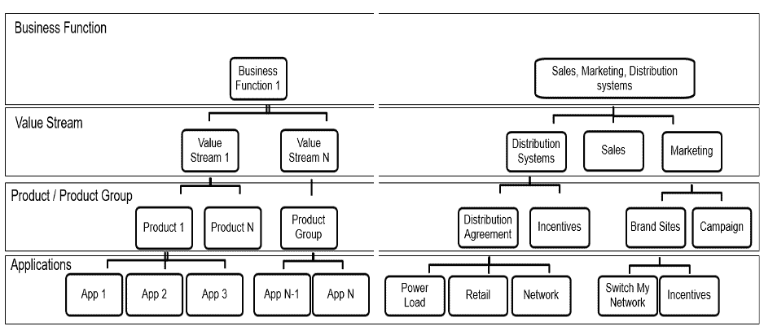

# 在公用事业中转向以产品为中心的工作

> 原文：<https://devops.com/shifting-to-product-centric-work-in-utilities/>

服务领域的大型组织正在从以项目为中心的运营方式转变为以产品为中心的工作方式。以客户为中心正在推动这一转变，因为以产品为中心的组织将客户放在一切工作的中心。这种转变在很大程度上取决于信息技术解决方案在上述组织中的部署方式。

本文探讨了以产品为中心的工作方式对公用事业组织的重要性，特别是电力部门，该部门正在寻求通过革命性地使用智能计量和智能家居等新的数字技术和解决方案来改变客户互动。

一开始，电力企业组织应该专注于向以产品为中心的工作方式转变，在客户分析等有望实现创新和数字化企业的领域开展工作。

Fig. 1: Current State of Play in Most Power Utilities

图 1 概述了大多数电力公司的现状，其中组织孤岛和应用孤岛导致客户在理解所提供的产品和服务方面面临挑战，以及生产力损失和对业务和法规要求的变化的反应时间增加。

在大多数电力公司中，业务单元中存在孤岛，这反映在支持这些业务单元的应用程序的组织和管理方式上。这导致重复劳动、工作和应用程序，以及时间和资源的浪费。客户经常对众多的服务产品和各种渠道感到困惑。在应对监管和/或商业环境变化带来的挑战方面也存在固有的延迟。

不过，这种情况正在改变，人们可以从“从仪表到现金”的流程中寻找市场现实和客户授权的反映。

根据我们的经验，转向以产品为中心的模式有四个关键驱动因素:

*   **数字核心**–发展、创新以及利用云、开发运维及敏捷性来支持业务。
    *   从构思到日落的开发实践和敏捷性。
    *   鼓励创新。
    *   数字就绪系统。
    *   关注产品价值。
    *   精益计划和维护。

*   **智能企业**–优化服务成本和交付，鼓励创新。
    *   支持电力公司业务敏捷性的自动化。
    *   支持配电和客户管理的自主操作。
    *   基于从客户和市场数据中获得的洞察力做出决策。
    *   关注产品、服务和客户参与的创新。

*   **体验质量**专注于改善客户体验。
    *   以产品为中心的服务交付。
    *   业务灵活性。
    *   DevOps 实践。
    *   体验中心性。
    *   以产品和体验为中心的指标。
    *   与业务保持一致的指挥中心。
*   **服务管理**以及电力公司服务交付的可扩展性和统一性集成，同时根据需要保留多供应商生态系统。
    *   持续改进。
    *   标准化部署和集成管理。
    *   多供应商情况下的协作。
    *   服务生命周期管理。
    *   信息技术服务交付绩效管理。

这种向以产品为中心的组织的转变确保了流程、人员、工作流和决策为电力公司的以下能力提供动力:

*   定制服务和优惠。
*   更好、更快地响应客户请求。
*   为客户提供一致和卓越的跨渠道体验。
*   提高生产力。
*   消除浪费。

## 转向以产品为中心的模式

以产品为中心的交付模式使用敏捷、DevOps 和精益原则进行战略规划，以确保不确定性和信息缺乏不会影响向最终客户交付服务。以产品为中心的模式重视相对短期的预算和工作规划，而不是财政年度开始时的大规模规划。这一点很重要，因为电力公司可能能够更好地一次规划一个季度，而不是一整年，特别是在当前的经济环境下。这不仅与业务敏捷性的目标密切相关，而且还确保了改进的规划和预算，因为每个季度都有更多关于业务目标的可用信息。如图 2 所示，围绕业务能力组织的新团队接着计划产品储备，执行、测试并向业务和客户持续交付业务价值
。

Fig. 2: Shifting from technology to business-aligned value streams or product-centric organization

电力公司还需要改变和改进他们以技术为中心的解决方案，以帮助进行预测和数据分析。以产品为中心的组织有助于实现这一目标，方法是确定差距并帮助创建自组织团队，然后这些团队承担组织的目标，以解决所有已确定的差距，包括预测和分析领域。

Fig. 3: Organization design – a product-centric organization

图 3 显示了以产品为中心的模型的样本组织设计。该图还显示了从业务功能到价值流再到产品或产品组，最后是提供价值的应用程序的结构分解，同时确保以客户为中心的目标是每个决策的核心。

## 治理和指标

在电力公司创建和采用以产品为中心的运作模式的一个非常重要的部分包括关注转型过程的治理，以及从转型中获得的业务成果。技术方面的敏捷和 DevOps 实践的加速和采用可以通过定性的采用度量来跟踪。这导致了产品水平的性能改进，带来了更好的产品和更快的交付，产品交付思维集中于以客户为中心，导致了以下趋势:

*   更快上市。
*   提高业务满意度。
*   质量提高。
*   降低信息技术成本。

除此之外，还应关注以下指标和措施:

*   收养措施。
    *   采纳成熟度。
    *   能力/技能指数。
    *   卓越运营。
*   产品团队级别的测量——在每个 sprint 的团队级别进行测量。
    *   生产力度量，如团队速度和吞吐量。
    *   利益相关者满意度测量，如产品所有者演示满意度。
    *   质量度量，例如自动化单元测试覆盖率和测试有效性的百分比。
    *   业务有效性度量，例如每个功能交付的业务价值和需求准备周期时间。
*   产品组级别的测量——每月或每季度在产品系列级别进行测量。
    *   需要时间来改变。
    *   需求变更的成本。
    *   发布频率。
    *   返工成本。
    *   平均恢复时间。
    *   应用稳定性。
*   投资组合水平衡量——每季度或每半年在投资组合水平进行衡量。
    *   交付满意度指数。
    *   顾客满意度指数。
*   团队满意度指标。
    *   团队幸福指数。
*   辅导效果。
    *   教练反馈。
*   团队的自组织商。
    *   产品所有权。
    *   冲刺健康。
    *   团队健康。
    *   技术健康。

## 电力公司的潜在受益领域

通过向以产品为中心的运营模式转型，电力公司至少可以在四个核心领域获得可量化的收益。它们是:

*   **预算和计划**
    *   成本和时间是严格运行的电力公司中最有价值的商品。
    *   以产品为中心的模型确保资金、精力和时间的分配基于对计划中已有投资的验证。
    *   由于以产品为中心的模型固有的节奏和时间限制，计划的时间线、工作量和收益的预测得到了改进。
*   **管理容量**
    *   重点是与业务保持一致，并持续交付业务价值。
    *   延误的成本和等待的成本也降低了。
    *   关注价值交付和量化的业务收益。
*   **项目管理**
    *   以产品为中心的组织中的治理是关于对利益量化的控制。
    *   以产品为中心的组织的焦点是“以正确的方式构建正确的东西”成本合理化、消除浪费和关注商业价值是直接的副产品。
*   **管理需求**
    *   需求的持续可视化和管理是这样一个领域，当需求和想法不断地从几个来源流入策略过滤器时，就会产生好处。
    *   以产品为中心的模型允许轻量级用例的持续细化，以确保价值被正确计算并分配给每个用例。
    *   计划、投资组合和产品积压被持续评估，以确保每个项目都有成本效益。

## 结论

电力公司使用以产品为中心的模型的一些好处如下:

*   针对效率、成本或舒适消费的定制电力计划。
*   可靠性的提高。
*   为意识更强的客户创建环境可持续的可再生能源计划。
*   随着法规的变化，逐步转向“一切照旧(BAU)”的关系。

电力公司以产品为中心的模式也有助于弥合数据鸿沟，从而提高数据和分析的利用率，并在以下领域实现创新计划:

*   客户最有可能使用的服务和产品。
*   优化收集和预测机制，以创建鼓励及时付款的计划。
*   创建预付费服务。
*   直接控制负荷的计划，允许公用事业公司在用电高峰期间减少空调类机械，作为回报，补偿消费者。
*   改进拖欠和欺诈管理的模式识别。
*   交叉销售机会。
*   有针对性的销售和营销活动。

*本文由塔塔咨询服务公司制造&公用事业 BG 的企业架构师**阿努拉格·乔杜里**合著。*

-[安舒主席之手](https://devops.com/author/anshu-premchand/)