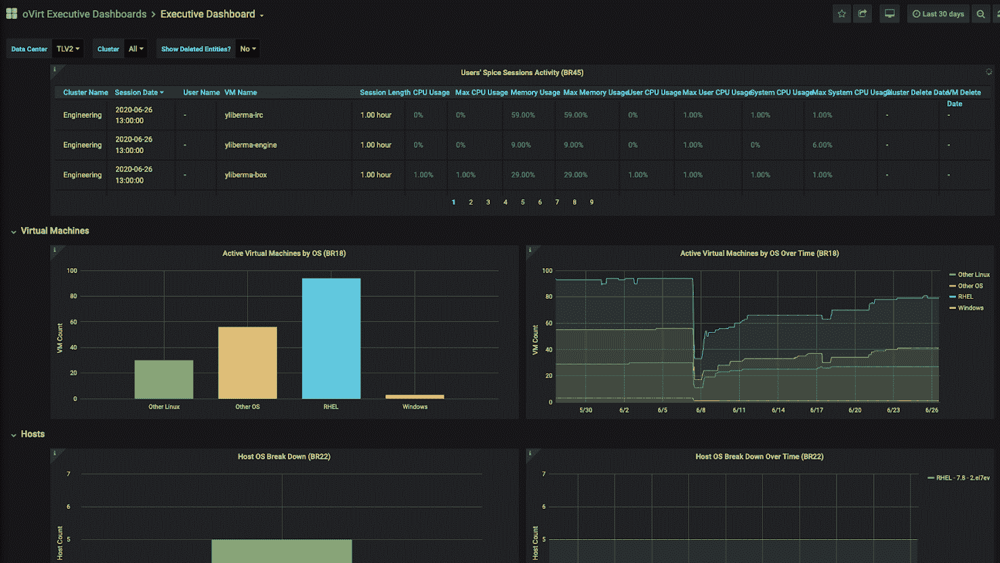

# Red Hat 更新虚拟化平台

> 原文：<https://devops.com/red-hat-updates-virtualization-platform/>

Red Hat 今天宣布了其虚拟机平台的[更新，现在可以在最新版本的 Red Hat Enterprise Linux (RHEL)上运行。](https://www.redhat.com/en/blog/red-hat-virtualization-now-and-next)

Red Hat 虚拟化 4.4 版现在可以在 RHEL 8.2 版上运行。此外，Red Hat 还为其数据仓库(DWH)服务添加了基于 Grafana 的仪表板，IT 团队可以使用这些仪表板来跟踪性能和分析工作负载。

最后，Red Hat Virtualization 4.4 使用其 NetworkManager 控制台简化了网络服务的配置。

Red Hat 云平台部门的产品经理彼得·劳特巴赫(Peter Lauterbach)表示，对 RHEL 8 的支持是该公司整体战略的核心，使 IT 团队能够同时运行基于微服务的应用和现有的单片应用。

Red Hat 设想 IT 组织将在运行 Red Hat OpenShift 的裸机服务器上部署 RHEL，这是一个基于 Kubernetes 的应用程序开发和部署平台，可以运行使用容器构建的应用程序。此外，Red Hat OpenShift 支持 [kubevirt](https://kubevirt.io/) ，这是一款开源软件，支持基于内核的虚拟机(KVM)，如 Red Hat Virtualization，在 Kubernetes 集群之上运行。Lauterbach 说，该软件以 Red Hat OpenShift 虚拟化的形式提供，可以根据需要在同一个 Kubernetes 集群上[运行传统的单片应用程序和基于微服务的应用程序。](https://containerjournal.com/topics/container-management/red-hat-integrates-kubevirt-with-kubernetes-management-platform-from-sap/)

Lauterbach 指出，这种方法不仅从基础设施的角度来看更易于管理，还可以减少单片应用程序和微服务之间的延迟。新冠肺炎疫情之后，许多 IT 团队加快了将应用程序迁移到云中的速度，他们将整个整体应用程序封装到容器中，然后无需重构即可移植到云平台。然后，他们可以通过将这些应用拆分成更小的微服务来开始对其进行现代化改造。

劳特巴赫还指出，利用 Kubernetes 在平台之间移动应用程序变得更加容易，因为由于 Kubernetes 社区提供了容器存储接口(CSI)和容器网络接口(CNI ),存储和网络服务之间的互操作性得到了显著改善。事实上，劳特巴赫说，基础设施的标准正在兑现其互操作性的承诺。

当然，Red Hat 几十年来一直在为开源虚拟机辩护。然而，随着新冠肺炎疫情带来的经济衰退，将有更多的组织寻求通过依赖商业虚拟机软件来降低成本。此外，Lauterbach 指出，现在云服务提供商如 Amazon Web Services (AWS)支持 KVM，通过在本地数据中心部署 Red Hat 虚拟化来创建混合云计算环境比在公共云中复制 VMware 环境要容易得多。

现在预测混合云计算之战在未来几个月甚至几年内会如何发展还为时过早。可以肯定的一点是，IT 基础架构环境越多样化，管理起来就越困难。