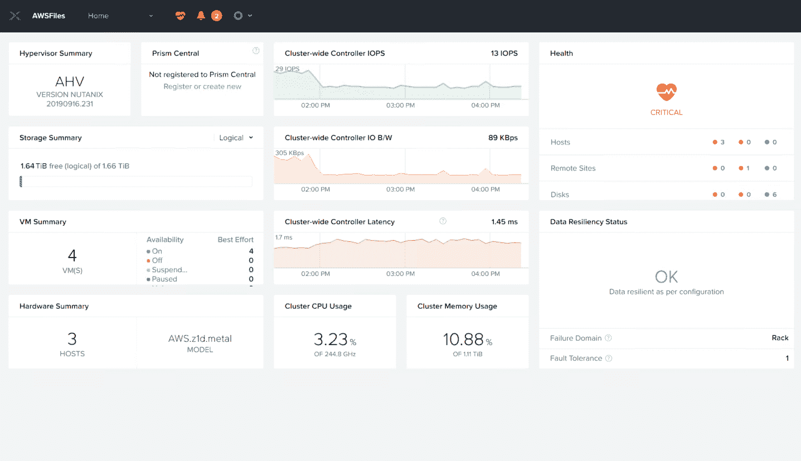

# Nutanix 为 AWS 带来 HCI 平台

> 原文：<https://devops.com/nutanix-brings-hci-platform-to-aws/>

Nutanix 今天宣布，Nutanix 集群现在可以在亚马逊 Web 服务(AWS)提供的亚马逊弹性计算云(Amazon EC2)的裸机实例上使用。

Nutanix 工程高级副总裁 Manoj Agarwal 表示，AWS 上的 Nutanix 集群将为 IT 组织提供基于 Nutanix 虚拟机的超融合基础设施(HCI)功能，而 AWS 目前还没有在公共云上提供这些功能。

他说，已经在内部 IT 环境中部署了 Nutanix 集群的 IT 组织将不必重构它们以将其提升和转移到公共云，并指出 IT 团队也将能够使用他们目前在内部 IT 环境中使用的相同 Nutanix Prism 管理工具在 AWS 上提供 Nutanix 集群。

IT 团队还将能够在 AWS 上使用 Nutanix 的附加工具，如管理非结构化数据的文件、编排应用程序的 Calm 和管理数据库的 Era。

Agarwal 拒绝透露 Nutanix 是否计划支持其他公共云。然而，在多个云上部署 HCI 软件将为 IT 组织提供部署工作负载的机会，而不必担心被锁定在特定的云服务上，他说。

随着新冠肺炎疫情带来的经济衰退，IT 团队面临着更大的降低总成本的压力。在疫情之前，许多 IT 团队都是孤立地管理云和内部 IT 环境。作为降低 IT 总成本的努力的一部分，越来越多的组织正在寻求采用异构混合云战略，这将使他们能够通过一个通用管理平台来管理多个平台。IT 团队可能不会在云之间动态地移动工作负载，但他们最终会转向一个通用的管理框架，使工作负载能够更容易地独立于底层 IT 基础架构进行管理。

当然，Nutanix 并不是唯一一家旨在成为管理平台提供商的 IT 平台提供商。Nutanix 没有依赖单独的计算和存储服务，而是致力于打造一个融合了计算、存储和网络管理的 HCI 平台。

当然，云服务提供商同时也在提供他们将代表客户管理的内部云平台实例。Agarwal 指出，Nutanix 方法使 IT 团队能够自动构建和管理他们自己的混合云计算环境，而不必将控制权交给云服务提供商。

就混合云计算而言，现在仍处于早期阶段，但很明显，在经济衰退之后，It 团队向混合云计算迈进的步伐将会加快。现在的问题是，在用于管理多个平台的管理框架相对成熟的情况下，如何最好地实现混合云目标。然而，无论选择哪条道路，最终都会有一个 IT 团队来管理它们。