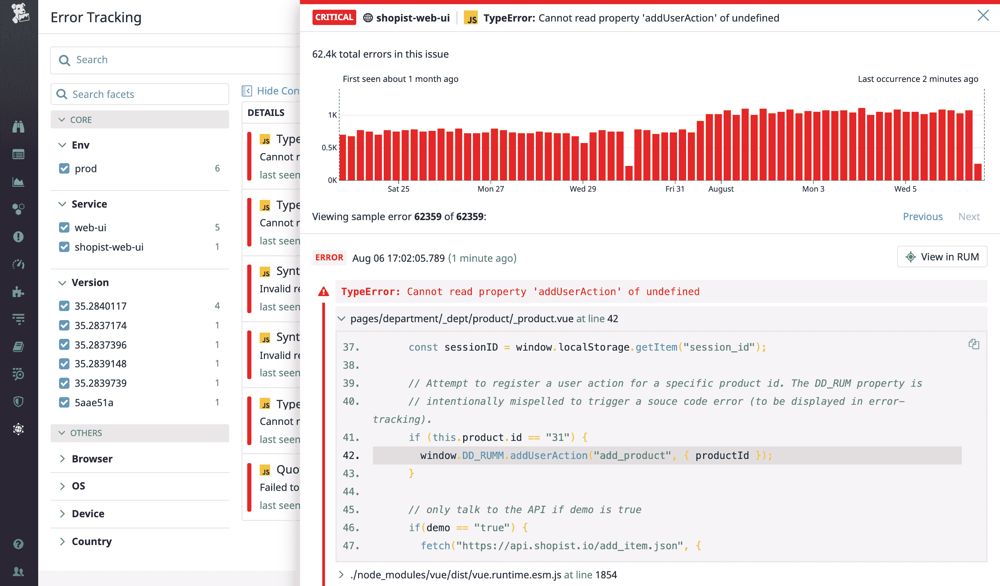
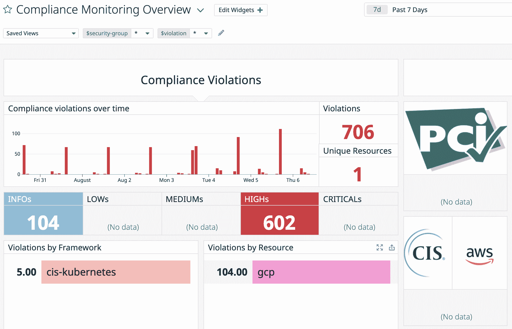

# Datadog 扩大了监控和分析服务的范围

> 原文：<https://devops.com/datadog-expands-scope-of-monitoring-analytics-services/>

Datadog 在今天举行的[在线 Dash 会议](https://www.dashcon.io/)上发布了一个事件管理平台以及其他分析工具，用于识别应用程序错误以及性能和合规性问题。

首席产品官 Amit Agarwal 表示，Datadog 平台的这些最新功能旨在进一步巩固 it 管理和监控。他说，IT 组织不应该发现自己获得并支持 20 种不同的工具，这些工具基本上都做同样的事情。

Datadog 事件管理服务通过在一个集中的控制台中统一警报数据、文档和协作来简化事件响应工作流，从而实现了这一目标。然后，这些工作流可用于创建自动化事件响应的行动手册。

与此同时，Datadog 还推出了连续分析器，专门用于测量生产环境中的代码性能，并推出了错误跟踪，该工具可实时自动汇总所有相关的应用程序错误，以便在由 Datadog 提供的命令行界面(CLI)支持的 DevOps 工作流流程环境中更轻松地发现可采取行动的问题。

Datadog 还推出了合规性监控，这是一项旨在识别错误配置的服务，一旦发生就会导致合规性问题漂移。一旦发现问题，Datadog 合规性监控会立即向 DevOps 团队发出警报。

最后，Datadog 推出了一个市场，让最终客户更容易获得补充的第三方应用程序。Datadog 市场的参与者包括 Fairwinds、Trek10、RapDev 和 IO Connect。

随着越来越多的组织将可观察性作为最佳 DevOps 实践的核心原则，Agarwal 说，整合监控工具以提供更大环境的需求是巨大的。Agarwal 补充说，这些工具不仅需要解决 IT 基础设施管理中的应用程序问题，还需要解决安全性和合规性要求方面的问题。

他说，考虑到维护所有这些平台的成本，it 团队依赖一种通过单一集成平台提供所有这些功能的服务在财务上更有意义。

在新冠肺炎疫情带来的经济衰退之后，Datadog 提出了整合 IT 监控和管理以降低总成本的理由。该公司打赌，许多 DevOps 团队更愿意将资源分配给开发应用程序，而不是提供和维护 DevOps 工具。

随着越来越多的 IT 组织过渡到基于微服务的应用程序，他们也将同时采用统一监控。鉴于构成现代应用的所有微服务之间存在的依赖性，监控现在几乎是任何云原生应用的要求。云服务提供的额外好处是能够根据需要扩展监控基础设施资源。

当然，Datadog 并不是唯一一家有着同样野心的统一监控工具提供商。然而，它确实有一个重要的客户群，这为它继续扩张提供了基础。唯一真正的问题是，考虑到所涉及的所有既得利益，确定组织愿意在多大程度上整合管理职能。