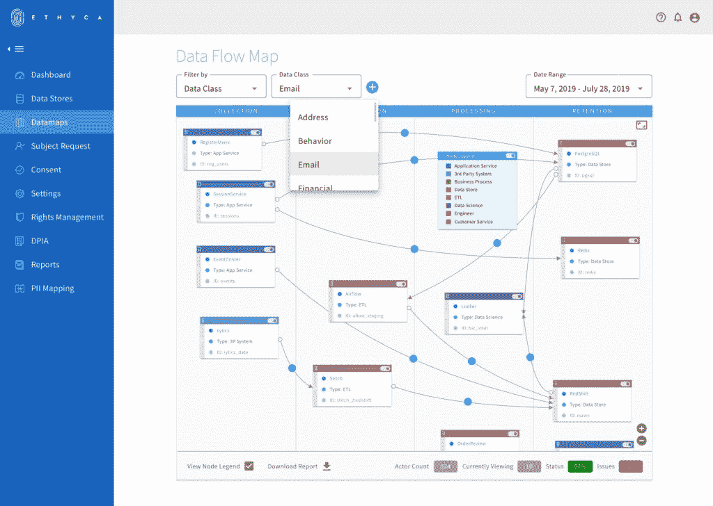

# 如何构建业务数据图

> 原文：<https://devops.com/how-to-build-a-business-data-map/>

最近在 DevOps.com 上，Anais Baig 提供了一个关于隐私流程和功能的简要概述，开发者需要考虑遵守新的全球隐私法，如欧洲的 GDPR 和加州的 CCPA。遵守这些法律的首要任务？构建业务数据图的需求。

毫不夸张地说，如果没有全面、准确的数据图，或者换句话说，没有企业在任何给定时间拥有的个人数据的完整清单，就不可能遵守这些现代隐私法规。开发人员会比大多数人更好地理解创建和维护这个记录的困难。

但这是可以做到的，今天我们将深入了解制作数据地图的要求和一些技术流程。

## 数据地图中有什么？

简而言之，数据地图显示了您的企业拥有的个人身份信息(PII)、您拥有它的原因、它的位置以及它的使用方式。要回答这四个问题，您需要审计业务中的数据库。确保包括第三方 SaaS 应用程序以及您自己的专有数据系统的一部分；算出每个字段包含的信息。然后，您需要与您的团队协作，以了解每个数据点的业务用途。

开发人员通常做的大部分工作是第一步:审计业务数据系统并记录数据库结构。至少，这些是你需要能够谈论你拥有的个人信息的每个领域的事情:

**来源:**是怎么收集的？

**用例:**它的业务用途是什么？

**储存:**为了进一步处理、转换或记录保存，储存在哪里？

**访问:**哪些业务单元可以访问数据？

**保留:**删除这些数据或更新用户对拥有这些数据的同意的时间表是怎样的？

**同意:**这些数据是通过明确的客户同意获得的吗？

如果您是一家小企业，有时数据图可以通过简单的电子表格“可视化”,但随着数据基础设施的扩展，它会很快发挥作用。较大的企业通常会发现，像构建实际地图一样构建数据地图非常有用，可以直观地表示企业中存在的数据关系。在这种形式中，数据图通常包含节点和链接，以显示包含任何个人身份信息的不同系统如何在您的组织中链接在一起。

这里有一个由 Ethyca 建造的:

可以想象，如果没有自动化工具，要达到这种优雅的可视化效果，需要做一些繁重的工作。对于那些刚刚开始绘制业务数据的人，我们推荐一种混合绘制方法。

## 映射的混合方法

混合方法意味着使用自动化基线流程来识别和记录您的组织正在处理的个人可识别信息，并将其存储到一个中央存储库中，然后使用手动标签分析数据分析来注释和验证您的堆栈中应用程序之间的实体关系。

标签分析涉及使用数据属性的名称来决定该属性标识哪个数据字典元素。例如，名为“email_id”的属性可以标识为“person.contact.email-address”。

当仅有属性的名称还不够时，属性所属的实体的名称也包括在分析中。例如，在名为“customer”的实体中，名为“name”的属性可以被标识为人名，而在名为“city_master”的实体中，类似名称的属性可以被标识为城市名。

有时，一组同时出现的属性很容易识别。例如，名为“lat”和“lng”的属性可以被识别为位置的纬度和经度。类似地，名为‘f _ name’和‘l _ name’的属性可以被识别为人名的一部分。

数据分析允许您通过使用数据库中的实际数据进行测试来手动确认标注分析中假定的关系。

实际数据中某些值或模式的存在可以确认某些映射。例如，如果属性的数据遵循“[【电子邮件保护】](/cdn-cgi/l/email-protection)”模式，则可以确认该属性捕获了电子邮件地址。

可以检查在不同表的属性中捕获的范围值，以查看这些属性是否引用了同一条信息，例如 user_id，该信息可用于将表与特定关系链接起来。类似地，属性中缺少值可以证实相反的情况。

如果您没有使用现成的数据映射解决方案，则标签和数据分析过程可能会非常艰巨。但是，如果操作正确，当您完成练习时，您将全面了解业务中的数据是如何联系在一起的，并且您将准备好开始回答与您拥有的每个 PII 领域相关的合规性问题。您还可以开始考虑随着数据清单的变化和发展来维护地图准确性的过程。