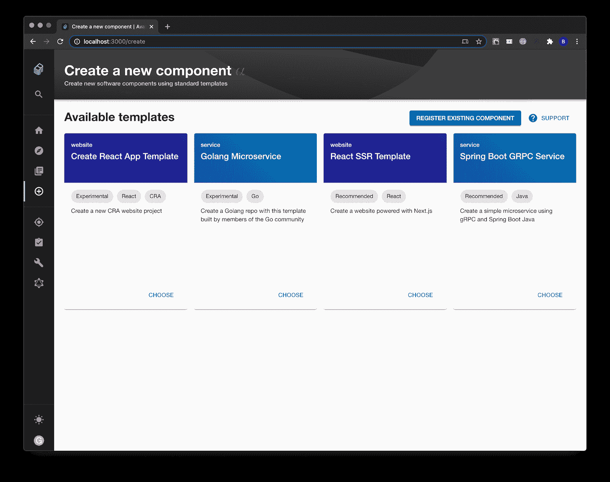

# Spotify 向服务目录项目添加自定义部署模板

> 原文：<https://devops.com/spotify-adds-custom-deployment-templates-to-service-catalog-project/>

Spotify 已经进入了开源 Backstage 目录项目的下一阶段，增加了对模板的[支持，通过模板部署软件组件的过程现在可以自动化。](https://backstage.io/blog/2020/08/05/announcing-backstage-software-templates)

Backstage 由 Spotify 开发，旨在创建一个开源目录，DevOps 团队可以通过该目录构建门户网站，集中管理开发人员工具。

Spotify 平台开发者体验产品负责人 Stefan Lund 表示，目标是为混乱的 IT 环境带来一些秩序。他指出，通过标准化开发人员可用的工具，Backstage 使 IT 组织能够开发更一致的工作流程。

lund 表示，DevOps 团队可以通过定制模板将这些工作流自动化，只需点击一下鼠标即可部署微服务、网站或其他软件组件。他说，这种方法也有助于鼓励重复使用开发者工具和那些工具用来创建的模块。

他补充说，在某些情况下，这些模板将消除依赖站点可靠性工程师(SREs)反复部署相同代码的需要。

Spotify 目前提议[将 Backstage 打造成一个沙盒级别的项目](https://github.com/cncf/toc/pull/476)，该项目将在云计算原生计算基金会(CNCF)的支持下进一步开发。

与此同时，Alund 表示，Spotify 将在开源 Jenkins 持续集成/持续部署(CI/CD)平台的核心实例基础上，继续完善过去四年在 DevOps 团队中广泛使用的服务目录。

目前还不清楚一个组织需要多成熟的开发环境才能意识到对目录的需求，通过目录，代码模块可以更容易地被重用。在某些情况下，过渡到微服务可能会不可避免地迫使问题。与其让开发人员重新发明微服务轮子，门户会让发现已经存在的软件资产并自动部署它们变得更容易。

Alund 指出，目录还提供了额外的好处，可以更容易地跟踪项目的出处，以及在由最佳 DevOps 实践实现的更大的软件供应链的背景下，谁目前对项目负有运营责任。

不管组织内部的 DevOps 成熟度如何，随着开发的微服务数量的增加，对跟踪服务的目录的需求变得越来越明显。据说现在每个公司都是软件公司。如果软件是作为数字业务资产来管理的，那么对于组织来说，确定他们拥有什么样的代码模块，然后确定哪些模块对组织最有价值是至关重要的。

只有到那时，每一个渴望成为软件供应商的公司，如果碰巧生产某种产品或提供某种服务，才能像真正的软件公司一样得到管理。任何达不到这一目标的事情都只是一种愿望的陈述。