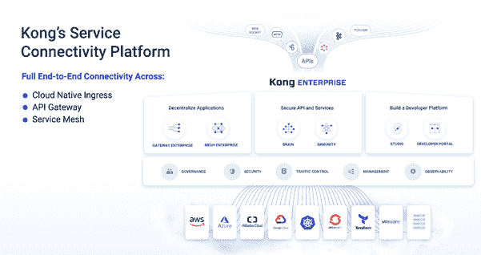

# 孔雄心勃勃地致力于统一企业 IT

> 原文：<https://devops.com/kong-extends-ambitious-effort-to-unify-enterprise-it/>

Kong Inc .今天发布了其平台企业版的[更新，为连接构成现代 IT 环境的各类应用程序提供了基础。](https://www.prnewswire.com/news-releases/kong-unveils-first-cloud-native-api-platform-built-for-devops-driven-automation-across-hybrid-environments-301118622.html)

公司首席技术官 Marco Palladino 表示，Kong Enterprise 的 2.1 版本使部署集成平台混合实例的数据平面成为可能，而无需在每个位置都需要单独的开源 Cassandra 数据库实例。

最新的更新还增加了对 Kong Mesh 的支持，这是一个基于库马构建的集成服务的服务网格，这是一个开源项目， [Kong 在今年早些时候捐赠给了云原生计算基金会(CNCF)](https://devops.com/kong-donates-kuma-service-mesh-to-the-cncf/)，它支持容器和遗留虚拟机平台。

Kong 还使使用 Go 编程语言构建插件成为可能，并增加了对管理应用程序编程接口(API)生命周期的插件的支持。

最后，Kong 在其开发人员门户中增加了对新的 Kong Vitals 用户界面的支持，用于仪表盘和应用程序注册工具。

Palladino 说，基于作为 Kong Enterprise 基础的 API 管理平台，Kong Enterprise 通过为单片和基于微服务的应用程序集成所有第 4 层到第 7 层服务，将企业 IT 环境内的连接提高到更高的抽象水平。Kong Enterprise 提供了一个抽象层，用于统一管理运行松散耦合应用程序的高度分布式 IT 环境，而不是在孤立的孤岛中管理一系列网络服务和相关服务。

Palladino 说，到目前为止，已有 250 多家 IT 组织采用了 Kong Enterprise 来简化分布式 IT 环境的管理。随着企业 IT 组织通过简化 IT 管理来降低 IT 总成本，这些努力只会加速。如今，大多数企业 IT 组织都在使用不同的工具管理多个平台，这些工具必须由不同的管理员掌握。孔正在为统一 20 多个不同平台的管理进行论证。这项工作的核心是 Kong Gateway，它是 Kubernetes 的一个实例，Kong 通过它将其框架扩展到这些环境中。

主要由于新冠肺炎疫情带来的经济衰退，企业 IT 组织转向混合云计算的速度有望加快。大多数组织无法从经济上证明为他们部署的每个平台雇佣和保留单独的管理员是合理的。

与此同时，数字业务转型计划需要通过在更高的抽象层次上管理基于 API 的服务来实现更敏捷的企业 IT 方法。

自然，组织可能需要行使政治意愿，将组成企业 it 环境的所有领域聚集在一起。然而，随着组织继续沿着开发运维的道路前进，在扩展的企业中无情地自动化分布式 IT 流程的需求变得前所未有的明显。