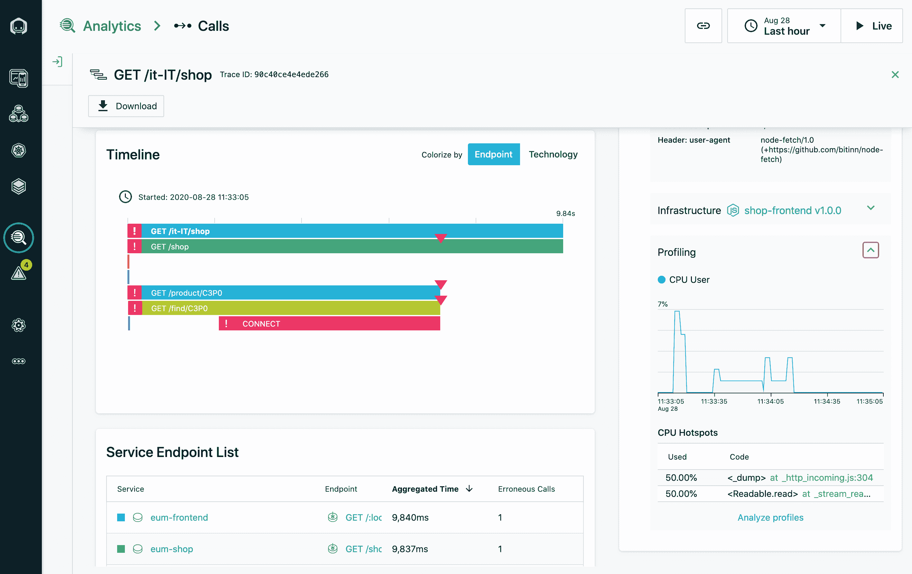

# Instana 对分布式跟踪应用连续分析

> 原文：<https://devops.com/instana-applies-continuous-profiling-to-distributed-traces/>

Instana 今天宣布，它已经[在其应用性能管理(APM)中添加了一个持续分析功能](https://www.instana.com/press-releases/instana-announces-direct-integration-of-traces-with-always-on-production-profiling/)，这使得开发运维团队可以更轻松地利用分布式跟踪来解决问题。

Instana 的技术总监兼 APM 策略师 Chris Farrell 表示，虽然分布式跟踪使识别瓶颈变得更加容易，但连续分析使深入分析以识别特定的 CPU、内存和并发问题成为可能。

基于 Instana 去年收购 StackImpact 时获得的技术，Farrell 表示，持续分析功能正在添加到 Instana APM 平台中，无需额外成本。

Instana 不需要构建、维护和部署可以使用分布式跟踪的监控平台，而是支持软件即服务(SaaS)平台，该平台可以从 DevOps 团队中卸载可观测性平台的所有后端管理，包括收集和存储分布式跟踪的成本。

Farrell 说，剖析功能持续地将单个轨迹直接映射到适用的过程剖面。无论何时出现问题，这些配置文件都是即时可用的。相比之下，采用分布式跟踪的竞争方法试图复制发现的瓶颈问题，希望查明问题所在，Farrell 指出，对于试图解决问题的 DevOps 团队来说，这仍然是一个碰运气的提议。然而，他说，希望不是一个合理的工程过程的属性。

Instana APM 平台针对基于微服务的应用进行了优化，但也可以应用于整体应用。然而，随着组织部署基于微服务的应用程序，依赖性变得更加复杂，这反过来需要采用某种类型的可观察性平台。从历史上看，由于使用 APM 平台的相关成本，大多数 IT 组织都将 APM 平台限制在其最有价值的整体应用程序上。

Farrell 表示，Instana 平台将使用自己的代理软件以及开源项目生成的跟踪数据，这些开源项目旨在降低检测应用程序的总成本。Instana 自动为应用技术堆栈的每个部分部署传感器，并跟踪所有应用请求，无需任何人工配置或应用重启。它还可以实时检测应用和基础架构的变化，调整自己的模型以直观显示变化，并在几秒钟内评估性能影响。

最后，Farrell 说，采用任何 APM 平台的目标都应该是减少 IT 团队解决问题的平均时间，他们越来越多地承担管理复杂应用程序的任务。面临的挑战是，不仅应用程序比以往更加复杂，而且组织也比以往更加依赖应用程序。随着 COVID-10 疫情带来的经济衰退，许多组织被迫加快数字业务转型计划，这些计划完全依赖于成功构建、部署和维护应用的速度。

当然，Instana 并不是 APM 平台竞相采用分布式跟踪来简化应用程序环境管理的唯一提供商。现在的问题是确定哪个 APM 平台不会让其客户为这一特权支付额外费用。