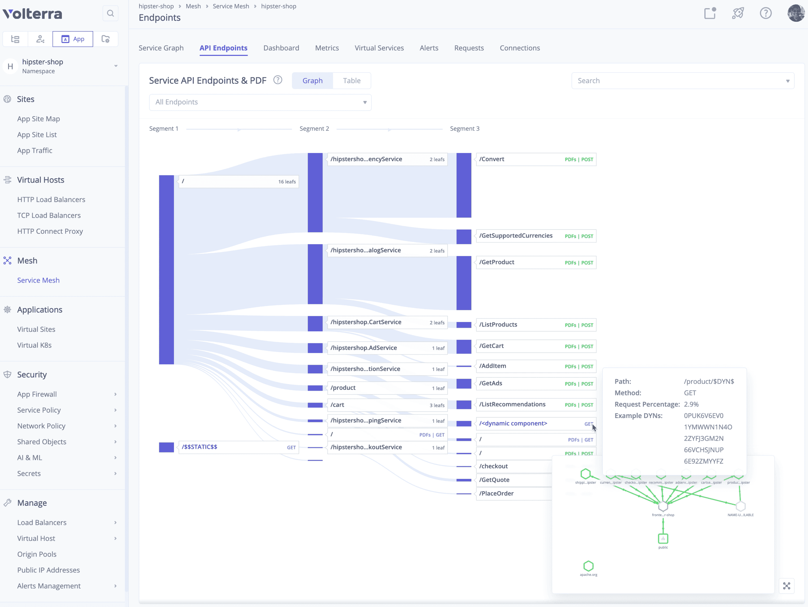

# Volterra 服务网状服务自动发现 API

> 原文：<https://devops.com/volterra-service-mesh-service-automatically-discovers-apis/>

Volterra 今天宣布，它已经通过软件即服务(SaaS)平台更新了一个服务网格，使其能够使用机器学习算法自动发现应用程序中的所有应用程序编程接口(API)，然后自动应用所有适用于这些 API 的白名单策略。

服务网格在代理服务器上添加了一个可编程的抽象层，使 it 团队能够更容易地[按需提供网络和安全服务](https://devops.com/why-service-meshes-are-security-tools/)。挑战在于服务网格的部署往往很复杂，并且服务网格本身和底层代理服务器软件之间也消耗大量资源。

公司首席执行官 Ankur Singla 表示，Volterra 通过将 VoltMesh 作为一种服务来解决这个问题，DevOps 团队可以远程调用该服务来简化网络服务的供应，而不必自行部署和维护服务网格。Volterra 声称 VoltMesh 已经被 50 多个企业 IT 组织和服务提供商所接受。VoltMesh 还可以通过该公司管理的应用交付网络(ADN)在全球范围内扩展到多个云提供商的集群。

Singla 表示，VoltMesh 正在将网络和安全服务的控制权转移给 DevOps 团队，方法是采用作为服务提供的网络结构，从而消除为每个集群部署单独的负载平衡器、API 网关和 web 应用防火墙的需要。Singla 补充说，该网络结构还为 DevOps 团队提供了网络服务的零信任架构，可以更好地确保应用程序的安全性，因为它由 Volterra 管理。

总的来说，服务网格正在成为网络运营和开发运维流程融合的关键。大多数开发运维团队可以在几分钟内调配虚拟机。然而，在公共云之外，仍然需要几天甚至几周的时间来调配网络和安全服务。服务网格提供了一种机制，用于以编程方式向 API 公开网络和安全服务，而无需网络工作人员使用每个设备独有的命令行界面(CLI)来手动配置每个设备、路由器和交换机。

现在说 It 组织会在多大程度上决定更多地依赖外部网络服务还为时过早。然而，越来越多的组织明显倾向于将有限的资源更多地用于开发和部署应用程序。运行这些应用程序所需的一切都变成了另一个可以编程调用的云服务。

自然，这种转变对网络运营团队的影响是深远的。许多组织在企业网络中有数百万美元的“沉没成本”。然而，当 DevOps 团队面临着比以往任何时候都更快地交付应用程序的挑战时，对僵化的网络服务的容忍度正在下降。许多开发运维团队会简单地选择依赖外部网络服务，就像他们选择在云中部署虚拟机，而不是等待内部 IT 团队在本地数据中心提供资源一样。说到传统的人际交往方式，时间和耐心已经不多了。