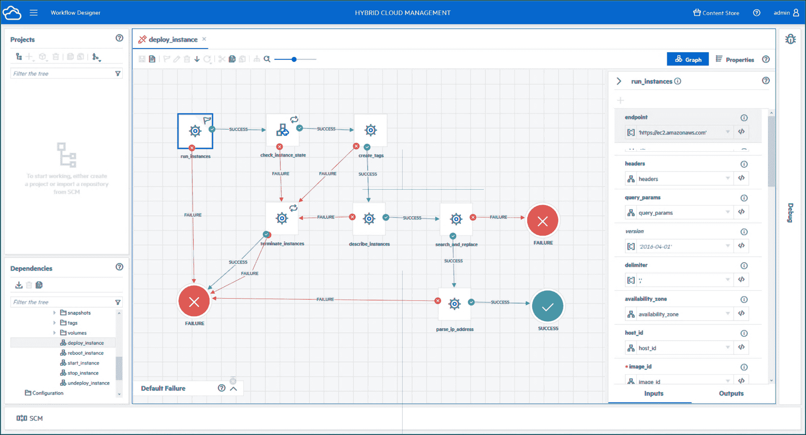

# 微焦点增强混合云实力

> 原文：<https://devops.com/micro-focus-strengthens-hybrid-cloud-hand/>

Micro Focus 提供了一个多租户云管理平台，可以部署在公共云或内部 IT 环境中。

Micro Focus 的 it 运营管理高级总监 Travis Greene 表示，[混合云管理 X](https://www.microfocus.com/en-us/press-room/press-releases/2020/micro-focus-introduces-hybrid-cloud-management-x-simplifying-the-delivery-of-multi-cloud-services) (HCMX)平台使得跨跨各种平台的混合云计算环境(包括公共云和 VMware 环境)统一 IT 服务的[管理成为可能。](https://devops.com/micro-focus-advances-capabilities-for-devops-in-latest-deployment-automation-release/)

HCMX 的核心是一个统一的门户和服务目录，IT 团队可以通过它来查找、请求和使用信息和企业服务。它构建在与服务自动化框架 X (SMAX)相同的框架上，后者是一个 It 服务管理(ITSM)平台，也是由微焦点提供的。因此，HCMX 也可以利用 Micro Focus 在 SMAX 上提供的相同的自然语言引擎、搜索和虚拟代理技术。

HCMX 还提供了一个可重复使用的工作流库，IT 团队可以通过该库自动化流程以及一组治理策略，这些策略可以根据事件或来自 IT 管理员的输入自动触发工作流，例如，限制特定云服务的使用。

随着新冠肺炎疫情带来的经济衰退，控制 IT 成本的压力比以往任何时候都大。在多云时代降低这些成本的一种方法是在一个公共控制平面下集中管理这些环境。如今，大多数 IT 组织都依赖独立的工具和控制台来管理彼此孤立的 IT 平台。不仅每个管理平台都要支付许可费用，而且 IT 部门通常还必须雇佣专家来管理每个单独的平台。随着混合云计算平台的不断成熟，依靠少数 it 通才来集中管理 IT 成为可能。

当然，过渡到单一混合云计算环境需要大量的时间和精力。IT 组织需要对单一平台做出多年承诺，以降低 IT 总成本。许多组织根本没有能力在组织内的多个部门强制采用单一管理平台，而不考虑潜在的节约。然而，完成过渡的组织不仅应该能够降低 IT 的总成本，还应该能够根据一个平台相对于另一个平台的成本和优点，更灵活地选择在何处部署其下一代应用程序工作负载。

此外，在任何一家主要云服务提供商的母公司都可能在一夜之间成为直接竞争对手的时代，许多组织现在更愿意保留他们的 IT 选项。当然，挑战在于确保部署在这些平台上的工作负载不依赖于在其他任何地方都不存在的专有接口。

当然，微焦点并不是唯一一家专注于混合云计算的 IT 管理工具提供商。IT 组织需要做出的决策是确定这些平台中的哪一个能够以组织能够承受的成本提供最大的灵活性。