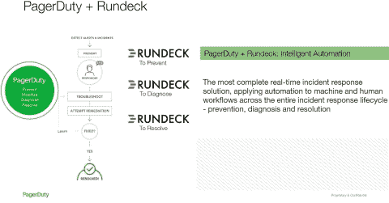

# 购买 Rundeck 以扩展数字化运营中的 DevOps 自动化能力

> 原文：<https://devops.com/pagerduty-to-acquire-rundeck-to-expand-devops-automation-capabilities-across-digital-operations/>

*企业级运行手册自动化和自动补救将提高数字前线团队的工作效率，使他们能够更快地解决事件、降低成本并保护客户体验*

(图片:商业资讯)

September 21, 2020 09:15 AM Eastern Daylight Time

三藩市—([商业新闻](https://www.businesswire.com/))—[寻呼机责任公司](https://cts.businesswire.com/ct/CT?id=smartlink&url=http%3A%2F%2Fwww.pagerduty.com&esheet=52290433&newsitemid=20200921005436&lan=en-US&anchor=PagerDuty%2C+Inc&index=1&md5=50e0bcda13f1372480ed9b3f9660fb1f)。(纽约证券交易所代码:PD)，全球领先的数字运营管理公司，今天宣布已达成最终协议，收购领先的企业 DevOps 自动化提供商 [Rundeck](https://cts.businesswire.com/ct/CT?id=smartlink&url=https%3A%2F%2Fwww.rundeck.com%2F&esheet=52290433&newsitemid=20200921005436&lan=en-US&anchor=Rundeck&index=2&md5=5f864b35706df0813cc618bd1ae8e583) 。此次收购加强了 PagerDuty 领先的事件响应产品，提供智能机器自动化，包括自动补救和自我修复，提高了解决和恢复工作的生产率。

> “Rundeck 旨在为利用混合基础架构自动化的 DevOps 团队解决棘手的时间敏感型挑战。有了 PagerDuty，我们可以加快我们在企业开发应用和以 IT 为中心的事件响应方面的发展，同时继续创新我们的产品和扩展我们的开源社区”
> 
> [发这条微博](https://www.businesswire.com/news/home/20200921005436/en/PagerDuty-to-Acquire-Rundeck-to-Expand-DevOps-Automation-Capabilities-Across-Digital-Operations#)

Rundeck 为一线事故响应团队(包括工程、IT、客户服务和安全部门)提供了一种自助式方式来运行以机器为中心的自动化工作流(或运行手册),只需按一下按钮即可预防、诊断和解决事故，而无需上报给专家。使用 Rundeck 的自动化操作手册，客户的事件响应时间缩短了 50%,极大地提高了团队的工作效率，减少了糟糕的客户体验。

Rundeck 的自动化解决方案在大型企业中实现了强大的产品市场适应性，为 150 多家企业和中端市场公司提供服务，这些公司正在寻求提高其数字产品的可用性。Rundeck 的土地和扩展走向市场运动始于 DevOps，建立在一个拥有超过 60，000 名用户的活跃开源社区之上。

“Rundeck 在为世界上最大的公司的 DevOps 团队提供规模化自动化方面有着令人印象深刻的记录，加上他们易于使用、专注于从业者的产品，使他们成为 page duty 的高度补充扩展，”page duty 首席执行官詹妮弗·特哈达说。“现在，从检测和诊断到恢复、补救和学习，我们可以一起自动完成人和机器不可预测的紧急工作，提供市场上最强大的实时事件响应平台。我们的 13，300 名客户相信我们能够确保他们的数字服务始终在线，现在我们正在确保他们能够更快、更高效地做到这一点。”

“Rundeck 旨在为利用混合基础架构自动化的 DevOps 团队解决棘手的时间敏感型挑战。Rundeck 首席执行官兼联合创始人 Alex Honor 表示:“借助 PagerDuty，我们可以加快企业开发应用程序和以 IT 为中心的事件响应的发展，同时继续创新我们的产品和扩展我们的开源社区。“和我们一样，PagerDuty 也沉浸在 DevOps 和数字化转型中，拥有无与伦比的领导力，受到大型企业公司和早期创新者中大量忠实用户群体的信任。我们期待为我们所有的客户带来事件响应和数字化运营方面最全面的产品。”

“糟糕的事情发生了，所以基础设施和运营专业人员需要准备自动化的运营响应；关联性能分析以预测和避免事故；支持预防性评估、演习/比赛日和混沌工程；Forrester 首席分析师查尔斯·贝茨(Charles Betz)说，利用事后分析来改进系统。专注于自动化事件响应的供应商 PagerDuty 将演示者带到其区域峰会，讨论事件指挥，以便从业者可以学习和采用最佳实践 ¹

根据最终协议的条款，page duty 将收购 Rundeck，总收购价格约为 1 亿美元(可调整)，其中约 60%以现金支付，40%以 page duty 普通股支付。该收购受某些惯例成交条件的限制，预计将于 2020 年 10 月完成。

电话会议信息:

PagerDuty 将于太平洋时间 2020 年 9 月 21 日下午 1:15 召开电话会议和网络直播，与分析师和投资者讨论 Rundeck 公告。这个电话会议可以从位于[investor.pagerduty.com](https://cts.businesswire.com/ct/CT?id=smartlink&url=https%3A%2F%2Finvestor.pagerduty.com%2Fevents-and-presentations%2Fdefault.aspx&esheet=52290433&newsitemid=20200921005436&lan=en-US&anchor=investor.pagerduty.com&index=3&md5=a5e4b3e54a17c6ae17b21b6196cd909e)的 PagerDuty 投资者关系网站访问。

安全港声明

本新闻稿包含“前瞻性陈述”，这些陈述基于 page duty 的信念和假设以及截至本新闻稿发布之日 page duty 可获得的信息。前瞻性陈述包括但不限于关于完成收购的预期时间(如果有的话)、成交条件和监管批准的满意度、收购的预期收益、将 Rundeck 成功整合到 page duty 业务的能力、收购对 page duty 产品和服务的影响、Rundeck 产品和服务的能力以及对 page duty 股东的预期稀释的陈述。有大量已知和未知的风险、不确定性和其他因素可能导致 PagerDuty 的实际结果、表现或成就与前瞻性陈述中明示或暗示的结果、表现或成就有重大差异，包括:在完成和整合合并后的业务、技术、人员和运营时遇到的困难；与收购相关的成本；收购以及由此产生的产品和服务的市场接受度；PagerDuty 无法从其业务的重大投资中实现价值，包括产品和服务创新；以及总体市场、政治、经济和商业状况。

有关可能影响 page duty 财务结果的潜在因素的更多信息，请参见该公司截至 2020 年 7 月 31 日的季度报告 Form 10-Q，该报告已在美国证券交易委员会备案，并在 page duty 向 SEC 提交了其他文件。除非法律要求，否则 PagerDuty 不承担更新或修改任何前瞻性陈述的意图或义务，也不承担更新实际结果可能与前瞻性陈述中预期的结果有重大差异的原因的意图或义务，无论是由于新信息、未来事件还是其他原因。

欲了解更多信息，请访问[www.pagerduty.com](https://cts.businesswire.com/ct/CT?id=smartlink&url=http%3A%2F%2Fwww.pagerduty.com&esheet=52290433&newsitemid=20200921005436&lan=en-US&anchor=www.pagerduty.com&index=4&md5=d6e78b774e8c6dbd54a2af0b86ee0d53)

在 2020 年 9 月 21 日至 24 日举行的**[page duty 峰会 20](https://cts.businesswire.com/ct/CT?id=smartlink&url=https%3A%2F%2Fsummit.pagerduty.com%2Fglobal&esheet=52290433&newsitemid=20200921005436&lan=en-US&anchor=PagerDuty+Summit20&index=5&md5=248e6febd7f17b84b03425ee7cb77d6c)** 上，了解更多有关 page duty 的最新平台创新、集成、客户用例、合作伙伴关系和思想领导力的信息。

**关于 page duty**

[page duty，Inc.](https://cts.businesswire.com/ct/CT?id=smartlink&url=https%3A%2F%2Fwww.pagerduty.com%2F&esheet=52290433&newsitemid=20200921005436&lan=en-US&anchor=PagerDuty%2C+Inc.&index=6&md5=259b97054b2f8daf368be4fa1bf31387) (纽约证券交易所代码:PD)是数字运营管理领域的领导者。在一个永远在线的世界里，各种规模的组织都相信 PagerDuty 能够帮助他们为客户提供完美的数字体验。团队使用 PagerDuty 来实时识别问题和机会，并召集合适的人员来更快地解决问题并防止将来出现问题。著名的客户包括通用电气、思科、基因泰克、电子艺界、考克斯汽车、网飞、Shopify、Zoom、DoorDash、lululemon 等等。要了解更多信息并免费试用 PagerDuty，请访问 www.pagerduty.com。关注我们的[博客](https://cts.businesswire.com/ct/CT?id=smartlink&url=https%3A%2F%2Fwww.pagerduty.com%2Fblog%2F&esheet=52290433&newsitemid=20200921005436&lan=en-US&anchor=blog&index=8&md5=39c79d3ea95781e2b5aca4c2bba24df8)，在[推特](https://cts.businesswire.com/ct/CT?id=smartlink&url=https%3A%2F%2Ftwitter.com%2Fpagerduty&esheet=52290433&newsitemid=20200921005436&lan=en-US&anchor=Twitter&index=9&md5=abdd4b4532d1a6436d607e6ef1b2c8f2)、 [LinkedIn](https://cts.businesswire.com/ct/CT?id=smartlink&url=https%3A%2F%2Fwww.linkedin.com%2Fcompany%2F482819&esheet=52290433&newsitemid=20200921005436&lan=en-US&anchor=LinkedIn&index=10&md5=ea31aa293f68f0de973cc55e47873a50) 、 [YouTube](https://cts.businesswire.com/ct/CT?id=smartlink&url=https%3A%2F%2Fwww.youtube.com%2Fchannel%2FUCIL6fDywCheNp3rnf_v4R-g&esheet=52290433&newsitemid=20200921005436&lan=en-US&anchor=YouTube&index=11&md5=a80ced958c6b59dfa3881cba7e2a0650) 和[脸书](https://cts.businesswire.com/ct/CT?id=smartlink&url=https%3A%2F%2Fwww.facebook.com%2FPagerDuty%2F&esheet=52290433&newsitemid=20200921005436&lan=en-US&anchor=Facebook&index=12&md5=8417c9b604b768709d69980f94f8d96b)上与我们联系。

¹ 不断变化的 IT 事件和危机管理格局，Forrester Research，Inc .，2018 年 2 月 20 日。