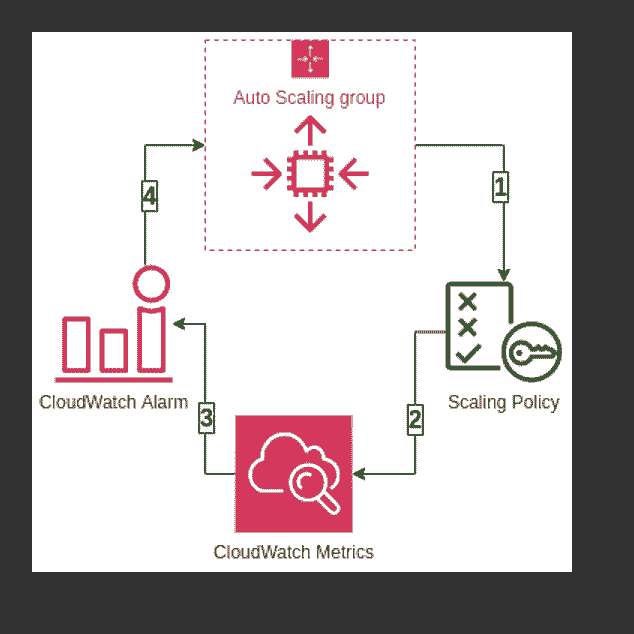
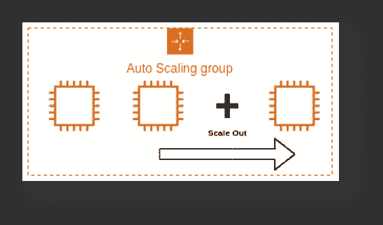
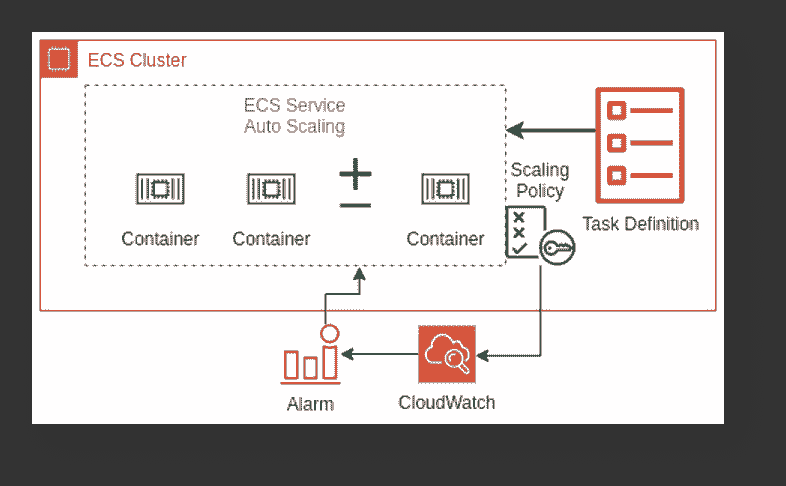
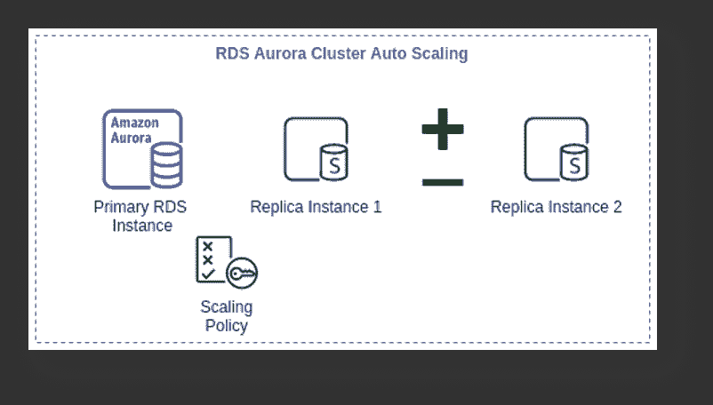
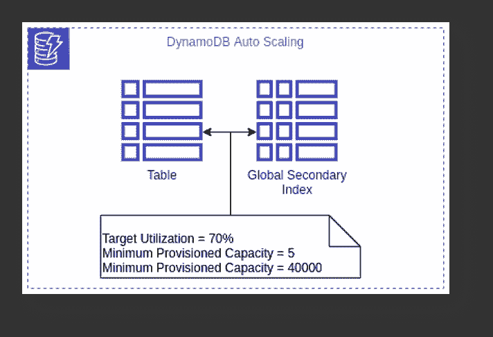

# 利用 AWS 自动扩展服务优化性能、削减成本

> 原文：<https://devops.com/optimize-performance-cut-costs-with-aws-autoscaling-services/>

在 AWS 云平台上实现物有所值的一个非常简单(免费)的方法是自动伸缩。自动扩展可实现更好的容错能力、更高的可用性和更好的成本管理，通过检测和替换基础架构中不健康的组件，快速扩展和缩减以满足流量需求，同时将您的成本控制在预算之内。

自动扩展的一些[关键优势](https://devops.com/the-power-of-autoscaling-and-the-mistake-youll-never-make-again/)包括:

1.  按需满足流量需求并相应地扩展。
2.  通过自动缩放组上的计划操作调整缩放组容量。
3.  减少资源和成本。
4.  通过跨可用性区域部署来提高应用程序可用性。

AWS 有几项服务可以帮助自动扩展基础架构组件，并减少与扩展相关的管理。它们通过 [CloudWatch 监控和可观测性服务](https://aws.amazon.com/autoscaling/faqs/)进行协调。CloudWatch 提供长达 1 秒的指标可见性、15 个月的数据保留(指标)以及对指标执行计算的能力。这使得数字工程团队可以对成本优化等事情进行历史分析。在指定指标的基础上，团队可以创建警报，警报触发自动扩展策略来执行预定义的步骤，或者向外扩展或者向内扩展。

## ****

## AWS 云平台上的自动扩展服务

**EC2 实例自动缩放**

EC2 实例自动伸缩有助于我们保持正确数量的 EC2 实例可用于处理应用的传入流量请求。我们可以创建一个 EC2 自动缩放组，它是 EC2 实例的集合。在该组中，我们可以指定一个最小值，确保该组永远不会低于指定的大小。我们还可以指定 EC2 实例的最大数量，这可以确保该组永远不会超过指定的大小。这将容量保持在最小和最大范围内，并确保您的自动缩放组具有在所需容量中指定的 EC2 实例。自动扩展还允许我们配置可在指定时间更改最小、最大和所需自动扩展组容量的计划操作。

EC2 实例自动扩展允许配置扩展策略，该策略将根据策略来增加或减少基础架构中的 EC2 实例。

有两种类型的扩展:手动扩展，我们可以从自动扩展组中附加和分离 EC2 实例；动态扩展，我们可以定义如何扩展自动扩展组容量，以响应传入的请求或特定资源利用率方面不断变化的需求。这使我们能够配置策略来处理纵向扩展和横向扩展，并根据策略针对请求数量、CPU 和内存利用率等因素采取行动。

****

下面是三种类型的动态扩展策略:

*   **目标跟踪:**该策略将根据特定指标的目标值增加或减少自动扩展组的当前所需容量。该策略维护容量以匹配指定的目标指标，如 CPU 或内存利用率。假设您已经将自动扩展组的利用率设置为 60%,目标跟踪策略将添加或删除 EC2 实例以满足指定的利用率。
*   **步进缩放:**该策略根据一组缩放调整(EC2 实例)来增加或减少自动缩放组的当前容量，这些缩放调整根据警报突破的大小而变化。让我们假设自动扩展组有三个阶段来跟踪 CPU 利用率—第一个警报将在达到 40%时触发，并将添加一个 EC2 实例；第二个警报将在达到 60%时触发，并将添加两个 EC2 实例；第三个警报将在达到 80%时触发，并将添加三个 EC2 实例。
*   **简单扩展:**这是一个简单的扩展策略选项，根据单次扩展调整增加或减少当前自动扩展组容量。在这里，我们可以添加一个 EC2 实例。

EC2 自动扩展提供按需实例扩展和 spot 车队实例自动扩展，通过这两种方式，我们可以根据需求自动增加或减少 spot 车队的当前容量。它可以在指定范围内启动(向外扩展)或终止(向内扩展)。

**ECS 容器服务自动扩展**

弹性容器服务(ECS)的自动伸缩作用于已发布的容器 CloudWatch 指标，如 CPU 和内存使用情况。它自动增加或减少 ECS 服务中容器任务的期望容量。CloudWatch 指标可用于向外扩展(添加更多任务)以处理大量传入请求，并在低利用率期间向内扩展(删除任务)。

ECS 自动扩展允许我们配置策略，包括目标跟踪、步进扩展和计划的扩展操作。

** ** ** RDS 存储自动缩放**

面向 MariaDB、MySQL、PostgreSQL、SQL Server 和 Oracle 的亚马逊关系数据库服务(RDS)支持存储自动扩展，零停机 RDS 存储自动扩展，以扩展连接到 RDS 数据库的后端存储卷，从而应对不断增长的数据库大小。

RDS 会监控当前的存储消耗，并在当前消耗接近实际调配的大小时扩大存储容量，而不会影响当前的数据库操作和干扰当前的数据库横切。

**极光自动缩放**

AWS Aurora 自动缩放可动态调整 Aurora 副本的数量。您可以定义扩展策略，Aurora 会相应地采取行动。它扩展 Aurora 副本，以处理数据库连接或工作负载的突然增加。随着数据库连接或工作负载的减少，Aurora 自动扩展会自动删除不需要的 Aurora 副本，因此客户无需为不需要的副本实例付费。

正如我们能够在其他服务中定义扩展策略一样，我们也可以在 Aurora 自动扩展中定义它们，它还允许我们配置可管理的 Aurora 副本的最小和最大数量。Aurora Auto Scaling 可用于 Aurora 引擎 MySQL 和 PostgreSQL。

** ** ** DynamoDB 自动缩放**

DynamoDB 工作负载最困难的部分是预测读写容量单位。如果应用程序在特定时间段需要高吞吐量，则没有必要在整个时间段内过度调配容量单位。Amazon DynamoDB Auto Scaling 会根据实际的流量请求模式，代表您动态调整提供的吞吐量。

随着工作负载的减少，应用程序自动扩展会减少调配的吞吐量容量单位，因此客户无需为任何不必要的容量付费。

通过 DynamoDB 自动缩放，我们可以在表或全局二级索引上创建缩放策略。我们可以在扩展策略中指定是要扩展读取容量还是写入容量(两者都要),以及表或索引的最小和最大配置容量单位设置。

## 为自动扩展准备您的基础架构

为了让这些 AWS 自动伸缩服务发挥应有的功能，组织需要确保具备:

*   使用 EC2 实例时指定的应用程序用户会话状态和持久性。
*   测试、监控和调整他们的自动扩展策略，以确保其按预期运行。
*   制定决策逻辑，根据预定义的阈值或时间表评估这些指标，并决定是横向扩展还是纵向扩展。
*   在配置自动缩放之前，设置特定于服务的限制。
*   在使用 EC2 自动缩放时，团队已经指定了冷却时间以及要启动的应用程序，并在规定的时间内准备好服务。