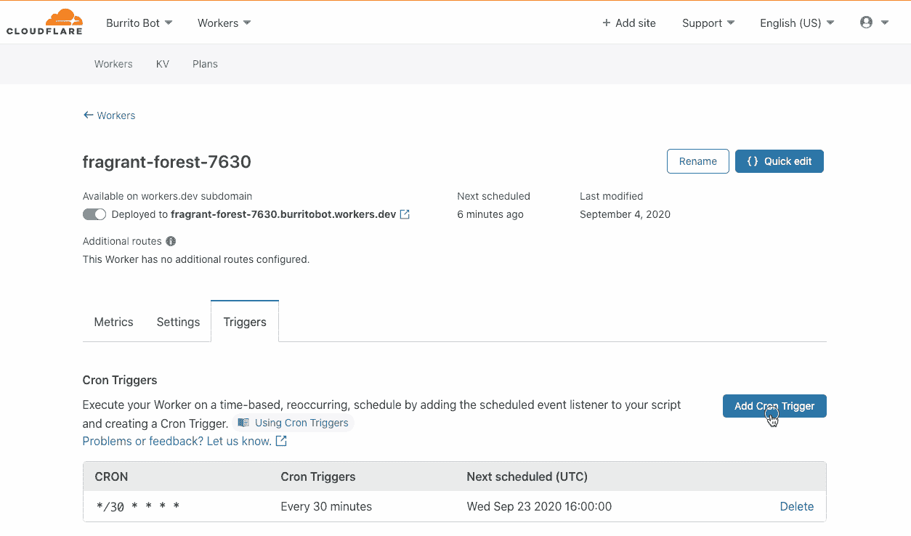

# Cloudflare 将 CDN 替代方案的范围扩展到公共云

> 原文：<https://devops.com/cloudflare-expands-range-of-cdn-alternatives-to-the-public-cloud/>

基于 200 多个数据中心的内容交付网络(CDN)提供商 Cloudflare 本周宣布，它已经推出了测试版的[耐久对象](https://blog.cloudflare.com/introducing-workers-durable-objects/)功能，使跨分布式无服务器 Cloudflare Workers 服务运行有状态应用成为可能。

公司首席执行官 Matthew Prince 表示，持久对象提供了一种真正统一的方法来管理存储和状态，确保 CDN 服务的低应用延迟。

Cloudflare 本周还推出了 [API Shield](https://blog.cloudflare.com/introducing-api-shield/) ，它采用基于客户端证书的身份和严格的基于模式的验证，使用托管公钥基础设施(PKI)，只允许具有已知行为和身份的应用程序编程接口(API)访问 CDN 服务。

该公司还添加了一个 [Cron Triggers](https://blog.cloudflare.com/introducing-cron-triggers-for-cloudflare-workers/) 工具，使 IT 团队能够在工人节点上调度作业，而不是总是必须发出 HTTP 请求。

最后，Cloudflare 本周增加了一个免费的 [Cloudflare Web Analytics](https://www.cloudflare.com/press-releases/2020/cloudflare-announces-web-analytics-a-privacy-first-free-alternative-for-all/) 工具和一个免费的 [Cloudflare Radar](https://www.cloudflare.com/press-releases/2020/cloudflare-launches-radar-sharing-the-latest-internet-trends-with-the-world/) 工具，允许 IT 团队使用从一个网络收集的数据来查看互联网上的全球流量和安全趋势，该网络涉及 100 多个国家的 2500 多万个互联网属性。

由于边缘计算的兴起，应用程序变得比以往任何时候都更加分散，因此越来越需要部署有状态的应用程序，以便在更接近数据生成和消费的地方处理数据。IT 团队不必手动部署这些边缘计算平台，Cloudflare 一直在为无服务器计算平台提供支持，使 IT 团队能够利用它代表他们管理的平台。

对于 Cloudflare，持久对象是可以用任何编程语言编写的类的实例。每个对象都有一个唯一的标识符，并且只存在于一个位置。任何在世界上任何地方运行的工作者，只要知道这个对象的 ID，就可以向它发送消息。持久对象可以将持久状态存储在磁盘上。每个对象还可以在内存中维护状态的一致副本，以消除延迟。内存中的对象将在空闲时关闭，并可以在以后需要时重新创建。

Prince 补充说，Cron Trigger 工具为 IT 团队提供了对如何消耗 Cloudflare CDN 上的容量的更多控制。

Prince 说，Cloudflare CDN 最终为部署边缘计算应用程序提供了一种成本更低的云服务替代方案，使 IT 团队能够更好地控制应用程序工作负载在何时何地运行。

在新冠肺炎时代，IT 组织派遣 IT 人员实际安装和更新物理基础架构的日子可能即将结束。没有必要花费成本或将 IT 员工置于感染病毒的风险中。现在的问题是，决定是采用云服务提供商，还是依赖几个 CDN 选项中的任何一个，这些选项在历史上被用来优化 web 应用程序。

无论选择哪种方式，在 IT 基础架构资源上远程部署任何类型的应用程序的能力从未像现在这样强大或简单。