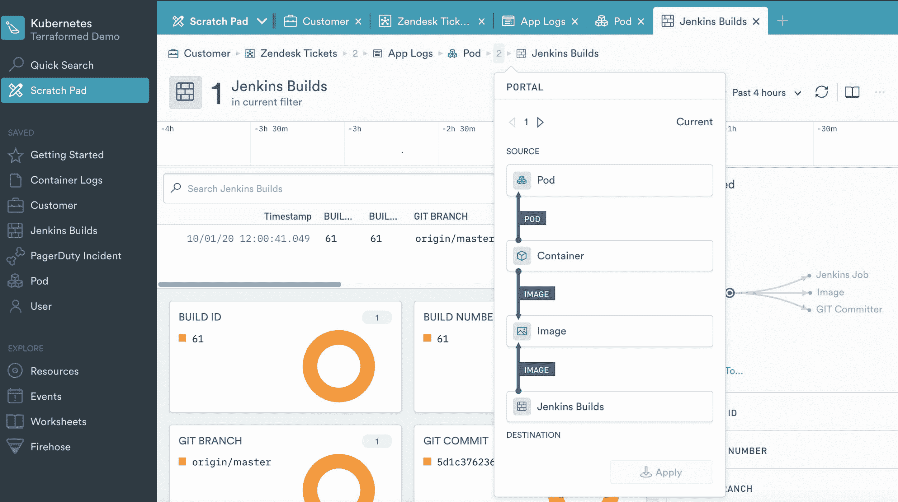

# Observe 展示了基于雪花 DBaaS 构建的可观测性平台

> 原文：<https://devops.com/observe-unfurls-observability-platform-built-on-snowflake-dbaas/>

在筹集了 3500 万美元的种子资金后，Observe Inc .已经从隐身状态中脱颖而出，提前获得了一个同名的可观测性服务，该服务利用了雪花公司创建的数据库即服务(DBaaS)平台。

公司首席执行官杰里米·伯顿(Jeremy Burton)表示，与其建立另一个数据湖平台，更有意义的是使用基于现有云服务的软件即服务(SaaS)应用模型来提供可观测性平台。

伯顿说，雪花基于亚马逊网络服务(AWS)云上运行的关系数据库，已经证明它可以扩展到接收日志、跟踪和指标。观察者平台利用该平台将该数据与监控应用程序和基础设施环境相关联，其方式提供了比隔离监控软件组件和基础设施遗留工具更多的上下文。

上下文是通过创建“资源”来表示的，例如，用户、会话、购物车、pod、容器、帮助台票据或构建。Observe 然后使 IT 团队也能够以一种普通 IT 管理员可以查询而不必标记每个资源的方式跟踪资源之间的关系，Burton 说。IT 团队还可以跟踪资源的属性如何随时间变化，Burton 指出，这可以用来重建整个 IT 系统在任何时间点的状态。

Burton 补充说，这种方法可以很容易地应用于现有的单片应用程序和新兴的微服务应用程序，因为所有需要的数据都被吸收到雪花服务中，而不需要 IT 团队首先检测然后更新每个应用程序。

Observe 的定价模式将基于存储在 AWS S3 存储桶中的数据量和发起的查询数量。Burton 指出，IT 团队将购买观察积分，这些积分只有在实际使用平台时才会计费。

虽然可观察性是最佳 DevOps 实践的核心租户，但 Burton 说，有必要以一种允许 IT 团队的任何成员解决任何问题的方式来民主化可观察性。伯顿说，不应该要求召集 IT 团队的每个成员来诊断一个问题，并指出随着时间的推移，这只会让那些并不真正需要处理基础设施问题的开发人员更加恼火。

Burton 说，IT 团队将能够访问仪表板，使新手或中级用户能够快速确定问题的根本原因，而经验丰富的工程师将能够访问基于类似电子表格的界面的工作表，通过该界面他们可以操纵数据。

可观测性平台提供商之间的竞争已经非常激烈。然而，随着组织寻求合理化现有的遗留监控工具，以支持添加更多上下文的平台，可观测性市场的整体规模将以数十亿美元来衡量。每个 IT 团队都需要根据成本和他们对一个供应商可能拥有而另一个供应商没有提供的功能的偏好，来决定哪种类型的平台对他们最有意义。