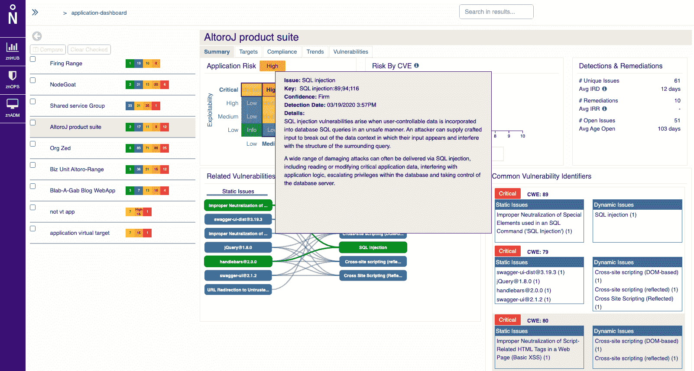

# ZeroNorth 扩展了 DevSecOps 编排范围

> 原文：<https://devops.com/zeronorth-extends-devsecops-orchestration-reach/>

ZeroNorth 已经[扩展了其同名的软件即服务(SaaS)平台，用于编排 DevSecOps 工具链](https://www.zeronorth.io/press-releases/zeronorth-delivers-new-capabilities-to-rapidly-identify-prioritize-and-remove-vulnerabilities-standing-in-the-way-of-software-excellence/)，以包括与 Scout Suite、Aqua Trivy、Gitlab 和 BitBucket Server 以及 ServiceNow 的配置管理数据库(CMDB)的集成。

该公司还增加了应用程序组合报告，以显示应用于每个应用程序的安全策略、扫描结果和补救工作的进度，以及定制警报和漏洞数据压缩参数的能力，如压缩率、漏洞和库的名称和类型。

最后，添加了可应用于漏洞数据集的过滤和搜索工具。

ZeroNorth 使通过 SaaS 应用程序平台集中编排和管理商业和开源应用程序安全扫描工具成为可能。

工程和产品管理高级副总裁 Christian J. van den Branden 表示，随着 DevSecOps 过程[继续发展和成熟](https://devops.com/devops-and-security-the-path-to-devsecops/)，大多数应用程序开发团队将采用多种扫描工具，因为不是每个工具都能发现每个漏洞。他说，这种漏洞扫描的深度防御方法需要一个编排工具来集成 DevOps 管道中的多个扫描工具。

van den Branden 指出，这种编排工具还使开发运维团队能够更容易地根据各种静态应用安全测试(SAST)和动态应用安全测试(DAST)工具发现的漏洞的严重性来确定漏洞的优先级。来自 Qualys、Snyk、Palo Alto Networks、Synopsys 和 WhiteSource 等供应商的工具在多个 DevOps 平台上都得到支持。

总的来说，范登布兰登说，在新冠肺炎疫情事件之后，一场安全问题的“完美风暴”正在形成。各种组织正争先恐后地构建和部署数字业务应用程序，以吸引那些越来越多地使用基本上不安全的网络在家工作的最终用户。他说，网络犯罪分子希望在开发应用程序时破坏它们，除此之外，他们还将目标锁定在凭证薄弱的最终用户身上，在应用程序部署到生产环境后，这些凭证可能会被用来向应用程序中注入恶意软件。

他补充说，鉴于需要保护的数字业务流程的敏感性，大多数 IT 组织显然需要提升他们的应用程序安全游戏。

理想情况下，DevOps 和网络安全团队将融合他们的工作流来实现这一目标。然而，在许多情况下，DevOps 团队将简单地扩展其现有管道，以自行解决安全问题，作为减少补救问题数量的努力的一部分，他们可能需要在应用程序部署到生产环境后分配时间进行补救。van den Branden 指出，使用一个基于 SaaS 的平台来协调 DevSecOps 流程和管道，这变得更容易实现。

无论 IT 组织如何提高应用程序安全性，时间都是至关重要的。现在，从公共云到多种边缘计算平台，越来越多的应用程序被部署在一个扩展的企业中。如果部署在这些平台上的代码从根本上说是不安全的，那么依靠遗留工具和流程来防御这种攻击几乎是不可能的。