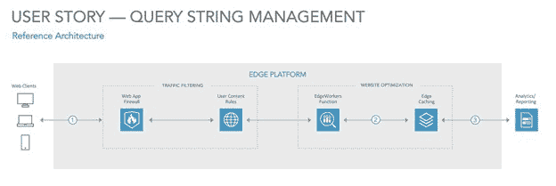

# Akamai 支持在边缘部署微服务

> 原文：<https://devops.com/akamai-enables-microservices-deployment-at-the-edge/>

Akamai 今天宣布，它将在其边缘计算平台上增加部署微服务的能力，以使开发人员能够更快地运行延迟敏感的应用程序。

Akamai 首席产品经理大卫·西奥博尔德表示，开发人员现在可以在边缘编写动态内容组装代码，以在 Akamai 智能边缘平台上创建微服务，包括外部请求和操纵响应主体的能力。他说，这种方法为开发人员提供了在相当于无服务器计算框架上运行边缘计算应用程序所需的原语。

此外，Akamai 正在为部署在其内容交付平台(CDN)边缘的 JavaScript 应用程序添加 EdgeWorker 报告和调试工具，并更新了其应用程序编程接口(API)，以便更轻松、更快速地部署“cloudlet”应用程序。

最后，Akamai 还更新了其 Akamai 图像和视频管理器软件即服务(SaaS)产品，增加了视频状态优化 API，IT 团队可以通过该 API 跟踪 Akamai CDN 优化的视频状态。

虽然 cdn 已经被广泛使用了几十年，但它们现在正在发展成为部署边缘计算应用的平台，这些应用是使用最佳 DevOps 实践开发和部署的。许多组织不再需要复制 CDN 提供商已经部署的 IT 基础设施，而是选择将 IT 基础设施作为一项服务来使用，同时部署边缘计算应用和现有的 web 应用。

CDN 提供商之间的竞争已经非常激烈，他们寻求利用全球的存在点，使 IT 团队能够在更靠近数据生成和消费点的地方部署应用程序。这些边缘计算应用中有许多是数字业务转型计划的核心,[要求近乎实时地处理数据](https://devops.com/akamai-extends-reach-to-the-iot-edge/)。因此，在本地数据中心处理这些数据会产生太多的延迟。

当然，云服务提供商也扩展了他们提供的服务范围，将 CDN 服务纳入其中。目前还不清楚 It 组织在多大程度上更喜欢利用这些云服务，而不是他们已经依赖的 CDN 功能来部署 web 应用程序。

无论采用何种方法，在新冠肺炎疫情之后，构建、部署和维护自己的边缘计算基础设施的 IT 团队数量都可能会大幅减少。IT 团队正试图通过尽可能限制差旅来降低其 IT 员工的潜在风险，这使得将 IT 人员送上飞机来安装基础架构成为最后的选择。

与此同时，开发人员正在以前所未有的速度构建更多的应用程序，这主要归功于 DevOps 流程，使他们能够在家工作。随着边缘计算应用程序的部署积压，更加依赖外部服务的需求变得更加迫切。在大多数 DevOps 团队例行公事地将 cdn 视为部署应用的另一个目标平台之前，可能还需要一段时间，但在许多情况下，这一天已经到来。