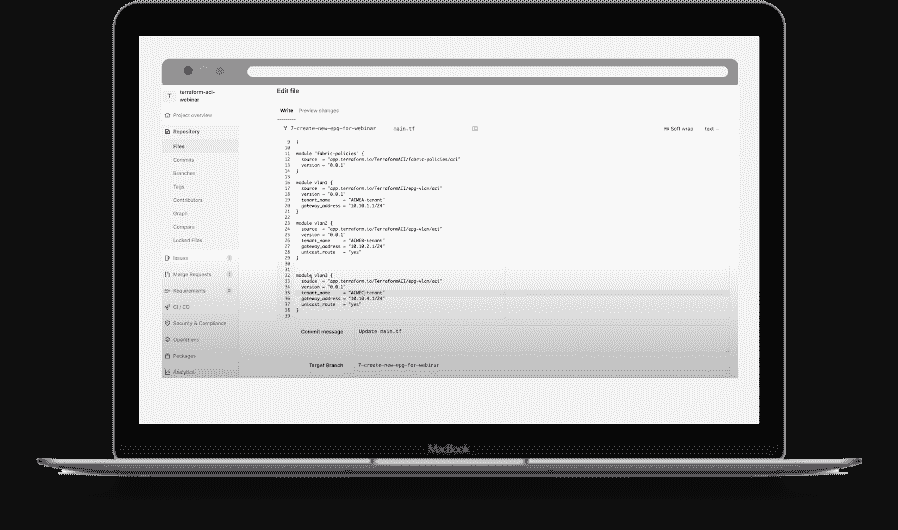

# 思科加大努力整合开发运维、网络运维

> 原文：<https://devops.com/cisco-expands-effort-to-meld-devops-netops/>

思科系统公司通过[增加对 Terraform 工具的支持以管理基础设施代码](https://blogs.cisco.com/datacenter/prepare-your-infrastructure-and-organization-for-devops-with-infrastructure-as-code)以及[扩展对 Ansible IT 自动化框架](https://blogs.cisco.com/datacenter/streamline-nx-os-fabric-deployments-with-cisco-dcnm-and-red-hat-ansible)的支持，加快了其融合网络运营(NetOps)的努力。

此外，思科还改进并标准化了应用编程接口(API ),使其可用于虚拟化网络服务的以应用为中心的基础设施(ACI)框架，并通过其 DevNet Express 培训计划扩展了免费代码示例、训练营和认证。

技术营销和解决方案工程副总裁 Yousuf Khan 表示，思科正朝着采用开源自动化工具的方向发展，这些工具正被广泛用于自动化 IT 基础设施的管理。他说，这种转变是由 DevOps 团队推动的，随着网络运营越来越多地集成到 DevOps 流程中，许多团队已经承担了对 IT 基础设施预算的控制。

Khan 补充说，为了增加其吸引力，思科正在为思科 ACI 提供 Terraform 提供商，以及 Ansible 和思科 ACI 多站点编排(MSO ),以使 IT 团队能够使用声明性工具实现网络管理自动化。Ansible 现在可以用来调用思科数据中心网络管理器(DCNM)以及思科已经通过 Ansible 提供的其他网络服务。

Terraform 被广泛用于以编程方式配置云基础设施，思科现在正在采用它来使 IT 团队能够应用于网络和服务器基础设施。与此同时，随着 IT 团队寻求在单一自动化框架上实现标准化，Ansible 正被多家 IT 基础设施提供商所接受。这种方法消除了为每个平台掌握多个专有 IT 自动化框架的需要。

Cisco 在过去几年中一直鼓励网络管理员放弃用于编程单个路由器和交换机的命令行界面(CLI ),转而支持基于图形工具的软件定义的网络架构，使 NetOps 团队能够使用其 ACI 框架支持的虚拟覆盖更灵活地管理网络基础设施。现在，随着越来越多的 IT 组织采用 Terraform 和 Ansible 作为管理异构 IT 基础架构环境的事实上的开源工具，ACI 正变得可由 Terraform 和 ansi ble 访问。Khan 说，这一努力将使 DevOps 团队更容易采用 GitOps 流程，从他们采用的任何持续集成/持续交付(CI/CD)平台在思科基础设施上部署应用程序。

他指出，最终目标是让网络更加灵活。如今，内部环境中的 IT 团队可以在几分钟内调配一台虚拟机，但仍需要等待数周才能调配网络服务。目标是将更像云的运营模式应用到混合 IT 环境中。

每个 IT 组织都需要决定在何种程度上融合他们的网络运营和开发团队。虽然管理网络服务的工具变得可用，但大多数网络运营和开发运维团队之间的文化差异仍然很大。然而，随着企业领导者继续要求更高水平的敏捷性，这种差距缩小的速度最终开始加快。