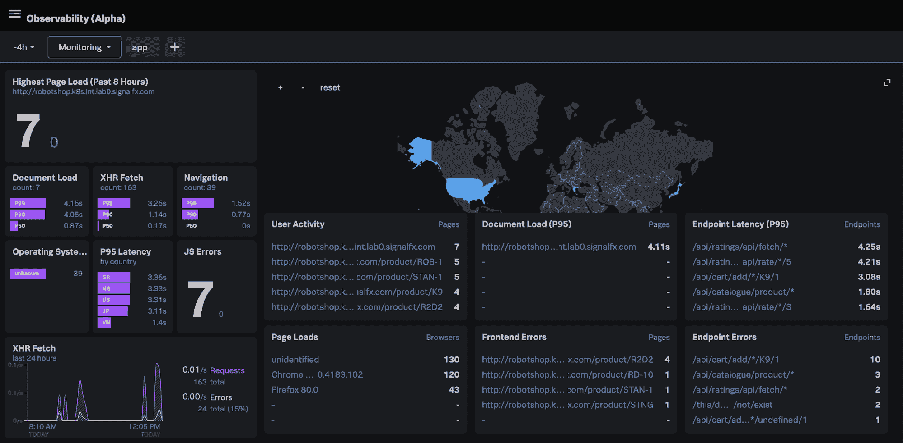

# Splunk 更深入地探讨了可观察性

> 原文：<https://devops.com/splunk-dives-deeper-into-observability/>

Splunk 在今天的在线 [.conf20](https://conf.splunk.com/) 会议上发布了 Splunk Observability Suite，该套件将用于基础设施监控、应用性能监控、数字体验监控、日志调查和事件响应的工具整合在一个产品中。

Splunk 的 ITOps 副总裁 Kia Behnia 表示，IT 团队可以实时关联指标、跟踪和日志数据，而不仅仅是监控 IT 平台，还包括最终用户体验。作为 Splunk Observability Suite 的一部分，Splunk 正在提供测试版 Splunk 日志观察器，这是一种基于云的服务，用于根据 Splunk 平台观察到的事件直观地检查日志并向 DevOps 平台发送消息，以及 Splunk 真实用户监控，这扩展了 Splunk 应用程序性能管理(APM)平台的范围，添加了一个跟踪特定最终用户应用程序体验的模块。

这一点至关重要，因为如果没有终端用户监控功能，可观察性平台将[缺乏关键的背景](https://devops.com/?s=observability)，Behnia 说，并指出可观察性需要从 IT 基础设施开始，然后扩展到包括实际的终端用户体验。

Splunk 本周还宣布了对 Splunk Cloud 和 Splunk Enterprise 的增强，它们现在基于现已上市的 Splunk 核心平台 8.1 版。该公司还推出了 Splunk 机器学习环境(SMLE)的测试版，以简化机器学习模型和算法的构建和运行。

Splunk 数据流处理器(DSP)平台也将在今年晚些时候进行更新，以增加对云服务的支持，如谷歌云平台(GCP)和 Azure Event Hub，以及对查找和机器学习算法的支持。

Splunk 还为 Kubernetes 提供了 Splunk Operator 的测试版，以简化部署，并在 GCP 上提供 Splunk 云。

该公司还在更新 Splunk 连接体验，以包括 Splunk 增强现实功能，该功能增加了远程协作功能，允许两个不同地方的用户进行交互并直观地比较数据。

Splunk TV 是一款用于分析 IT 运营趋势的移动应用，现在也可以在谷歌 Android 和苹果上使用。用户现在还可以集中控制多台电视，而不必连接到同一个网络。

Splunk IT 运营产品组合的其他新增产品包括 Splunk Service Intelligence for SAP，它将人工智能(AI)应用于这些环境；Splunk IT 服务智能(ITSI)的更新，增加了预测分析工具；通过[收购 SignalFX](https://devops.com/splunk-to-acquire-signalfx-to-gain-apm-platform/) 获得的 Splunk 基础设施监控插件，用于集成 Splunk 基础设施监控；以及 Splunk IT Essentials 的测试版，以提供更精确的 Splunk 云实施。

最后，Splunk 更新了 Splunk Enterprise Security，并推出了 Splunk Mission Control 和 Splunk Mission Control 插件框架。该框架使得将第三方安全工具与 Splunk 安全信息事件管理(SIEM)和 Splunk Phantom 安全协调自动化和响应(SOAR)平台的更新相结合成为可能。初始合作伙伴包括埃森哲安全、C3M、Crowdstrike、Netskope、Recorded Future、RiskIQ 和 Tenable。

综上所述，显而易见，Splunk 现在正努力在所有可能的 it 方向上扩展可观察性。