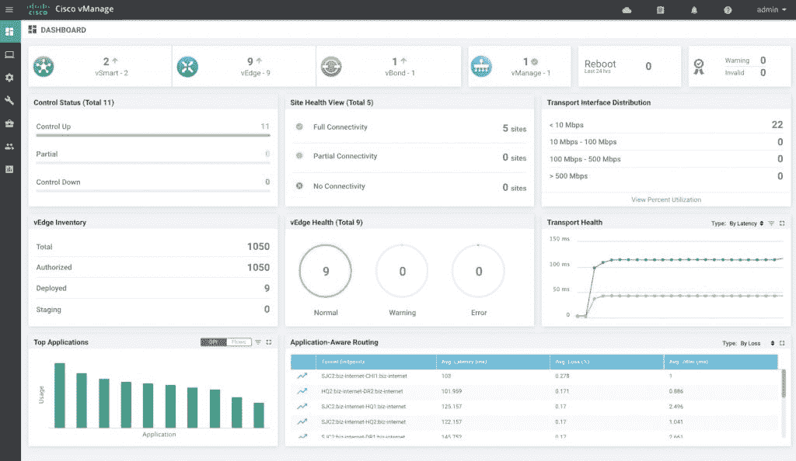

# 思科重组网络边缘产品组合

> 原文：<https://devops.com/cisco-revamps-portfolio-at-the-network-edge/>

思科今天宣布推出一系列 Catalyst 产品，将安全的软件定义广域网(SD-WAN)和路由器的功能结合在一个平台上。

思科 Intent Based Networking Group 的企业路由和 SD-WAN 基础设施产品管理高级总监 Archana Khetan 表示，Catalyst 8000 系列由物理设备和虚拟设备组成，无需组织在网络边缘部署单独的 SD-WAN 和路由器。

Catalyst 8500 平台系列的高端基于第三代 Quantum Flow 处理器，这是思科在其网络设备中采用的专有 ASIC。它专为数据中心、主机托管和聚合站点而设计，并首次为思科集成了 40G 和 100G 以太网端口。

Catalyst 8300 系列边缘平台专为从仅依赖路由器过渡到采用 SD-wan 的分支机构而设计。Catalysts 8300 系列除了提供比传统 Cisco 路由器高 4 倍的性能外，还允许组织插入与现有 Cisco ISR 4400 路由器兼容的模块。还可以通过 UCS-E 系列刀片式服务器添加计算和交换功能，并且可以添加基于 UADP 的交换模块来创建软件定义的分支机构，该分支机构能够在 x86 处理器上运行基于容器的微服务应用程序。思科今天还推出了 Catalyst 蜂窝网关，面向希望通过 4G LTE 无线网络连接分支机构的组织，并计划支持 5G 网络。

最后，思科增加了 Catalyst 8000V Edge 软件，使 IT 团队能够在公共云上部署思科网络软件。Khetan 说，虽然大多数公共云已经提供了网络服务，但 Catalyst 8000V Edge 软件提供了更高级的网络和安全功能，可以作为现有企业网络的扩展进行管理。

Catalyst 8000 系列的每个成员都与 Cisco Umbrella 集成，以提供通过云管理网络和安全策略的方法，而 Cisco SD-WAN Cloud OnRamp 与 Amazon Web Services (AWS)、Google 和 Microsoft 的云服务集成，以提供对这些环境的可见性。

此外，每个平台都提供对可编程应用编程接口(API)库的访问，这是思科持续融合网络运营和开发工作流的努力的一部分。

虽然思科仍然是企业网络设备的主要提供商，但 SD-WAN 平台的兴起(本质上取代了分支机构中的路由器)已经产生了一系列竞争对手，这些竞争对手正在分支机构中以牺牲思科的利益为代价获得立足点。随着 Catalyst 8000 系列的推出，思科的目标是在单个平台内弥合路由器和 SD-WAN 设备之间的差距，该平台有望更易于通过云进行管理。

目前还不清楚这种方法会在多大程度上引起企业 It 环境的共鸣，但很明显，思科现在已经准备好反击了。