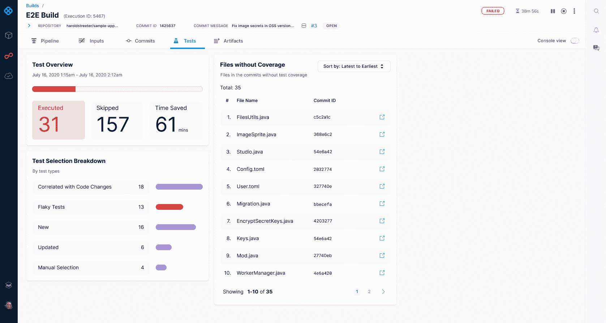

# 将 AI 应用于 DevOps 的工具

> 原文：<https://devops.com/harness-to-apply-ai-to-devops/>

Harness 在今天的 [{Unscripted} 2020](https://www.unscriptedconf.io/) 会议上宣布，计划在第四季度推出一个测试版模块，该模块利用[机器学习](https://devops.com/?s=machine%20learning)算法来优化 Harness 持续集成(CI)企业平台上的构建和测试周期。

与此同时，Harness 正在添加一个连续功能模块的测试版，以使 DevOps 团队能够采用功能标记来简化应用程序开发过程。用于功能验证和分析的可视化控制面板监控所有标志，包括活动、非活动、活动和非必需标志，以及客户问题单，以简化对添加到应用程序中的新功能的管理。

Harness 还在更新其连续交付(CD)平台，以包括改进的用户界面、GitOps 和管道代码流程、双向同步和冲突管理，以及跨团队标准化部署的模板。

最后，Harness 正在添加 Harness 下一代持续验证工具，以提供对 IT 环境变化影响的可见性。该工具可以独立部署，也可以与任何 CD 平台结合使用，旨在使开发运维团队更容易发现问题的根本原因，这些问题通常源于最近对稳定的 it 环境所做的更改。

Harness 首席执行官 Jyoti Bansal 表示，机器学习算法形式的人工智能(AI)将在将 DevOps 自动化提升到新的水平方面发挥重要作用。Harness AI 模块通过关联和隔离测试到更改的代码，而不是要求每次更改都执行所有测试，可以将测试周期时间减少 75%。他说，利用方法意味着只运行相关的测试循环。

持续集成企业还将能够通过突出现有测试周期没有覆盖的代码变更来识别测试计划中的差距。未来还将添加库缓存和容器图像大小优化，以提高构建效率。

Harness 还宣布，它打算更广泛地应用机器学习算法。算法将使 DevOps 团队能够控制、优化和加速软件管道的流动，而不是要求工程师手动验证构建、测试、部署和发布。Harness 还将应用数据科学技术来观察代码流经每个管道步骤时的质量、性能、成本和可靠性，如果需要，还会自动中止或回滚软件的交付。

Bansal 补充说，随着每个构建的提交，收集更多关于工作流过程的元数据的机会只会增加。

显然，Harness 不是唯一一个寻求应用机器学习算法的 CI/CD 平台提供商。由于机器学习算法，应用程序的开发和部署速度在未来几个月可能会增加几个数量级。现在的问题是，企业的其余部分将在多大程度上吸收这种潜在的变化率。