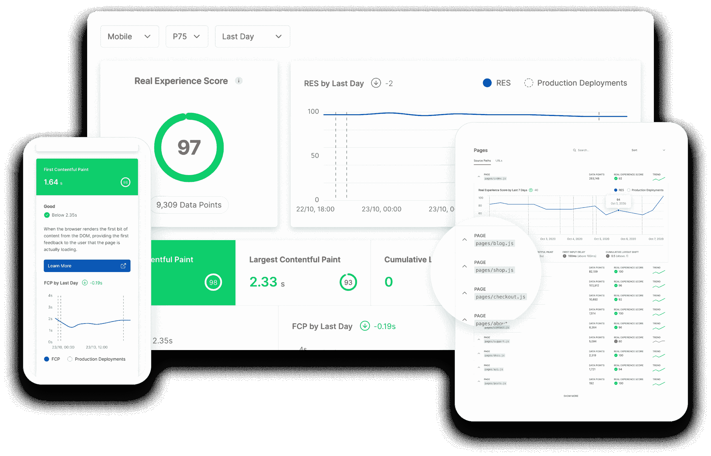

# Vercel 基于 React 框架优化应用

> 原文：<https://devops.com/vercel-optimizes-apps-based-on-react-framework/>

Vercel，在其上线期间[接下来。JS Conf](https://nextjs.org/conf/stage/n) 事件，宣布了对其开源反应式编程框架的更新，增加了对自动[图像优化](https://devops.com/?s=Image%20optimization)的支持，以及对连续网络生命分析的访问。

公司首席执行官 Guillermo Rauch 表示，Next.js 10 还增加了对国际化路由和自动语言检测以及快速启动电子商务功能的支持。

由脸书首创的反应式编程框架正获得越来越多的关注，因为构建更多交互式应用来推动数字业务转型和其他计划的需求变得越来越重要。Vercel 使得通过托管的无服务器云环境构建这些应用程序变得更加容易。

图像优化成为网站的一个问题，因为随着时间的推移，成功的应用程序更新会降低性能。Next.js 10 为开发人员提供了传统 HTML 和浏览器图像堆栈的替代品，后者只支持一种图像大小和类型。Rauch 说，开发人员可以基于 React 以渐进的方式用图像组件自动替换传统的 HTML 图像标签。

他说，电子商务应用程序尤其“革命的时机已经成熟”——在新冠肺炎疫情之后，随着各组织越来越依赖在线互动，他们发现现有的应用程序不仅速度慢，而且也不太吸引人。劳奇指出，客户对应用程序体验越满意，他们就越有可能回到那个网站。

Vercel 使用 Node.js 10 的开源 Next.js 商务平台增加了自动化以及 BigCommerce 开发的数据层和可重用数据原语，以实现电子商务应用程序的现代化。Vercel 还在测试 Node.js 内置的视频平台，该平台将作为开源平台提供。

最后，Next.js 分析模块提供了持续的反馈，以帮助开发人员更好地了解他们的网站或应用程序的表现。劳奇说，谷歌搜索引擎网站上的页面排名现在越来越多地受到谷歌网络生命分数的影响，分析模块旨在识别对基于 React 的应用程序的性能产生负面影响的首次输入延迟和累积布局偏移问题。

最终，我们的目标是交付新一代的网络和移动应用。使用 Node.js 的组织包括苹果、Twitch、抖音、Lululemon、Target、Lyft 和 Hulu。Airbnb、Hashicorp、Washington Post 和猫途鹰等公司也在 Vercel 云平台上部署其前端。

每家公司实现网络和移动应用组合的现代化可能还需要一段时间，但在这个节骨眼上，现在只是时间问题，而不是是否。依赖传统 HTML 方法来构建和部署这些应用程序的组织会发现，随着时间的推移，他们的应用程序——以及网站——的使用率将会下降。当组织比以往任何时候都更加依赖 web 和移动应用程序来保持与客户的联系时，交互式应用程序可能很快就会成为生死存亡的问题。