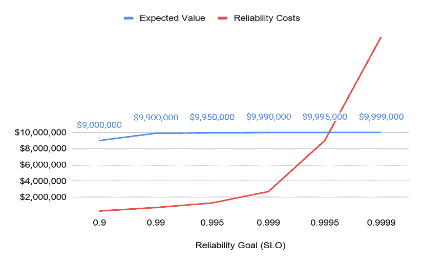
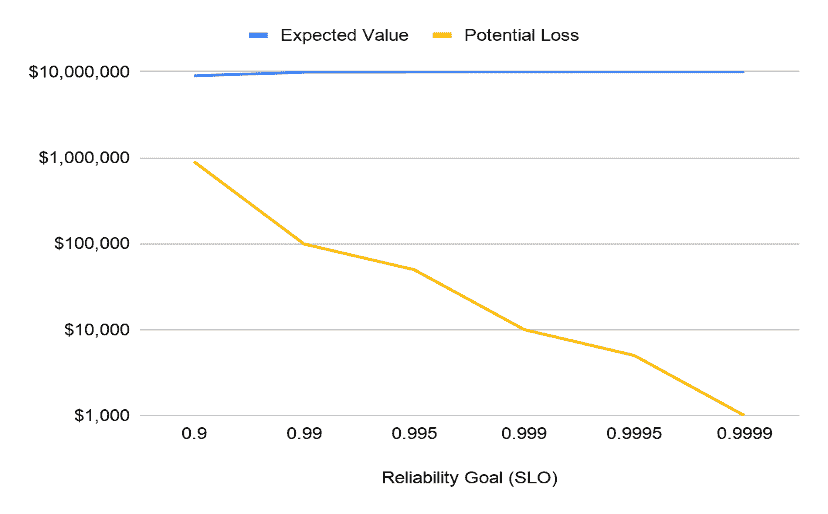
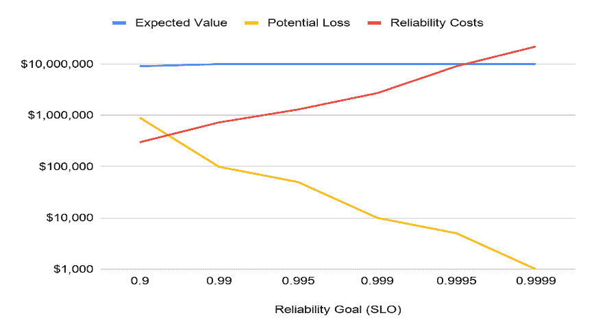

# SREs:停止向你的产品经理要求 SLO

> 原文：<https://devops.com/sres-stop-asking-your-product-managers-for-slos/>

[软件可靠性工程](https://devops.com/?s=software%20reliability%20engineering)的一个基本前提是，你应该把你的可靠性目标——也就是你的服务水平目标(SLO)——建立在让你的客户满意的服务水平上。问题是，定义什么让您的客户满意需要软件可靠性工程师(sre)和产品经理(pm)(也称为业务利益相关者)之间的沟通，这可能是一个挑战。这么说吧，SREs 和 pm 的目标不同，说的语言也略有不同。

这并不是说项目经理没有意识到项目经理带来的价值。如今，在软件即服务的时代，安全性、可靠性和数据隐私等特性(过去被认为是“非功能性需求”)被视为 SaaS 公司提供的服务产品的关键特性。现代应用程序用户和软件服务客户非常关心数据隐私、网络安全和正常运行时间；因此，经前综合症也很关心。事实上，在一个公司的网站上看到这些功能被突出宣传并不罕见(我今天看到一个声称“每个客户 99.99%的正常运行时间！”)因为营销人员知道，客户是根据公司能否提供可靠性、速度、安全性和性能质量来做出购买决定的。所以，是的，经前综合症*做*护理。

困难在于项目经理和 SRE 之间关于提供该级别服务的价值和相关成本的协商:

出于多种原因，与提供更高水平的可靠性相关的人员和基础设施成本呈几何级数增长，但对于一家 1000 万美元的企业来说，损失 1，000 分之一的交易与损失 1，000 分之一的交易相比，其预期价值仅为 1，000 美元。

但是，将“客户满意度”转化为来自可观察指标的实际目标，说起来容易做起来难，尤其是对于那些刚刚开始实施 SLO 的公司而言。让我们面对现实吧，[所有关于](https://nobl9.com/2020/06/15/do-you-really-need-five-nines/) [九](https://nobl9.com/2020/06/15/do-you-really-need-five-nines/)的谈论可能很难概念化。幸运的是，有一种简单的方法可以让 PMs 和 SREs 有相同的波长。

***工程师们，不要再向你们的 pm 要 SLO 了！相反，将用户故事转化为可靠性目标。***

用户故事是项目经理向工程团队表达客户体验和期望的好方法。然后，SREs 可以通过几个简单的步骤将用户故事转化为 SLO。

## 什么是用户故事？

用户故事是描述特定类型的用户如何参与服务的叙述。第一人称情节可能是这样的:我是*这种类型的人*，而*这是我需要的* *并期望*快乐，如果*我不快乐，这就是你将要付出的代价。*

注意:在这个用户故事中，我们冒昧地加入了对用户可靠性期望的同情。

**零售示例:** *我是你们黑色星期五在线商店的购物者，我想利用你们的黑色星期五促销活动。我想登录，仔细阅读你的黑色星期五交易，挑选我喜欢的产品和功能，并在一两分钟内完成购买。如果登录时间太长，或者我在系统中被挂起，我会很容易感到沮丧，并转向其他零售商。我不想错过交易！*

SRE 可以利用这个用户故事，问项目经理几个问题，收集一些更关键的信息，然后做一些简单的数学运算，得出黑色星期五的 SLO。

### 问你的项目经理这些问题

为了确定用户故事的可靠性目标，您需要添加三个上下文:

**步骤 1–确定最重要的用户交易**

首先，确定事务成功的相对优先级或关键程度。并非所有的事务都是平等创建的，因此我们需要了解我们在这里谈论的是哪种事务。例如，浏览目录页面(如果不成功可以刷新)与购物者的结账体验不同。

**零售示例:**我们在零售业务中有几笔交易，包括:

1.  库存目录搜索。
2.  订单履行。
3.  支付处理。
4.  价格和折扣。
5.  结账体验/购物车放弃。

对于我们的示例，让我们开发支付处理的 SLO，这是一个吞吐量指标，即零售商在给定时间内可以处理的交易总数。

**第 2 步——估算不同时间的交易量**

既然我们已经知道了我们正在谈论的交易(支付处理吞吐量)，我们就可以估计每一个类别中将要发生的交易或用户交互的大致数量，四舍五入到最接近的数量级(参见[费米估算](https://en.wikipedia.org/wiki/Fermi_problem))。你的业务有多少是在这段时间发生的？你有一天中的关键时刻吗？你有关键季节吗？你一年中有重要的一天吗？

相同的交易在不同的时间可能更有价值或更无价值。想象一下超级碗比赛期间播放的广告，或者市场开放时的股票价格。或者当你的 CEO 正在做一个重要的客户演示时。时机很重要。

**零售示例:**我们假设的零售商在假日购物季有关键时期，还有一个被称为黑色星期五的关键日子。通常，4%的年度业务发生在黑色星期五周末，16%的年度业务发生在剩余的假期。

Adobe Analytics 估计整个周末(感恩节到网络星期一)的销售额占整个假期总收入的 20%。根据全国零售联合会的数据，2019 年假日销售额为[7302 亿美元，占全年销售额的 20%](https://nrf.com/media-center/press-releases/nrf-says-2019-holiday-sales-were-41-percent)。

**第三步——评估每种情况下交易的商业价值**

最后，我们现在可以理解该事务的可靠性如何影响业务成果。这可能是收入损失的风险，也可能是品牌声誉指标，如 CSAT 下降。现在，您对不可靠性的业务影响有了一个非常清晰的了解。

**零售示例**:如果我们想象的零售商有 1000 万美元的收入，那么在黑色星期五周末，它将赚到 40 万美元，在假期的剩余时间里，它将赚到 160 万美元。在黑色星期五，购物车价值 100 美元，节日期间价值 80 美元，其余时间价值 50 美元。黑色星期五每天有 800 笔交易，每个假期有 625 笔交易，其他任何一天有 488 笔交易。

既然有了这些信息，就可以开始根据风险价值和满足可靠性目标的成本来计算适当的 SLO 了。

如果可能的话，您可以估计提供每个可靠性级别的成本。不仅要考虑云计算和直接运营成本，还要考虑测试、性能、安全性、混沌工程、发布管理、回滚、监控、随叫随到、自动化等方面的可靠性投资。，这是达到每个点的可靠性水平所需的。通过绘制成本图(至少数量级),您可以找到风险价值和可靠性成本交叉的平衡点。这是这些交易的业务合理的 SLO。

绘制风险值作为**值** x **量** x **SLO** 的函数。随着可靠性的提高，风险价值将急剧下降；然而，实现这种可靠性的成本也呈指数增长。对于任何给定的用户故事来说，投资超过风险金额是不值得的，因此 SLO 的决定是明确的。请注意，团队目前可能无法实现 SLO，但是您对业务的重要性以及可靠性投资的盈亏平衡点有一个精确的概念。

不要让项目经理“说 SRE 语”，而是通过使用用户故事的通用语言来构建业务相关的 SLO，从而跨越沟通鸿沟。