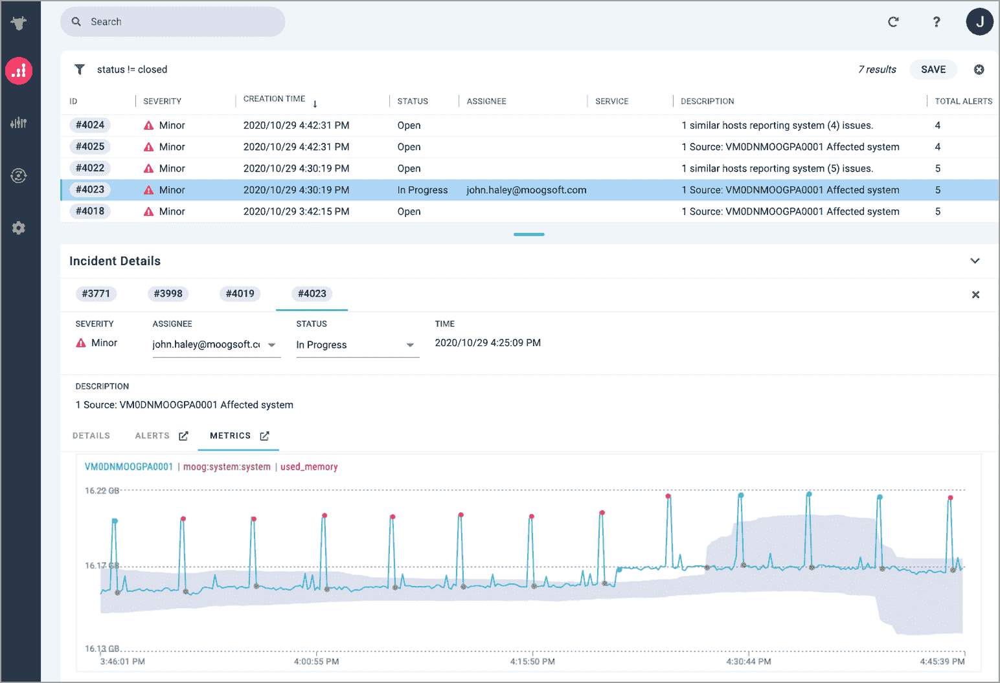

# Moogsoft 推出人工智能云服务以实现可观察性

> 原文：<https://devops.com/moogsoft-unfurls-ai-cloud-service-for-observability/>

Moogsoft 今天发布了 Moogsoft Observability Cloud，这是其现有平台的一个软件即服务(SaaS)实例，用于通过[机器学习](https://devops.com/?s=machine%20learning)算法使用人工智能来检测异常并对警报进行优先排序。

公司首席执行官 Phill Tee 表示，现在每个 IT 组织都可以采用机器学习算法来更好地管理他们的 IT 环境，而不必建立和管理人工智能 IT 运营(AIOps)平台。Moogsoft Observability Cloud 的定价将基于团队和企业的数据摄取率，但目前，Moogsoft 正在提供免费试用版。

收集器直接从 Amazon EC2、Docker、MongoDB、Redis 和其他平台等来源获取时间序列指标数据。其他指标也可以通过用户可定义的指标 API 来获取。Tee 说，目标是让 it 团队在几分钟内从人工智能中受益，而不是等待几天或几周的时间让机器学习算法学习整个 IT 环境。

他补充说，围绕基于微服务的架构和一套 REST 应用程序编程接口(API)设计，Tee 指出，Moogsoft Observability Cloud 使 DevOps 团队能够自助服务他们自己的可观测性需求。

Moogsoft Observability Cloud 将统计计算和异常检测算法应用于时序指标数据。然后，关联引擎透明地匹配模式，为单个通知提供更多的上下文，Tee 注意到这减少了整体警报疲劳。

Moogsoft 平台还可以与 PagerDuty 等 IT 协作工具集成，并可以配置为通过开放的 webhook API 向任何端点发送数据。总的来说，这种能力使 IT 团队能够建立工作流，以更快地找到 IT 问题的根本原因，同时减少现有监控工具产生的噪音，Tee 说。

Moogsoft 计划继续提供其平台的现有内部版本，但预计随着时间的推移，大多数 IT 组织将更喜欢依赖于代表他们管理的 AIOps 平台。不管交付模式如何，Tee 表示，IT 团队将很快开始使用语音界面与这些平台进行交互，这些界面将在紧迫问题变成重大事件之前自动识别它们。

与此同时，Tee 表示，IT 专业人士对人工智能的抵触情绪正在下降。不仅他们中的更多人遇到了各种形式的人工智能在消费应用中的广泛使用，而且许多 it 专业人员也开始意识到，如果不更多地依赖机器学习算法和其他形式的人工智能，一组人不可能优化复杂的 IT 环境。他指出，事实上，组织很快就会发现很难留住越来越希望拥有人工智能工具的 it 专业人员。

说到 AIOps 平台，已经不缺乏选择了。用不了多久，每个 IT 管理平台都将被注入机器学习算法。现在的问题是确定这些算法将在多大程度上永远改变现有的 IT 管理流程。