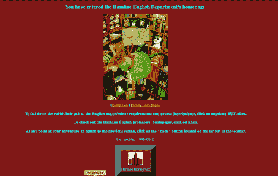
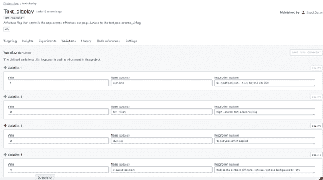

# 可访问性和功能标志

> 原文：<https://devops.com/accessibility-and-feature-flags/>

身体健康是暂时的。我们有些人生来就有残疾，有些是后天发展的。在你生命中的某个时刻，你会老到需要老花镜，或者你会折断你的手臂，或者你会出现听力问题。你是戴着眼镜看这一页吗？你用的是护腕还是符合人体工程学的鼠标？您的操作系统是否设置为黑暗模式？那些都是[可访问性修改](https://devops.com/?s=accessibility)。

## 网络生来就是可访问的

万维网的管理机构 W3C(T1)有一点我很喜欢也很欣赏，那就是他们一直致力于使网络开放和可访问。浏览器和其他软件使用的标准来自 W3C 推荐标准。你现在的浏览器可以显示 1998 年的网页，而且清晰可辨，甚至很漂亮，如果图像被捕捉到的话。

W3C 有一个致力于可访问性的小组，他们的新标准集 [WCAG 2.2](https://www.w3.org/WAI/standards-guidelines/wcag/new-in-22/) 将于本月生效。12 月，网站的可访问性将根据新标准进行评级。

> [**WCAG 2.0**](https://www.w3.org/TR/WCAG20/) 和 [**WCAG 2.1**](https://www.w3.org/TR/WCAG21/) 是稳定的、可参照的技术标准。他们有 12 到 13 个指导方针，这些指导方针根据四个原则组织而成:可感知、可操作、可理解和可靠。每个指南都有可测试的*成功标准*，分为[三个级别:A、AA 和 AAA](https://www.w3.org/WAI/WCAG21/Understanding/conformance#levels) 。

网页有很多简单的可访问性修正，比如使用语义标题代替文本样式，使用 HTML 按钮代替 div。然而，很多时候，即使是最底层，A，也从一个组织的网页中消失了。但是像软件中的所有东西一样，渐进的改进和快速的反馈比需要大量投入的大型转换项目更有用。

## 一些网页可访问性需求冲突

有时，可访问性需要冲突。例如，在 WCAG 文档中的[示例用户](https://www.w3.org/WAI/people-use-web/user-stories/)列表中，一些用户需要他们的文本在尺寸增大的按钮周围重排，一些用户需要按钮停留在稳定的位置以便于查找。如果你曾经因为一个手机更新重组了你所有的应用程序而感到沮丧，你可以理解当一个日常界面未经允许而改变时会有多困难。

高对比度的文字，白底黑字或黑底白字，通常会对弱视用户有所帮助。然而，患有阅读障碍和其他文本处理障碍的用户会发现对比度太不协调，需要更低的对比度来帮助他们舒适地阅读——类似于灰白色上的深灰色。一个网站或应用程序很难满足这些相互冲突的需求，所以用户通常有浏览器扩展或设置来帮助他们管理他们的 web 体验。

网站和应用开发者需要意识到，并不是每个人都按照开发者的想法使用他们的网站或应用。用户可能有较小的屏幕，或者在移动设备上，或者安装了开发人员从未听说过或想象过的浏览器扩展。只要我们按照保持 [web 语义](https://en.wikipedia.org/wiki/Semantic_Web)的可访问性标准进行开发，这个系统就会工作。让机器访问网络有助于人类，这似乎是矛盾的，但事实确实如此，因为人类正在使用计算机的概念以一种适合他们的方式来翻译信息。

## 功能标志有什么帮助

我一直在思考功能标志如何使易访问性设计变得更容易，尤其是在试图为有不同需求的人群服务的问题上。

当有可能为每个人服务时，这应该是默认的和主要的页面代码。每个人都有自己的标准，比如语义标题、图片替代文本和非图片文本。有些人需要进一步的适应，如减少运动，标签导航或大按钮。这些需求可能是标志变量。

在下图中，我为文本显示配置了一个带有四种变体的标志:

*   标准(CSS 行为不变)
*   低视觉(高对比度文本，允许调整大小)
*   阅读障碍(在 CSS 中使用 open readia 字体)
*   降低对比度(降低文本和背景之间的对比度)

这种标志变化可以与用户可配置的设置联系起来，这样，每当他们登录到网站时，即使他们在不同的浏览器或设备上，他们也能以他们需要的方式获得文本。

当然，这是一个简单的例子。理想情况下，开发人员和易访问性倡导者将共同努力，确定网站或应用程序的哪个部分应该修改，以及如何与其他修改相结合。

## 缺乏规划是技术债务

即使你的团队没有一直可用的用户研究或可访问性专家，你也可以主动编码为他们腾出空间。可访问性标志将是永久的——您不会希望像删除展示标志一样删除它们。因为它们是永久的，所以将它们用作占位符没有坏处；他们不会增加更多的测试需求。

在一个项目的开始，大多数团队没有资源去做他们想做的每一件事，即使他们知道最终需要做这件事。我们不为概念验证应用程序进行本地化，我们不为严格意义上的内部工具编写 API 文档。但是如果一个产品成功了，那么我们确实需要添加那些元素，它们变成了我们必须偿还的技术债务，而没有给产品增加新的价值。

降低债务成本的方法之一是为将来的修改添加占位符。试图用硬编码的界面元素来重构应用程序以接受本地化就像试图在已经烤好的饼干中添加巧克力片一样——效果要差得多。使用标志集只返回一个缺省值(目前)是一种为代码中的未来变化做计划的方法，而不需要进行全部投资。

## 未来就在这里

WCAG 标准不是武断的，也不是毫无意义地强加的。它们的存在是为了帮助每个人获得他们需要的信息、服务和能力。当我们建立的网站不符合这些标准时，我们就会失去顾客、客户和用户——而且数量不小。

与创建完全独立的网站相比，使用功能标志使您的网站易于访问是一种更小、更便宜的干预措施。特性标志也有助于构建一个框架，根据需要提供站点的其他元素，使您能够精确高效地满足用户需求。