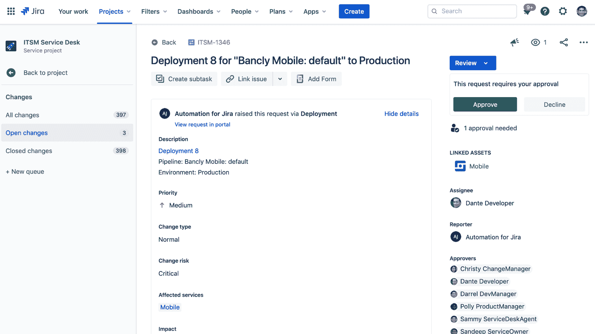

# Atlassian 推出 ITSM 平台

> 原文：<https://devops.com/atlassian-launches-itsm-platform/>

Atlassian 今天推出了吉拉服务管理，这是一个基于云的平台，旨在弥合开发运维与基于票证的 IT 管理方法之间的鸿沟，从而扩展了其在 [IT 服务管理](https://devops.com/?s=IT%20service%20management) (ITSM)领域的业务。

Atlassian 的 IT 产品负责人 Edwin Wong 表示，吉拉服务管理建立在 Opsgenie 之上，这是一个 IT 事件管理平台。他说，我们的目标是提供一个 ITSM 平台，通过让开发者更容易地处理 IT 支持流程，以更高的速度更好地管理 IT。

他补充说，展望未来，吉拉服务管理公司将增加资产和配置管理以及对话票务功能，这些功能是 Atlassian 通过最近收购 [Mindville Insight](https://devops.com/atlassian-adds-asset-management-to-itsm-portfolio/) 和 [Halp](https://devops.com/atlassian-acquires-halp-to-gain-help-desk-based-on-slack/) 获得的。

吉拉服务管理目前为 Opsgenie 的随叫随到调度、警报和事件群集提供支持，并与吉拉项目管理软件、Bitbucket 存储库和 Confluence 协作软件进行更深入的集成。

Wong 指出，IT 团队还可以利用诸如批量票证操作以及机器学习算法等功能来智能地对类似票证进行分类。

吉拉服务管理取代了许多开发团队已经用来管理事件的吉拉服务台平台。他说，现在的目标是提供一个平台，让开发者和 it 管理员更容易合作解决问题。目前有超过 25，000 家组织采用吉拉服务台，Wong 说，它提供了客户基础，Atlassian 打算从这些客户中推动 DevOps 和 ITSM 工作流的融合。

大多数传统的 ITSM 平台是为 IT 管理员设计的。然而，随着它的不断发展，开发人员开始承担端到端应用的责任。Wong 说，这种转变需要一种不同的 ITSM 方法，提供与 DevOps 工具的更深入集成，使开发人员能够解决问题，而不需要 IT 组织为每个事件召开“作战室”会议。

吉拉服务管理的推出正值越来越多的组织开始将 ITSM 过渡到云。由于大多数 IT 人员全职或兼职在家工作，以帮助抗击新冠肺炎疫情的传播，组织需要可以从任何地方轻松访问的 ITSM 平台。

每个 IT 组织都需要决定他们需要在多大程度上融合开发运维与 ITSM 工作流。目标应该是使开发人员能够在需要时有效地解决问题。仍然需要基于 ITIL 框架的基于票证的方法来管理 IT。然而，组织发现基于 ITIL 的框架无法实现快速解决涉及定制应用软件的事件所需的敏捷性。

不管前进的道路如何，随着组织开始意识到他们对软件的依赖，ITSM 正在进入一个新的阶段。当最终用户登录 ITSM 平台创建一个由 IT 管理员处理的作业单时，这种日子即将结束，如果需要，IT 管理员会联系开发人员。我们需要的是一种更主动的方法，无论何时出现问题，都能立即提醒开发人员。挑战在于以尽可能减少摩擦的方式实现这种程度的支持。