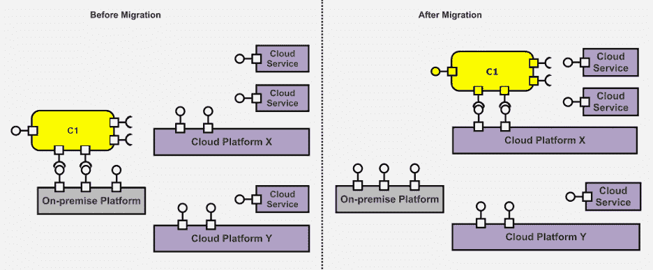
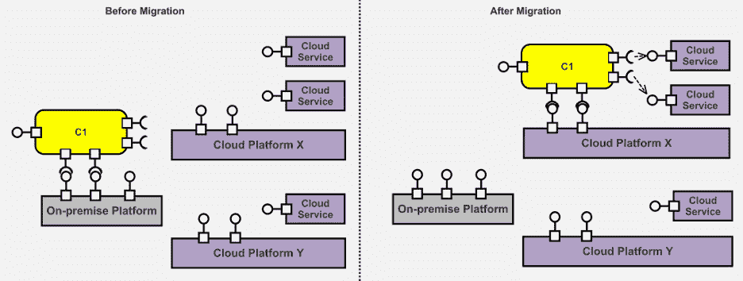
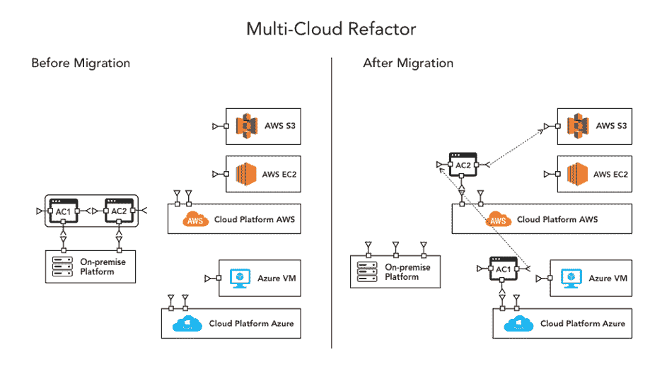
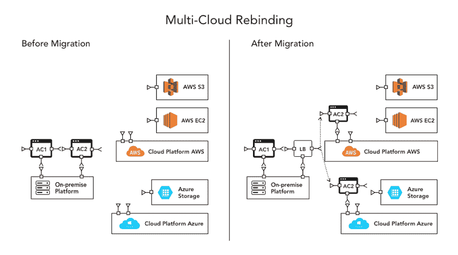
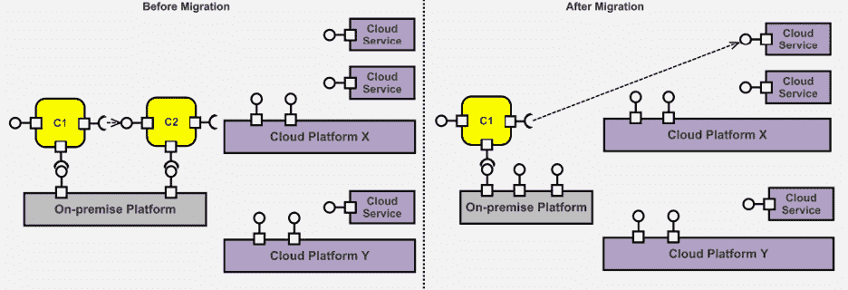
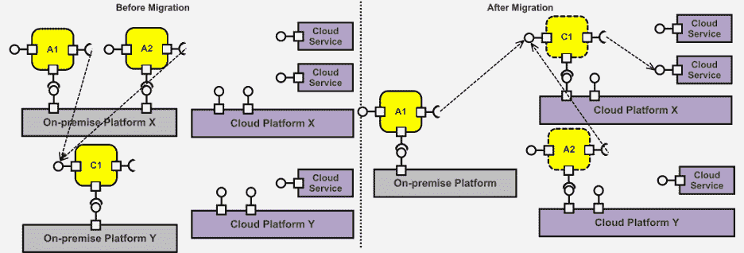

# 对您的组织来说，最佳的多云战略是什么？

> 原文：<https://devops.com/whats-the-best-multi-cloud-strategy-for-your-organization/>

扩展您的业务需要强大的解决方案，而多云战略可以帮助您实现这一目标。关于组织是应该采用多种云还是坚持单一供应商，一直存在争议。最近， [Reddit](https://www.reddit.com/r/devops/comments/ecpjau/do_you_really_need_multicloud_strategy/) 的一个用户， ***发帖提问“你需要多云战略吗？”***

对该问题的回答提供了一些有趣的观察结果，其中大型组织正在考虑将多云策略作为故障转移情形。大多数组织都在向云计算战略迁移，以:

*   避免供应商锁定。
*   将计算功能的依赖性移植到一个云服务。
*   实现自我集装箱化和便携性。

多重云是一种策略，组织在其中从异构云提供商寻求服务。此类提供商可以专注于平台即服务(PaaS)、基础设施即服务(IaaS)和软件即服务(SaaS)。多云还可以包括公有云、私有云，甚至混合云服务。

该战略在全球各组织中非常受欢迎。到 2020 年底，全球云计算管理市场规模将超过 16.596 亿美元，预计在 2021-2026 年的预测期内，CAGR 将增长 16.1%。

在这里，我们将发现一些适用于多云部署的出色架构设计。但是，在此之前，我们先来回答一下大多数组织应该问的问题。

## **为什么要部署多云战略？**

假设你是一个像 Spotify 这样的大组织，你所有的数据都由一个供应商处理——比如说[谷歌云平台](https://cloud.google.com/) (GCP)。现在，流媒体服务将所有的芯片都集中在一家供应商身上。这并不是说 GCP 效率低下，而是依赖程度更高。那么，最坏的情况是什么呢？

对于一个组织来说，多云是一个架构决策。它有助于减少对单一供应商的依赖，并创建一个故障保险。

因此，让我们为您的企业发现一些有趣的云计算迁移策略。

### 重新部署**多云**迁移模式

应用程序或软件的重新部署需要架构的重构。这是重新审视部署策略的一个很好的方式，尤其是当您迁移到多云时。这种迁移模式有助于将现有架构转变为多云设计。它包括预定义的架构元素，包括服务、云平台、连接器甚至现场存储设备。

Image Source: [Re-deployment Migration Pattern](https://spiral.imperial.ac.uk/bitstream/10044/1/40541/7/MigrationPatterns-SPE-final.pdf)

任何服务组件都可以是原子的，或者允许分层冗余。这里，在迁移之前，组件使用本地平台的服务。这些服务可以是不同组件架构或 IaaS 的协调。

一旦我们将组件迁移到多云架构设计，本地服务将被公共云平台取代。因此，应用程序可以在云平台上重新使用，而不会增加运营支出，从而提供更好的虚拟化。

### 云化

云化设计架构探索公共云平台的集成，以增加功能。在迁移之前，组件使用本地服务，没有任何附加功能。它降低了可扩展性，增加了冗余，降低了可重用性。

Image Source: [Cloudification Migration Pattern](https://spiral.imperial.ac.uk/bitstream/10044/1/40541/7/MigrationPatterns-SPE-final.pdf)

这里的解决方案很简单:您可以迁移到云化架构。在这里，内部部署服务与现有的公共云平台相集成，以实现扩展功能。

### 迁移设计模式

有时，多云体系结构设计中的重大变化会增加运营支出。此类问题的解决方案是重新定位策略，这有助于最大限度地利用现有架构的多云功能。

Image Source: [Relocation Migration Pattern](https://spiral.imperial.ac.uk/bitstream/10044/1/40541/7/MigrationPatterns-SPE-final.pdf)

在这里，该架构使用队列、数据库分区和其他工具(如 NoSQL 或缓存)来利用云服务。它有助于提高云中重新托管的组件的效率。

### 多云重构

许多大型组织选择多云架构设计。该组件通常非常大，无法利用云平台提供的高级优化。庞大的组件不能很好地响应数据的变化和差异。

Image Source: [Reforctoring Multi-cloud](https://www.simform.com/multi-cloud-architecture/#mcloudvshcloud)

解决方案是[重构多云](https://www.simform.com/multi-cloud-architecture/#mcloudvshcloud)架构。应用程序被重构为小组件，这些小组件针对较低的使用率进行了单独优化。通过集成，并行架构有助于提高多种云功能的性能、可扩展性和灵活性。

### 多重云重新绑定

多重云重新绑定是一种特别安全的架构。以网飞的流媒体服务为例:你正在应用程序上观看电影，但由于云平台的一个错误，流媒体停止了。网飞只是将流量路由到最近的健康数据中心或云服务，以获得不间断的体验。

Image Source: [Rebinding Multi-cloud pattern](https://www.simform.com/multi-cloud-architecture/#mcloudvshcloud)

在故障转移期间，当不正常的实例恢复正常时，重新绑定多云架构有助于重定向流量。因此，您可以再次使用原始云服务，并将流量引回。

### 替代建筑设计

现有产品的创新往往需要更高能力的服务。例如，您希望将机器学习算法集成到应用程序中，但由于现有的云服务，当前的架构不具备该功能。因此，您可以将云服务替换为具有更好性能和处理此类集成的服务。

Image Source: [Replacement Architecture Design Pattern](https://spiral.imperial.ac.uk/bitstream/10044/1/40541/7/MigrationPatterns-SPE-final.pdf)

替代架构可节省您的重新设计工作和运营成本。它通过采用先进技术的云服务来帮助提高您产品的性能。

### 多应用现代化

为了降低成本和提高一致性，许多组织倾向于创建内部应用程序组合。然而，现实世界中发生的事情往往与预想的架构不同。这些共享组件没有这种一致性，并且成本较高。

Image Source: [Multi-application Modernization Pattern](https://spiral.imperial.ac.uk/bitstream/10044/1/40541/7/MigrationPatterns-SPE-final.pdf)

在这里，您可以看到 A1/A2，C1 共享内部部署平台作为部署在云环境上的产品组合。这些服务不是一个产品组合，而是单独部署在一个重新架构的云计算设计中。它有助于识别不同组件的功能，并找到它们之间共享的解决方案。它将帮助组织不断了解共享解决方案的信息，并通过优化降低运营成本。

## 结论

当前的应用程序市场让许多组织在创新和进步中跃进。它鼓励这些公司使用云计算架构来利用不同的微服务和容器。多云环境正在发展，一个新的“功能即服务”( FaaS)时代已经到来。

打破单一供应商的束缚，使用来自多种云的服务来部署应用程序，这种做法如今很流行。这一革命性变化的最大好处是更好的一致性、灵活性和性能，这一点变得显而易见。组织可以转向多个供应商来分担工作负载并创建服务生态系统。